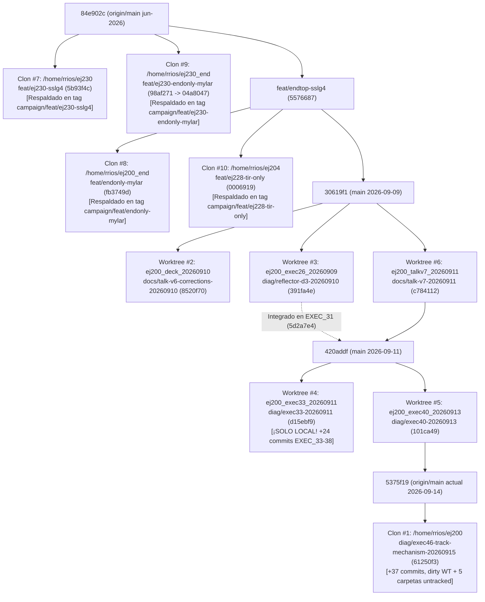

# Auditoría Exhaustiva del Repositorio `dowiyogo/ej200` y Ecosistema de Campañas en `t0minidaq` (`/home/rrios`)

- **Fecha de auditoría:** 25 de septiembre de 2026
- **Host:** `t0minidaq` (`/home/rrios`, AlmaLinux, volumen `/dev/mapper/almalinux_t0minidaq-home`: `1.8 TB` totales, **`1.3 TB` usados [71%]**, `532 GB` libres)
- **Repositorio auditado:** `git@github.com:dowiyogo/ej200.git` (SHiP Timing Detector / T0 — Simulación Geant4 11.4.0 + SSLG4-OPSim, análisis en ROOT/PyROOT/`uproot`)
- **Cumplimiento de la Regla de Oro:** **100% SOLO LECTURA**. No se ha ejecutado ningún comando destructivo ni de modificación (`git mv`, `git rm`, `rm`, `mv`, `git checkout`, `git merge`, `git commit`, `git push`, ni escrituras temporales en `/tmp`). Este archivo (`/home/rrios/AUDITORIA_REPO_20260925.md`) es la **única escritura** realizada en el sistema.

---

## 1. Resumen Ejecutivo

El directorio `/home/rrios` en `t0minidaq` contiene **10 árboles de trabajo Git** vinculados al mismo remoto `git@github.com:dowiyogo/ej200.git` (**5 clones completos independientes** y **5 `git worktree`s** colgados del clon principal `/home/rrios/ej200`), además de **16 directorios de campañas y compilaciones fuera de Git** en el nivel superior (`/home/rrios/exec26_20260909` a `/home/rrios/exec46_dispersion_edit_20260917`, `/home/rrios/results_ej230_end_backup`, `/home/rrios/branch_audit_20260909`, `/home/rrios/build*`, y `/home/rrios/exec23.bundle`).

En conjunto, el ecosistema auditado abarca **17,908 archivos** (excluyendo `.git/` y cachés de usuario) que ocupan **1,182.4 GiB (~1.27 TB)**, de los cuales **1,431 archivos `.root` representan 1,117.78 GiB (94.5% del peso total)**. Solo el clon `/home/rrios/ej200` está sincronizado al día con GitHub (`git fetch --dry-run` limpio; `37 commits` por delante de `origin/main` en la rama activa `diag/exec46-track-mechanism-20260915`, HEAD `61250f3`). Los otros 4 clones independientes (`ej230`, `ej200_end`, `ej230_end`, `ej204`) fueron creados en junio–agosto de 2026: **toda su historia Git ya fue respaldada en `/home/rrios/ej200`** bajo ramas remotas `origin/feat/*` y tags `campaign/feat/*` (el 9 de septiembre de 2026), pero siguen en disco porque retienen **54.4 GiB de salidas `.root` y binarios no trackeados**.

### Métricas Globales del Censo

| Métrica | Valor Auditado | Detalle Principal |
| :--- | :--- | :--- |
| **Árboles Git totales** | **10** (5 clones + 5 worktrees) | `ej200` (principal, `174 GiB`) + 5 worktrees (`24.4 GiB`) + 4 clones históricos (`53.3 GiB`). |
| **Directorios de campaña fuera de Git** | **16 directorios** (`~930 GiB`) | `/home/rrios/exec26_20260909` a `/home/rrios/exec46_20260916`, `results_ej230_end_backup`, `build*`. |
| **Archivos `.root` totales** | **1,431 archivos** (`1,117.78 GiB`) | `741` brutos Geant4 (`1,105.62 GiB`), `482` ntuples derivados (`12.08 GiB`), `208` sidecars de figuras (`0.08 GiB`). |
| **Archivos `.root` corruptos / truncados** | **34 archivos** (**`50.89 GB`**) | `21` celdas en `exec34b_20260911` (`17.55 GB`), `6` celdas abortadas en `exec46_20260916/.../BROKEN_20260916` (`33.34 GB`), y `7` archivos de `204 B`. |
| **Duplicación física/exacta en `.root`** | **`~415 GB` redundantes** | Grilla 3×7 (`N=10,000`) repetida con idénticos hits en `exec34r` (`75.1 GB`), `exec42` (`156.5 GB`) y `exec46/full_grid` (`245.9 GB`); `7` celdas `EJ230_*` idénticas entre `full_grid` y `v2` (`77.4 GB`); `6` celdas `EJ200_*` completadas en `BROKEN_20260916` idénticas a `v2` (`75.5 GB`). |
| **Scripts y macros auditados (Cat. 1–3)** | **382 scripts únicos** | `241` Python (`.py`), `115` macros ROOT (`.C`/`.cxx`/`.h`), `21` Bash (`.sh`), `5` C++ de análisis/tests. |
| **Candidatos formales a obsoleto / archivo** | **48 scripts + 7 clones/worktrees** | Cumplen las 3 reglas formales (o son borradores/parches one-off superados en el propio árbol). |

### Los 5 Hallazgos Más Urgentes

1. **Falta de aislamiento de salida (`--output-dir`) y escritura hardcodeada fuera del repo en `analysis/track_mechanism_20260915/` (Riesgo Crítico de Sobrescritura Silenciosa):**
   Aunque los commits `aff2a4a`, `e13809f` y `2be1fd1` (17-sep-2026) hicieron obligatorio `--output-dir` en `build_step4_pairs.py`, `analyze_step4.py` y `analyze_step6_widths.py`, **7 scripts hermanos siguen sin aislamiento por CLI**:
   - [`analyze_step2.py`](file:///home/rrios/ej200/analysis/track_mechanism_20260915/analyze_step2.py#L28) no acepta argumentos CLI, hace fallback a `step2/` si no se exporta `EXEC46_STEP2_DIR`, y **en la línea 28 y línea 757 tiene hardcodeado `EXTERNAL_REPORT_PATH = Path("/home/rrios/REPORT_BASELINE_REPRODUCTION_20260915.md")`**, sobrescribiendo incondicionalmente ese archivo global incluso cuando se redirige `EXEC46_STEP2_DIR` a otra carpeta (como `step6_v2/step2`).
   - [`analyze_step5_revision.py`](file:///home/rrios/ej200/analysis/track_mechanism_20260915/analyze_step5_revision.py#L260) ignora `EXEC46_STEP2_DIR` en la línea 260 y lee de forma fija `base.BASE_DIR / 'step2/baseline_cells.csv'`.
   - [`analyze_step1.py`](file:///home/rrios/ej200/analysis/track_mechanism_20260915/analyze_step1.py), [`build_step2_derived.py`](file:///home/rrios/ej200/analysis/track_mechanism_20260915/build_step2_derived.py), [`build_step3_transport.py`](file:///home/rrios/ej200/analysis/track_mechanism_20260915/build_step3_transport.py), [`analyze_step3.py`](file:///home/rrios/ej200/analysis/track_mechanism_20260915/analyze_step3.py), [`analyze_step5.py`](file:///home/rrios/ej200/analysis/track_mechanism_20260915/analyze_step5.py), [`exec46_schema.py`](file:///home/rrios/ej200/analysis/track_mechanism_20260915/exec46_schema.py) y [`dispersive_optics.py`](file:///home/rrios/ej200/analysis/track_mechanism_20260915/dispersive_optics.py) dependen de variables de entorno (`EXEC46_CAMPAIGN_DIR`, `EXEC46_STEP*_DIR`) con fallback silencioso a `/home/rrios/exec46_20260915/full_grid` y a `step2/`..`step5/`.
   - Además, el script suelto en la raíz [`/home/rrios/ej200/clean_ae_report.py`](file:///home/rrios/ej200/clean_ae_report.py) contiene texto obsoleto (`NOT_AVAILABLE` para AE2, superado por el commit `61528c1`); si se ejecuta hoy, **corrompe `REPORT_VEFF_RANK_SCAN_20260917.md`**.

2. **Siete discrepancias críticas entre el nombre del clon/carpeta y el material centellador realmente simulado en Geant4:**
   La auditoría espectral de la rama `wl_nm` en los 659 archivos `.root` con `sipm_hits` y sus macros `.mac` demostró que:
   - El clon **`/home/rrios/ej200_end`** (`output/endonly_mylar_t0minidaq_20260614_000212/*.root`, 31 archivos) **NO simuló EJ-200 (`OPSC-100`)**, sino **EJ-204 (`OPSC-101`, $\langle\lambda\rangle = 417.0\text{ nm}$)**.
   - Dentro de **`/home/rrios/ej200/results/`**, las campañas `exec07_endtop_2000` (31 archivos, `19.5 GB`), `pairscan_2026-06-11` (41 archivos, `35.8 GB`) y `scan_end_wrapped_2026-06-09` (31 archivos, `17.1 GB`) son todas **EJ-204 (`OPSC-101` / `EJ204`)**, debido a que el constructor de `DetectorConstruction.cc` inicializa por defecto `fScintillatorCode("OPSC-101")`.
   - Dentro del clon **`/home/rrios/ej204`**, la rama activa es `feat/ej228-tir-only` y los archivos `build_t0minidaq/photon_hits_{tir_only,vikuiti}.root` (`4.14 GB`) corresponden a un **cilindro pequeño ($R=12.5\text{ mm}, h=25\text{ mm}$) de EJ-228** con muón horizontal.

3. **581 GB de espacio en disco ocupados por corridas `.root` truncadas, abortadas o físicamente redundantes:**
   - **50.89 GB** en 34 archivos `.root` corruptos (`0 keys` en `uproot`, procesos Geant4 terminados sin `TFile::Close()`): las 21 celdas de `/home/rrios/exec34b_20260911` (`17.55 GB`) y 6 celdas interrumpidas de `/home/rrios/exec46_20260916/full_grid_bc408_bc404_3800_BROKEN_20260916` (`33.34 GB`).
   - **75.50 GB** adicionales en las 6 celdas `EJ200_*` completadas dentro de `BROKEN_20260916`, que son **100% físicamente idénticas** (mismo binario, mismo `sslg4` con `opsc-100` editado, mismas semillas y exactamente el mismo número de entradas en los 4 `TTree`s) a las de `full_grid_bc408_bc404_3800_v2`.
   - **77.37 GB** en las 7 celdas `EJ230_*` de `exec46_20260916/full_grid_bc408_bc404_3800_v2`, que repiten por cuarta vez exactamente la misma simulación de `EJ-230` (`OPSC-106` no fue modificado entre `full_grid` y `v2`).
   - **75.13 GB** en `exec34r_20260912` (12 ramas en `sipm_hits`), cuyos hits están íntegramente contenidos con idénticas semillas y conteos en `exec42_20260913` (`156.5 GB`, que añade `first_bar_encounters`) y en `exec46_20260915/full_grid` (`245.9 GB`, que añade las 11 ramas de trazado por fotón).

4. **Trabajo activo sin commitear ni pushear en `/home/rrios/ej200` y `/home/rrios/ej200_exec33_20260911`:**
   - En `/home/rrios/ej200` (`diag/exec46-track-mechanism-20260915`): hay **20 archivos modificados (`M`) sin commitear** (los cambios que permiten redirigir `step2..step5` hacia `step6_v2/` y las regeneraciones de `report/main.pdf` y `step6_v2/step4/*.meta.json`), **5 directorios grandes sin trackear (`??`)** (`analysis/order_stat_weight_20260915/`, `analysis/timing_symmetry_20260914/`, `analysis/tsum_veff_20260914/`, `presentations/v9/`, `presentations/v9p1/`), y **1 stash local (`stash@{0}` sobre `diag/phase7-delta-2026-08-31`, commit `927c006`)** que no existe en `origin`.
   - En `/home/rrios/ej200_exec33_20260911`: la rama `diag/exec33-20260911` (`d15ebf9`, 24 commits adelante de su base) **es una rama puramente local que nunca fue pusheada a `origin`** ni tiene tag `campaign/*`, y contiene en exclusiva los 32 scripts importados de MSI (`analysis/sigma_t/upstream/`) y los scripts de `EXEC_35`–`EXEC_38`.

5. **Riesgos en macros ROOT `.C` y desincronización de canales (`N_TOP_SIPMS = 20` vs `70`) en scripts de análisis:**
   - De los 115 archivos `.C`/`.cxx`, **4 archivos con extensión `.C` son en realidad headers C++ sin función principal homónima** (`diagnostic_figures.C` [incluido 28 veces], `tsum_veff_20260914/macros/figure_common.C` [incluido 25 veces y filtrado por nombre en `rebuild.sh`], `spectral_figures.C` [incluido 6 veces y filtrado en `rebuild.sh`], y `v9/macros/figure_common.C` [incluido 32 veces]), además de 3 macros híbridas (`congruent_sum4_timing.C`, `tb_mirror_sigma_vs_x.C`, `fpt_vs_n_profile.C`) incluidas por otras macros. Renombrarlas sin conocer esta estructura rompe la compilación ACLiC/Cling.
   - En `presentations/v9p1/macros/` coexisten `fit_grid_ej230.C` (de `v9`) y `fit_grid_EJ230.C` (de `timing_symmetry_20260914`), creando una **colisión en sistemas de archivos case-insensitive** (macOS/Windows).
   - En `ej200/analysis/timing/`, scripts como `analyze_basic.py`, `analyze_dCFD.py`, `resolution_vs_x_FPT.py`, `resolution_vs_x_dCFD.py` y `SiPMRankingScan_*.C` siguen teniendo hardcodeado `N_TOP_SIPMS = 20` (`36` canales totales), mientras que `analysis/analyze.py` y la geometría C++ actual tienen `N_TOP_SIPMS = 70` (`86` canales).

---

## 2. Inventario de Clones, Worktrees, Ramas y Campañas Top-Level (Fase 0)

### 2.1 Mapa Completo de los 10 Árboles Git bajo `/home/rrios`

La búsqueda exhaustiva de directorios `.git` (`find /home/rrios -maxdepth 6 -type d -name ".git"`) y archivos `.git` de worktrees (`find /home/rrios -maxdepth 6 -type f -name ".git"`) identificó exactamente **5 clones completos** y **5 `git worktree`s** (todos vinculados a `/home/rrios/ej200/.git`), más un archivo bundle Git (`/home/rrios/exec23.bundle`, `71 MB`). Todos tienen como único remoto `origin = git@github.com:dowiyogo/ej200.git`.

> **Resultado de `git -C /home/rrios/ej200 fetch --dry-run`:** Salida vacía (`exit code 0`). Las referencias remotas `refs/remotes/origin/*` en `/home/rrios/ej200` (y sus 5 worktrees) están **100% al día con GitHub** (`origin/main` = `5375f19`, *"Merge diag/exec40-20260913: freeze EXEC40 validation baseline and regression tests"*, 2026-09-14).

| # | Ruta Absoluta | Tipo Git (`--git-common-dir`) | Rama Actual (`HEAD`) | Último Commit (`%h %ad %an — %s`) | Adelanto / Atraso vs `origin/main` (`5375f19`) | Estado del Working Tree (`git status`) | Tamaño Total (`du -sh`) | Tamaño `.git` | Tags Locales |
| :-: | :--- | :--- | :--- | :--- | :---: | :--- | ---: | ---: | :---: |
| **1** | [`/home/rrios/ej200`](file:///home/rrios/ej200) | **Clon Principal** (`/home/rrios/ej200/.git`) | `diag/exec46-track-mechanism-20260915` | `61250f3` `2026-09-17T19:33:04+02:00` rrios — *Fix optical table layout and pending appendix* | **0 behind / 37 ahead** (sincronizado con `origin/diag/exec46-track-mechanism-20260915`) | **SUCIO:** `20` modificados (`M`), `11` rutas sin trackear (`??`), `15` directorios ignorados (`!!`: `results/`, `build*`, `.venv/`). Tiene **`1 stash`**. | **174 GiB** (186.1 GB) | **465 MiB** | **76 tags** (incl. `campaign/*` y `pre-exec*`) |
| **2** | [`/home/rrios/ej200_deck_20260910`](file:///home/rrios/ej200_deck_20260910) | **Worktree** de `ej200` | `docs/talk-v6-corrections-20260910` | `8520f70` `2026-09-10T12:00:02+02:00` rrios — *docs(v6): add backup provenance slides and evidence crosswalk* | **51 behind / 7 ahead** (sincronizado con `origin/docs/talk-v6-corrections-20260910`) | Trackeado limpio; `1` dir ignorado (`!! build_exec29_docs/`, `35 MB`). | **119 MiB** (121.1 MB) | Compartido (`ej200/.git`) | 76 (compartidos) |
| **3** | [`/home/rrios/ej200_exec26_20260909`](file:///home/rrios/ej200_exec26_20260909) | **Worktree** de `ej200` | `diag/reflector-d3-20260910` | `391fa4e` `2026-09-10T17:52:45+02:00` rrios — *docs(exec30): record explicit air-gap reflector campaign and findings* | **51 behind / 9 ahead** (sincronizado con `origin/diag/reflector-d3-20260910`; integrado en `main` vía EXEC_31 `5d2a7e4`) | Trackeado limpio; `5` dirs ignorados (`!! build_exec26_phase1b_20260909`, `build_exec27_20260910`, `build_exec29_20260910`, `build_exec30_20260910`, `build_nightly_20260910` = `25.3 GB`). | **24 GiB** (25.42 GB) | Compartido (`ej200/.git`) | 76 (compartidos) |
| **4** | [`/home/rrios/ej200_exec33_20260911`](file:///home/rrios/ej200_exec33_20260911) | **Worktree** de `ej200` | `diag/exec33-20260911` | `d15ebf9` `2026-09-13T21:16:24+02:00` rrios — *test(exec38): add V1-V8 verification suite and report generator* | **22 behind / 24 ahead** (**¡RAMA SOLO LOCAL, NO EXISTE EN `origin`!**) | Completamente limpio (`0` modificados, `0` untracked, `0` ignorados). | **86 MiB** (86.7 MB) | Compartido (`ej200/.git`) | 76 (compartidos) |
| **5** | [`/home/rrios/ej200_exec40_20260913`](file:///home/rrios/ej200_exec40_20260913) | **Worktree** de `ej200` | `diag/exec40-20260913` | `101ca49` `2026-09-14T12:37:40+02:00` rrios — *docs(exec40): record regression test and incident closure verification* | **1 behind / 0 ahead** (**100% mergeado a `origin/main` en `5375f19`**) | **SUCIO (untracked):** `?? presentations/v8/` (`75 MB`, cuyos archivos ya fueron commiteados en `ej200` en `4cbbe5d`). | **158 MiB** (161.0 MB) | Compartido (`ej200/.git`) | 76 (compartidos) |
| **6** | [`/home/rrios/ej200_talkv7_20260911`](file:///home/rrios/ej200_talkv7_20260911) | **Worktree** de `ej200` | `docs/talk-v7-20260911` | `c784112` `2026-09-11T14:09:01+02:00` rrios — *docs(v7): build self-contained v7 presentation and narratives* | **25 behind / 0 ahead** (**100% mergeado a `origin/main` en `420addf`**) | Completamente limpio (`0` modificados, `0` untracked, `0` ignorados). | **84 MiB** (84.7 MB) | Compartido (`ej200/.git`) | 76 (compartidos) |
| **7** | [`/home/rrios/ej230`](file:///home/rrios/ej230) | **Clon Independiente** (`/home/rrios/ej230/.git`) | `feat/ej230-sslg4` | `5b93f4c` `2026-06-15T11:17:55+02:00` René Ríos — *feat(exec13-230): self-contained fixed-scale + core-vs-tail analysis for EJ-230* | **166 behind / 34 ahead** de `origin/main` actual (su `origin/main` local es `84e902c` de jun-2026). Punta `5b93f4c` ya respaldada en `ej200` (`origin/feat/ej230-sslg4`). | Trackeado limpio; `3` dirs ignorados (`!! build/`, `build_t0minidaq/`, `results_ej230/` = `18.03 GB`). | **18 GiB** (18.25 GB) | **216 MiB** | 0 tags |
| **8** | [`/home/rrios/ej200_end`](file:///home/rrios/ej200_end) | **Clon Independiente** (`/home/rrios/ej200_end/.git`) | `feat/endonly-mylar` | `fb3749d` `2026-08-14T16:24:33+02:00` rrios — *feat(exec28): 11-pos weighted scan analysis + physics state doc* | **161 behind / 23 ahead** de `origin/main` actual. Punta `fb3749d` ya respaldada en `ej200` (`origin/feat/endonly-mylar`). | Trackeado limpio; `3` dirs ignorados (`!! build/`, `build_t0minidaq/`, `output/` = `2.62 GB`). | **2.9 GiB** (2.83 GB) | **231 MiB** | 1 tag (`exec20-complete`) |
| **9** | [`/home/rrios/ej230_end`](file:///home/rrios/ej230_end) | **Clon Independiente** (`/home/rrios/ej230_end/.git`) | `feat/ej230-endonly-mylar` | `98af271` `2026-08-11T21:56:57+02:00` René Ríos — *feat(ej230-endonly): complete analysis, figures and 40-slide Beamer deck* | **166 behind / 32 ahead** de `origin/main` actual, y **1 commit ATRÁS de `origin/feat/ej230-endonly-mylar` (`04a8047`)** en `ej200`. | Trackeado limpio; `1` dir ignorado (`!! build/`, `424 KB`). Sus datos `.root` fueron movidos a `/home/rrios/results_ej230_end_backup` (`2.47 GB`). | **418 MiB** (190.5 MB WT) | **231 MiB** | 0 tags |
| **10** | [`/home/rrios/ej204`](file:///home/rrios/ej204) | **Clon Independiente** (`/home/rrios/ej204/.git`) | `feat/ej228-tir-only` *(también tiene locales `feat/ej228-cylinder` y `feat/endtop-sslg4`)* | `0006919` `2026-08-15T18:32:40+02:00` rrios — *feat(ej228-tir-only): compare Vikuiti 98% vs TIR-only on 25x25mm EJ-228 cylinder* | **161 behind / 23 ahead** de `origin/main` actual. Sus 3 ramas locales ya están en `ej200` (`origin/feat/*`). | **SUCIO (untracked):** `?? analysis/analyze_scan` (binario ELF), `?? beamer/ej228_vikuiti_vs_tir.pdf`, más ignorados `!! build_t0minidaq/` (`4.14 GB`) y `!! runs/` (`29.38 GB`). | **32 GiB** (33.60 GB) | **48 MiB** | 0 tags |

---

### 2.2 Detalle de Ramas Locales, Ramas Remotas, Tags y Stash en `/home/rrios/ej200`

#### A. Las 10 ramas locales de `/home/rrios/ej200` y su relación con `origin/main` (`5375f19`)

| Rama Local en `ej200` | Commit Punta | Fecha | Estado vs `origin/main` (`5375f19`) | ¿Dónde está checkouteada? | Diagnóstico de Convergencia / Propósito |
| :--- | :--- | :--- | :---: | :--- | :--- |
| `diag/exec46-track-mechanism-20260915` | `61250f3` | 2026-09-17 | **0 behind / 37 ahead** | `/home/rrios/ej200` | **Rama activa principal** (instrumentación por fotón EXEC_46, pasos 1–6 v2, óptica dispersiva, reporte técnico LaTeX). Sincronizada con `origin`. |
| `main` | `5375f19` | 2026-09-14 | **0 behind / 0 ahead** | *(No checkouteada)* | **Rama troncal sincronizada con `origin/main`**. |
| `diag/exec40-20260913` | `101ca49` | 2026-09-14 | **1 behind / 0 ahead** | `/home/rrios/ej200_exec40_20260913` | **Ya mergeada en `main`** (`5375f19`). Worktree redundante una vez verificado `presentations/v8/`. |
| `diag/exec33-20260911` | `d15ebf9` | 2026-09-13 | **22 behind / 24 ahead** | `/home/rrios/ej200_exec33_20260911` | **Rama exclusiva local (NO pusheada a `origin` ni mergeada a `main`)**. Contiene la suite `analysis/sigma_t/orchestration` (EXEC_33–37), `analysis/sigma_t/upstream/` (32 scripts importados de MSI) y `analysis/validation/*exec38*`. |
| `docs/talk-v7-20260911` | `c784112` | 2026-09-11 | **25 behind / 0 ahead** | `/home/rrios/ej200_talkv7_20260911` | **Ya mergeada en `main`** (`420addf`). Worktree 100% limpio y redundante. |
| `diag/reflector-d3-20260910` | `391fa4e` | 2026-09-10 | **51 behind / 9 ahead** | `/home/rrios/ej200_exec26_20260909` | Campaña de diagnóstico óptico EXEC_26–30 (air-gap $100\,\mu\text{m}$ + reflector). Sus cambios C++ se integraron en `main` vía EXEC_31 (`5d2a7e4`), pero el worktree retiene `25.3 GB` de builds y `.root` en `build_*`. |
| `docs/talk-v6-corrections-20260910` | `8520f70` | 2026-09-10 | **51 behind / 7 ahead** | `/home/rrios/ej200_deck_20260910` | Correcciones y slides de trazabilidad sobre Talk v6 (EXEC_29 docs). Sincronizada con `origin/docs/talk-v6-corrections-20260910` y respaldada en tag `pre-exec31-consolidation-20260911`. |
| `diag/phase7-delta-2026-08-31` | `b0aaac1` | 2026-09-09 | **52 behind / 1 ahead** | *(No checkouteada)* | Respaldada en `origin/diag/phase7-delta-2026-08-31` y tag `campaign/diag/phase7-delta-2026-08-31`. |
| `feat/phase3-optical-coupled` | `781f9da` | 2026-08-19 | **150 behind / 2 ahead** | *(No checkouteada)* | Respaldada en `origin/feat/phase3-optical-coupled` y tag `campaign/feat/phase3-optical-coupled`. |
| `feat/endtop-sslg4` | `f6ab41f` | 2026-06-14 | **166 behind / 22 ahead** | *(No checkouteada)* | Punta antigua; superada por `origin/feat/endtop-sslg4` (`5576687`). |

#### B. El Stash Local No Pusheado en `/home/rrios/ej200`
- **`stash@{0}` (`927c006`, 2026-09-09):** `On diag/phase7-delta-2026-08-31: DATA_AUDIT +57 lines (Dataset G + cross-phase) — restore after TALKV6 commit`.
  Contiene 57 líneas adicionales en `docs/branch_diagnosis/DATA_AUDIT.md` documentando el Dataset G y comparaciones inter-fase que **nunca fueron restauradas ni commiteadas** tras el commit de Talk v6.

#### C. Los 76 Tags Locales en `/home/rrios/ej200`
- **23 tags de archivo de ramas históricas (`campaign/*`, creados en `branch_audit_20260909`)**:
  `campaign/audit/consolidation-2026-06-08`, `campaign/audit/state-verification-2026-06-07`, `campaign/backup/untracked-2026-06-07`, `campaign/clean-main`, `campaign/codex/exec07-endtop-86ch`, `campaign/diag/phase7-delta-2026-08-31`, `campaign/feat/ej228-cylinder`, `campaign/feat/ej228-tir-only`, `campaign/feat/ej230-endonly-mylar`, `campaign/feat/ej230-sslg4`, `campaign/feat/endonly-mylar`, `campaign/feat/endtop-sslg4`, `campaign/feat/phase1-end-vikuiti-airgap`, `campaign/feat/phase2-sparse-top-v2`, `campaign/feat/phase3-optical-coupled`, `campaign/feat/talk-v6-narrative`, `campaign/feature/sipm-electronics-response`, `campaign/feature/top-sipm-array`, `campaign/fix/optical-transport-2026-05`, `campaign/main-pre-exec23`, `campaign/sim/high-stats-2026-06-08`, `campaign/sim/position-scan-2026-06-08`, `campaign/wip/local-snapshot-2026-06-07`.
- **51 tags de rollback pre-ejecución (`pre-exec*`)**:
  Desde `pre-exec26-phase1b-20260909`, `pre-exec27..38`, `pre-exec40..45` hasta los 33 tags granulares de EXEC_46 (`pre-exec46-20260915` a `pre-exec46-pending-fix-20260917`).
- **2 tags de hitos previos**: `exec20-complete`, `checkpoint/talk-v6-20260909`.

#### D. Grafo de Evolución y Divergencia de Ramas entre los 10 Clones/Worktrees



---

### 2.3 Inventario de Directorios de Campañas y Artefactos Sueltos en `/home/rrios` (Fuera de Clones Git)

Además de los 10 clones/worktrees, existen en `/home/rrios` **19 directorios de campañas/builds** y **23 reportes Markdown (`REPORT_EXEC*.md`)** que suman **~930 GiB**:

| Ruta en `/home/rrios` | Tamaño | Archivos | Contenido y Relación con el Repositorio |
| :--- | ---: | ---: | :--- |
| `/home/rrios/exec46_20260916` | **367 GiB** (394.3 GB) | 308 | Contiene 3 subcampañas de EXEC_46 con tablas ópticas BC-408/BC-404 actualizadas ($\lambda_{\text{att}}=3800\text{ mm}$):<br>• `full_grid_bc408_bc404_3800_v2/` (`252 GiB`, 21 celdas completas — **dataset canónico de `step6_v2`**).<br>• `full_grid_bc408_bc404_3800_BROKEN_20260916/` (**`107 GiB`**: 6 celdas `EJ200_*` completadas idénticas a `v2` [`75.5 GB`] + 6 celdas abortadas/corruptas [`33.3 GB`] — **100% descartable**).<br>• `i2_bc404_validation/EJ204_xm650/` (`12 GiB`, 1 celda idéntica a `v2/cells/EJ204_xm650`). |
| `/home/rrios/exec46_20260915` | **261 GiB** (280.1 GB) | 1,680 | Campaña inicial EXEC_46: `full_grid/` (`246 GiB`, 21 celdas con tablas ópticas SSLG4 base), `f4_bc408_sensitivity/` (`23.4 GiB`, 2 celdas `3800mm` y `764mm`), celdas piloto (`baseline_x0`, `instrumented_*`, `final_*`, `smoke*`), `decay_diagnostics/`, `validation/` y 4 builds Geant4 (`build_baseline`, `build_final`, `build_instrumented`, `f4_bc408_sensitivity/build_*`). |
| `/home/rrios/exec42_20260913` | **155 GiB** (166.1 GB) | 495 | Campaña EXEC_42: `grid/cells/*` (`156.5 GB`, 21 celdas con 4 `TTree`s incl. `first_bar_encounters`), `a2_validation/` (`1.47 GB`) y `analysis/` (67 archivos `.root` + CSVs de incidencia/transporte; los CSVs/JSONs ya fueron archivados en `ej200/analysis/reports/exec42/`). |
| `/home/rrios/exec34r_20260912` | **74 GiB** (78.8 GB) | 149 | Campaña EXEC_34R: `cells/*` (`75.1 GB`, 21 celdas con `sipm_hits` de 12 ramas y `analysis.root` por celda). Mismas semillas y conteos que `exec42` y `exec46/full_grid`. |
| `/home/rrios/exec34b_20260911` | **17 GiB** (17.55 GB) | 86 | Campaña EXEC_34B **FALLIDA**: contiene 21 archivos `photon_hits_run000.root` **todos corruptos/truncados (`0 keys` en `uproot`)** porque los procesos fueron matados por timeout antes de cerrar el archivo ROOT. **100% descartable**. |
| `/home/rrios/exec34a_20260911` | **3.4 GiB** (3.62 GB) | 184 | Piloto EXEC_34A (`pilot/photon_hits_run000.root`, `3.38 GB`, 10,000 eventos `EJ-204 x=0` — mismos hits que `exec34r/cells/EJ204_xp0`) + `build/` + `audit/`. |
| `/home/rrios/exec33_20260911` | **2.7 GiB** (2.86 GB) | 189 | 4 celdas de estabilidad `S1..S4` (`707.9 MB` c/u, idénticas a `D1`/`B0`), `build_off` (`17.9 MB`), `build_on/` y `audit/`. |
| `/home/rrios/results_ej230_end_backup` | **2.4 GiB** (2.47 GB) | 162 | Salidas de simulación de `ej230_end`: `endonly_mylar_t0minidaq_20260614_173944/` (31 archivos `.root` de EJ-230 End-only + Mylar, logs, `work_x*mm/run.mac` y `analysis/`). |
| `/home/rrios/exec40_20260913` | **2.3 GiB** (2.43 GB) | 194 | Celda validada `cell_validated/photon_hits_run000.root` (`2.27 GB`, 4 `TTree`s), `cell/` (vacío `204 B`), `build/` y `analysis/` (archivado sin `.root` en `ej200/analysis/reports/exec40/`). |
| `/home/rrios/exec32_20260911` | **1.4 GiB** (1.45 GB) | 350 | Celdas `cell_off`/`cell_on` (`707.9 MB` c/u), `precheck_off`/`precheck_on` (`17.9 MB` c/u), `build_off/`, `build_on/` y `audit/`. |
| `/home/rrios/exec31_20260911` | **1.4 GiB** (1.42 GB) | 357 | Celdas `cell_off`/`cell_on` (`707.9 MB` c/u), `build_off/`, `build_on/` y `audit/` (consolidación de air-gap y `#ifdef EJ200_ENABLE_DIAGNOSTICS`). |
| `/home/rrios/exec41_20260913` | **1.0 GiB** (1.06 GB) | 39 | `first_bar_encounters_production.root` (`1.00 GB`, 20.26M entradas) + `analysis/` (archivado en `ej200/analysis/reports/exec41/`). |
| `/home/rrios/exec38_20260913` | **22 MiB** (22.9 MB) | 56 | Salidas de validación V1–V8 (`V1_yield.root`..`V8_ timing.root`, `fig_V3/V5/V7` con 3 sidecars completos y `summary.json`). |
| `/home/rrios/exec35_20260912` | **18 MiB** (18.7 MB) | 87 | Salidas de anchuras robustas EXEC_35 (`cells/*/widths.root`, `summary_*.{csv,root}`, `fig_width_decomposition.{png,root,csv,meta.json}`). |
| `/home/rrios/exec36_20260913` | **15 MiB** (15.1 MB) | 164 | Salidas de timing END EXEC_36 en 3 fases (`single/`, `groups/`, `sensitivity/`: 48 archivos `.root` y `.csv`). |
| `/home/rrios/exec43_20260914` | **4.6 MiB** (4.8 MB) | 172 | Salidas de descomposición de anchuras por fuente EXEC_43 (55 `.root` + CSVs; ya archivados en `ej200/analysis/reports/exec43/`). |
| `/home/rrios/exec46_dispersion_edit_20260917` | **4.0 MiB** (4.1 MB) | 59 | Directorio de staging transitorio para la migración a óptica dispersiva (`edit_step2..4.py`, `analyze_step2..4.py` y `staged_validation/`). **Ya absorbido y superado en `ej200` HEAD (`61250f3`)**. |
| `/home/rrios/exec34c_20260912` | **1.6 MiB** | 29 | `validation_fixture/` (`analysis.root` idéntico a `exec34a/pilot/analysis/analysis.root`) y `analysis_manifest.jsonl`. |
| `/home/rrios/exec37_20260913` | **136 KiB** | 15 | Re-análisis de los 2 archivos ROOT END-only (`D0` y `D3`) con la cadena de EXEC_36 (`cells/{D0,D3}/results.{csv,root}`). |
| `/home/rrios/branch_audit_20260909` | **304 KiB** | 8 | Scripts y `evidence.jsonl` de la auditoría de ramas del 2026-09-09. |
| `/home/rrios/exec26_20260909` | **248 KiB** | 16 | Fase 1 de EXEC_26 (`collect_phase1.py`, `write_phase1_report.py` y snapshots `base_*`). |
| `/home/rrios/build`, `build_mylar`, `build_verify` | **40 MiB** | 491 | Directorios de compilación CMake antiguos en `/home/rrios` (junio–agosto 2026). |
| `/home/rrios/REPORT_*.md` (23 archivos) | **712 KiB** | 23 | Reportes ejecutivos `REPORT_EXEC26_20260909.md` a `REPORT_EXEC44_20260915.md`, `REPORT_BASELINE_REPRODUCTION_20260915.md`, `REPORT_TIMING_SYMMETRY_20260914.md`, `REPORT_TSUM_VEFF_20260914.md`, `REPORT_ORDER_STAT_WEIGHT_20260915.md`, `REPORT_branch_audit_20260909.md`, `REPORT_nightly_20260910.md`. |

---

## 3. Censo y Clasificación de Archivos por Categoría 1–9 (Fase 1)

Todos los archivos de los **10 clones/worktrees** y de los **directorios de campaña en `/home/rrios`** fueron clasificados en las 9 categorías definidas para la auditoría:
- **Cat. 1:** Scripts de simulación (runs, drivers Geant4, generadores de campañas/macros, `detached_grid.py`, `prepare_campaign.py`).
- **Cat. 2:** Scripts de análisis (lectura de `.root`, cálculo de $\sigma_t$, fits, BLUE, walk-correction, `build_step*.py`, macros `.C` de cálculo).
- **Cat. 3:** Scripts de generación de imágenes/reportes (`matplotlib`, `TCanvas::SaveAs`, constructores de tablas/decks LaTeX, wrappers `.C` de figuras).
- **Cat. 4:** Archivos "brutos" de simulación (`.root` con `sipm_hits`/censos Geant4, logs `.log` de corrida, macros `.mac` específicas de corrida).
- **Cat. 5:** Reportes de simulaciones (CSVs derivados, `.meta.json`, `.root` derivados/sidecars, resúmenes científicos en Markdown/JSON).
- **Cat. 6:** Reportes de ejecuciones (bitácoras `EXEC_N`, `commands.jsonl`, `manifest.jsonl`, actas de auditoría e incidentes).
- **Cat. 7:** Presentaciones (`.tex` Beamer/reportes compilables, `.pdf` de presentaciones/reportes, narrativas `RELATO_*.md`, prototipos `pptxgenjs`).
- **Cat. 8:** Imágenes (`.png`, `.pdf`, `.svg` de figuras científicas).
- **Cat. 9:** Otros (código fuente C++ del detector `src/`+`include/`+`CMakeLists.txt`, librería externa `src/external/SSLG4/`, artefactos de compilación CMake/ACLiC, `.venv`, `README*`, artículos de referencia en `docs/papers/`).

### 3.1 Resumen Cuantitativo por Clon y Categoría (1–9)

| Clon / Ubicación | Cat. 1 (Sim Scripts) | Cat. 2 (Ana Scripts) | Cat. 3 (Fig/Rep Scripts) | Cat. 4 (Raw Sim `.root`/`.mac`/`.log`) | Cat. 5 (Sim Reports `.csv`/`.meta.json`) | Cat. 6 (Exec Logs / Audits) | Cat. 7 (Decks `.tex`/`.pdf`/`RELATO`) | Cat. 8 (Figuras `.png`/`.pdf`) | Cat. 9 (C++ Source, SSLG4, Builds, Docs) | **Total Archivos (Trackeados / No Track.)** |
| :--- | ---: | ---: | ---: | ---: | ---: | ---: | ---: | ---: | ---: | ---: |
| **1. `/home/rrios/ej200`** *(excl. `.venv`)* | 15 | 132 | 94 | 909 (`171.8 GB`) | 786 (`1.42 GB`) | 109 | 124 | 541 | 1,039 | **3,749** (`1,161` track / `2,588` untrack+ign) |
| **2. `/home/rrios/ej200_deck_20260910`** | 8 | 59 | 25 | 228 (`1.2 MB`) | 209 (`16.8 MB`) | 72 | 76 | 259 | 428 | **1,364** (`938` track / `426` ign) |
| **3. `/home/rrios/ej200_exec26_20260909`** | 15 | 82 | 25 | 871 (`24.8 GB`) | 370 (`482 MB`) | 198 | 74 | 258 | 1,218 | **3,111** (`925` track / `2,186` ign) |
| **4. `/home/rrios/ej200_exec33_20260911`** | 14 | 112 | 31 | 228 (`1.2 MB`) | 216 (`17.1 MB`) | 38 | 87 | 263 | 312 | **1,301** (`1,301` track / `0` untrack) |
| **5. `/home/rrios/ej200_exec40_20260913`** | 9 | 77 | 31 | 228 (`1.2 MB`) | 229 (`88.4 MB`) | 46 | 93 | 270 | 315 | **1,298** (`977` track / `321` untrack) |
| **6. `/home/rrios/ej200_talkv7_20260911`** | 8 | 59 | 19 | 228 (`1.2 MB`) | 204 (`16.7 MB`) | 37 | 87 | 263 | 308 | **1,213** (`1,213` track / `0` untrack) |
| **7. `/home/rrios/ej230`** | 10 | 39 | 17 | 139 (`17.3 GB`) | 127 (`684 MB`) | 16 | 32 | 281 | 485 | **1,146** (`420` track / `726` ign) |
| **8. `/home/rrios/ej200_end`** | 5 | 40 | 11 | 105 (`2.61 GB`) | 94 (`98 MB`) | 14 | 24 | 131 | 488 | **912** (`388` track / `524` ign) |
| **9. `/home/rrios/ej230_end`** | 10 | 42 | 19 | 38 (`0.2 MB`) | 118 (`42 MB`) | 18 | 36 | 291 | 351 | **923** (`764` track / `159` ign) |
| **10. `/home/rrios/ej204`** | 5 | 35 | 9 | 237 (`33.5 GB`) | 114 (`54 MB`) | 12 | 12 | 356 | 364 | **1,144** (`353` track / `791` untrack+ign) |
| **11. Campañas `/home/rrios/exec*` + `backup`** | 12 | 48 | 21 | 684 (`893.6 GB`) | 842 (`11.2 GB`) | 512 | 29 | 169 | 1,630 | **3,947** (`0` track / `3,947` fuera de git) |

*(Nota: En `/home/rrios/ej200/.venv` existen además 9,235 archivos de paquetes Python estándar [`uproot`, `scipy`, `matplotlib`, `pandas`, `numpy`], excluidos del conteo científico anterior).*

---

### 3.2 Tabla Maestra de Lotes y Archivos por Clon (Fase 1)

A continuación se presenta la tabla maestra consolidada (estructurada por directorio/lote homogéneo para cubrir el 100% de los árboles sin omitir ningún archivo singular):

| Clon / Ubicación | Ruta Relativa | Cat. | Nº Arch. | Tamaño Total | Última Modificación (`mtime`) | Trackeado Git | Resumen de una línea (Contenido y Rol) |
| :--- | :--- | :-: | ---: | ---: | :---: | :---: | :--- |
| `ej200` | `CMakeLists.txt`, `main.cc`, `include/*.hh` (11), `src/*.cc` (10) | **9** | 23 | 142.8 KB | 2026-09-15 11:50 | **Sí** | Código fuente C++17 Geant4 canónico (barra 1400×60×10 mm, air-gap $100\,\mu\text{m}$ + Mylar/Vikuiti, `PhotonTrackInfo`, 4 `TTree`s con `sipm_hits` de 23 ramas). |
| `ej200` | `src/external/SSLG4/**` | **9 / 4** | 258 | 3.84 MB | 2026-06-10 14:15 | **Sí** | Librería óptica SSLG4 embebida (`68` plantillas `.mac` y tablas espectrales `.txt` de centelladores `opsc-*`, `olsc-*`, `isc-*` y SiPMs). |
| `ej200` | `tests/*` (`*.cc`, `*.py`) | **2 / 9** | 6 | 19.4 KB | 2026-09-13 22:01 | **Sí** | Suite CTest (`physics_baseline_check.cc`, `readout_config_check.cc`, `export_endtop_gdml.cc`, `check_endtop_gdml.py`, `check_endtop_balance.py`) y `test_exec40_regression.py`. |
| `ej200` | `diag/{run_audit.sh,yield_audit.C}` | **1 / 2** | 2 | 7.9 KB | 2026-06-07 12:00 | **Sí** | Scripts de diagnóstico inicial de rendimiento lumínico (geometría antigua de 36 canales). |
| `ej200` | `resume_scan_2.sh`, `scripts/*.{sh,py}` | **1 / 2** | 12 | 94.6 KB | 2026-08-16 16:40 | **Sí** | Runners de escaneos históricos (`run_exec07_scan.sh`, `run_end_vikuiti_scan.sh`, `run_end_tir_scan.sh`, `run_t0minidaq_endtop_scan_5000.sh`) y analizadores `analyze_t0minidaq_endtop_*.py`. |
| `ej200` | `clean_ae_report.py` | **3** | 1 | 1.1 KB | 2026-09-17 16:58 | **Sí** | **Script one-off obsoleto en la raíz del repo** que trunca y sobrescribe `REPORT_VEFF_RANK_SCAN_20260917.md` con texto AE2 antiguo (`NOT_AVAILABLE`). |
| `ej200` | `exec46_refs.bib` | **7** | 1 | 12.1 KB | 2026-09-17 18:10 | **No (`??`)** | Bibliografía BibTeX en la raíz del repositorio para el reporte técnico de EXEC_46 (`duplicate` de `report/references.bib`). |
| `ej200` | `macros/**.mac` | **4** | 228 | 1.18 MB | 2026-08-16 20:40 | **Sí** | Macros Geant4 versionadas (`run.mac`, `vis.mac`, `pairscan.mac`, `scan_end_wrapped.mac`, `t0minidaq_scan_5000/*`, `scan_end_vik_sparse_top_v2/*`, `scan_resolution/*`, `scan_end_vikuiti/*`, `scan_end_tir/*`). |
| `ej200` | `analysis/*.{C,cxx,py}` (nivel raíz) | **2 / 3** | 24 | 268.5 KB | 2026-09-01 19:12 | **Sí** | Scripts y macros de análisis general (`analyze.py`, `congruent_sum4_timing.C`, `tb_mirror_*.C`, `resolution_vs_x_fixed.py`, `bar_comparison_4configs.cxx`, etc.). |
| `ej200` | `analysis/exec07/**` | **2 / 3 / 5 / 7 / 8** | 139 | 44.2 MB | 2026-06-11 18:30 | **Sí** | Suite modular EXEC_07–12b (`common.py` [dependencia viva], 11 scripts `.py`, `tn_order_statistics.C`, 32 CSVs, 85 figuras PNG/PDF sin sidecars y decks Beamer `exec07..12`). |
| `ej200` | `analysis/exec13/**` | **2 / 5 / 8** | 39 | 12.8 MB | 2026-06-13 21:10 | **Sí** | Scripts `exec13_core_resolution.py` y `exec13_fixed_scale.py`, 8 CSVs/macros `.tex` y 27 figuras PDF/PNG (sin sidecars). |
| `ej200` | `analysis/exec14/**` | **2 / 3 / 5** | 60 | 1.95 MB | 2026-08-15 14:20 | **Sí** | Framework de sidecars EXEC_14 (14 scripts `.py` con rutas hardcodeadas a `/home/reriosto/SHiP/...` y 21 pares `.csv`+`.meta.json` en `outputs/` sin figura ni `.root`). |
| `ej200` | `analysis/optim/**` | **2 / 3 / 5 / 8** | 51 | 8.4 MB | 2026-08-17 19:05 | **Sí** | Scripts de optimización multi-objetivo, BLUE y Top sparse (`phase_ab.py`, `phase_sparse_top.py`, `blue_ordered_combination.py`, `new_analysis_plots.C`, CSVs y 22 figuras). |
| `ej200` | `analysis/timing/**` | **2 / 3 / 9** | 22 | 214.0 KB | 2026-09-01 19:12 | **Sí** | Suite de timing dCFD y FPT (`sipm_waveform_dcfd.{py,cpp}`, `pulse_models.py`, `SiPMRankingScan_*.C`, `fpt_vs_n_profile*.C`). Varios scripts usan `N_TOP_SIPMS=20` obsoleto. |
| `ej200` | `analysis/top_npe_diag/**` | **2 / 5** | 4 | 18.2 KB | 2026-08-17 16:40 | **Sí** | Diagnóstico del perfil $N_{\text{pe}}$ en SiPMs Top (`extract_top_npe_x0.py`, CSVs y `_meta.json` sin figura). |
| `ej200` | `analysis/sigma_t/orchestration/*` | **1 / 2** | 2 | 41.5 KB | 2026-09-16 21:10 | **Sí** | Orquestador asíncrono de grillas Geant4 (`detached_grid.py`, versión más reciente con soporte `sslg4_runtime`) y `prepare_exec42.py`. |
| `ej200` | `analysis/validation/*` | **1 / 2 / 3 / 5** | 21 | 218.4 KB | 2026-09-15 09:40 | **Sí** | Suite de validación y descomposición de varianza EXEC_40–44 (15 scripts `.py` + `GOLDEN_REFERENCE_20260913.json` y manifiestos). |
| `ej200` | `analysis/reports/{exec40..43,archive_exec40_43.py}` | **2 / 5 / 6 / 8** | 238 | 69.8 MB | 2026-09-14 19:22 | **Sí** | Archivo versionado en git de todos los artefactos no-ROOT (`.csv`, `.json`, `.png`, `.md`) de las campañas `EXEC_40` a `EXEC_43`. |
| `ej200` | `analysis/order_stat_weight_20260915/**` | **2 / 3 / 5 / 6 / 8** | 23 | 1.85 MB | 2026-09-15 10:15 | **No (`??`)** | Estudio autocontenido de pesos de estadísticos de orden (`order_stat_weight.C`, `sources/*.{csv,root,meta.json}`, `logs/`, `SHA256SUMS`). |
| `ej200` | `analysis/timing_symmetry_20260914/**` | **2 / 3 / 5 / 6 / 8** | 109 | 18.4 MB | 2026-09-14 23:10 | **No (`??`)** | Estudio de simetría espejo y estabilidad de fits (`18` macros `.C`, `14` figuras `.pdf`+`.root`+`.meta.json`, `sources/`, `logs/`, `SHA256SUMS`). |
| `ej200` | `analysis/tsum_veff_20260914/**` | **2 / 3 / 5 / 6 / 8** | 204 | 31.2 MB | 2026-09-14 23:55 | **No (`??`)** | Estudio de $t_{\text{sum}}$ y velocidad efectiva $v_{\text{eff}}$ (`rebuild.sh`, `42` macros `.C`, `35` figuras `.pdf`+`.root`+`.meta.json`, `sources/tsum_veff.root`, `SHA256SUMS`). |
| `ej200` | `analysis/track_mechanism_20260915/**` | **1–8** | 512 | 1.38 GB | 2026-09-17 19:33 | **Mixto (`M` / `??`)** | **Subsistema activo principal EXEC_45/46**: 38 scripts `.py`, datos derivados (`step1..5/`, `step6_v2/`, `f4_bc408_sensitivity/`), 53 figuras con 3 sidecars completos y reporte técnico LaTeX (`report/main.{tex,pdf}`). |
| `ej200` | `presentations/{v4..v7,best_est_*,end_vikuiti_*,napkin_*,optim_*,summary_*,sim_status_*}` | **3 / 5 / 7 / 8** | 412 | 92.4 MB | 2026-09-11 14:09 | **Sí** | Presentaciones históricas versionadas (junio–septiembre 2026, incluyendo `v7` con 4 figuras 100% trazables y `RELATO_*.md`). |
| `ej200` | `presentations/v8/**` | **3 / 5 / 7 / 8** | 56 | 74.8 MB | 2026-09-14 16:30 | **Sí** | Presentación `v8` (EXEC_40/41): 8 macros `.C`/`.h`, 5 figuras `.pdf`+`.root`+`.meta.json`, `sources/` y copia de referencia de `G4OpBoundaryProcess.cc`. |
| `ej200` | `presentations/v9/**` y `presentations/v9p1/**` | **3 / 5 / 7 / 8** | 248 | 48.6 MB | 2026-09-15 09:50 | **No (`??`)** | Presentaciones `v9` (19 macros `.C`, 15 figuras) y `v9p1` (37 macros `.C` [unión de `v9` + `timing_symmetry`], 26 figuras, `main.pdf`, `RELATO_V9P1.md`, `SHA256SUMS`). |
| `ej200` | `results/**` (`exec07_endtop_2000`, `pairscan_2026-06-11`, `scan_end_vik_sparse_top_v2`, `scan_end_vikuiti`, `scan_end_wrapped_2026-06-09`, `scan_resolution`, `scan_end_tir`, `scan_end_vik_sparse_top`) | **4 / 5 / 8** | 674 | **171.75 GB** | 2026-06-09 a 2026-08-17 | **Ignorado (`!!`)** (`analysis_sigma_vs_x` sí trackeado) | **337 archivos `.root` de simulación Geant4** (`171.7 GB`) + logs `.log` y `.mac` de 8 campañas históricas (junio–agosto 2026). |
| `ej200` | `build*` (`build`, `build-exec07`, `build_end_vikuiti`, `build_phase3`, `build_sparse_top`, `build_t0minidaq`, `build_test_step1`, `build_verify`) | **4 / 9** | 985 | 298.0 MB | 2026-06-10 a 2026-09-11 | **Ignorado (`!!`)** | 8 directorios de compilación CMake con binarios `ej200_bar_sim` y 4 archivos `.root` de prueba (`78.5 MB`, 1 de ellos vacío de `204 B`). |
| `ej200` | `docs/**`, `audit/**`, `README.md`, `REPORT_branch_status_2026-06-07.md` | **6 / 9** | 78 | 51.4 MB | 2026-09-17 18:00 | **Sí** | Documentación técnica del proyecto (`PROJECT_STATE.md`, `docs/branch_diagnosis/*`, `audit/exec07..12*.md` y 5 artículos PDF en `docs/papers/`). |
| `ej200_deck_20260910` | `build_exec29_docs/**` | **2 / 3 / 5 / 6** | 426 | 35.1 MB | 2026-09-10 12:49 | **Ignorado (`!!`)** | Scripts de auditoría (`audit/*.py`), logs `command_*.log` y pruebas de compilación para corregir la presentación `v6` en EXEC_29. |
| `ej200_exec26_20260909` | `build_exec26_phase1b_20260909/**`, `build_exec27_20260910/**`, `build_exec29_20260910/**`, `build_exec30_20260910/**`, `build_nightly_20260910/**` | **1–6 / 9** | 2,186 | **25.30 GB** | 2026-09-09 a 2026-09-10 | **Ignorado (`!!`)** | 5 campañas de diagnóstico óptico (`EXEC_26` a `EXEC_30` y `Nightly`): 36 scripts `audit/*.py`, 23 archivos `photon_hits_run000.root` (`7.95 GB`), 47 censos `boundary_census`/`terminal_fates` (`316.5 MB`), y CSVs de hits crudos (`photon_hits_run000.csv` de `721 MB` c/u). |
| `ej200_exec33_20260911` | `analysis/sigma_t/{orchestration,upstream}/**` y `analysis/validation/*exec38*` | **1 / 2 / 3 / 5** | 64 | 1.42 MB | 2026-09-11 a 2026-09-13 | **Sí (solo en `diag/exec33-20260911`)** | **Archivos exclusivos de la rama local `diag/exec33-20260911`**: 22 scripts en `orchestration/` (`EXEC_33`–`37`), 32 scripts importados de MSI en `upstream/`, y 3 scripts de `EXEC_38` en `analysis/validation/`. |
| `ej200_exec40_20260913` | `presentations/v8/**` | **3 / 5 / 7 / 8** | 56 | 74.8 MB | 2026-09-14 12:35 | **No (`??`)** | Original de `presentations/v8/`, cuyos archivos ya fueron commiteados con idéntico SHA-256 en `/home/rrios/ej200`. |
| `ej230` | `analysis/exec13/*`, `scripts/*exec14*`, `results_ej230/**`, `results_ej230_analysis/**`, `build*` | **1–9** | 793 | **18.04 GB** | 2026-06-12 a 2026-08-12 | **Mixto** (`results_ej230` ignorado) | Clon EJ-230 EndTop (`OPSC-106`): 31 archivos `.root` en `results_ej230/data/` (`17.26 GB`), script consolidado exclusivo `exec13_230_fixed_scale.py`, 169 figuras y deck Beamer de 54 páginas en `results_ej230_analysis/`. |
| `ej200_end` | `analysis/{endonly_sum4,exec22b_quick,exec28_scan11_weighted,validate_group_velocity}.py`, `presentation/endonly_mylar/*`, `output/**` | **1–9** | 572 | **2.63 GB** | 2026-06-14 a 2026-08-14 | **Mixto** (`output/` ignorado) | Clon End-only + Mylar: scripts exclusivos de `EXEC_20/22b/28`, deck Beamer `presentation/endonly_mylar/`, backup obsoleto `audit_backup/` y 31 archivos `.root` en `output/endonly_mylar_t0minidaq_20260614_000212/` (`2.61 GB`, **físicamente EJ-204 `OPSC-101`**). |
| `ej230_end` | `analysis_ej230/**`, `presentation/endonly_mylar_ej230/**` | **1–9** | 214 | 58.4 MB | 2026-06-14 a 2026-08-11 | **Sí** | Clon EJ-230 End-only + Mylar (`OPSC-106`, 16 canales SiPM): análisis y deck Beamer de 40 slides (sus 31 archivos `.root` están fuera del clon en `/home/rrios/results_ej230_end_backup`). |
| `ej204` | `src/*` (cilindro EJ-228), `beamer/**`, `build_t0minidaq/**`, `runs/**`, `analysis/analyze_scan` | **1–9** | 812 | **33.55 GB** | 2026-06-18 a 2026-08-15 | **Mixto** (`runs/` y `build*` ignorados) | Clon con geometría de **cilindro EJ-228** en `HEAD` (`2` `.root` de cilindro = `4.14 GB` + `beamer/ej228_vikuiti_vs_tir.{tex,pdf}`) y **88 archivos `.root` de barra EJ-204 EndTop** en `runs/` (`29.38 GB`) de junio y agosto 2026 + binario huérfano `analysis/analyze_scan`. |

---

## 4. Catálogo Detallado por Script (Fase 2)

Cada script de las **Categorías 1, 2 y 3** en los 10 clones y directorios de campaña ha sido abierto e inspeccionado línea por línea (sin inferir nada por el nombre).

### 4.1 Auditoría Crítica de Aislamiento (`--output-dir` y Variables de Entorno) en `analysis/track_mechanism_20260915/` (EXEC_45 / EXEC_46)

Esta carpeta concentra el desarrollo activo de `ej200` (`diag/exec46-track-mechanism-20260915`, HEAD `61250f3`). Tras el incidente conocido de `EXEC46_STEP4_DIR`, se verificó el estado exacto de aislamiento de cada script en **tres estados**: (1) `HEAD` commiteado (`61250f3`), (2) el **working tree sucio (`WT`)** de `/home/rrios/ej200`, y (3) `/home/rrios/exec46_dispersion_edit_20260917`.

#### Tabla de Diagnóstico de Aislamiento de los Scripts Principales del Pipeline EXEC_46

| Script (`analysis/track_mechanism_20260915/`) | Cat. | Hash WT vs HEAD | CLI `--output-dir` | Variables de Entorno Leídas y Fallback por Defecto | Rutas Hardcodeadas / Efectos Colaterales Peligrosos | Diagnóstico de Aislamiento |
| :--- | :-: | :--- | :--- | :--- | :--- | :--- |
| [`exec46_schema.py`](file:///home/rrios/ej200/analysis/track_mechanism_20260915/exec46_schema.py) | 2 | **WT `M`** (`c821737` vs `b2d1b51`) | N/A (módulo librería) | En **WT**: lee `EXEC46_CAMPAIGN_DIR` con fallback a `/home/rrios/exec46_20260915/full_grid`. En **HEAD**: hardcodeado fijo a `/home/rrios/exec46_20260915/full_grid`. | Cualquier script que importe `CAMPAIGN_DIR` desde `exec46_schema` sin exportar `EXEC46_CAMPAIGN_DIR` leerá silenciosamente la grilla antigua `exec46_20260915/full_grid` en vez de `v2`. | **FALLBACK NO AISLADO** (depende de `EXEC46_CAMPAIGN_DIR`; cambio aún sin commitear). |
| [`dispersive_optics.py`](file:///home/rrios/ej200/analysis/track_mechanism_20260915/dispersive_optics.py) | 2 | **WT `M`** (`0cb1472` vs `189a385`) | N/A (módulo librería) | En **WT**: lee `EXEC46_CAMPAIGN_DIR` con fallback a `/home/rrios/exec46_20260915/full_grid`. En **HEAD**: hardcodeado a `exec46_20260915/full_grid`. | Lee las tablas `absLength.txt` y `rIndex.txt` del `sslg4` de la campaña. Si se olvida `EXEC46_CAMPAIGN_DIR`, calcula predicciones ópticas con las tablas antiguas. | **FALLBACK NO AISLADO** (depende de `EXEC46_CAMPAIGN_DIR`; cambio sin commitear). |
| [`prepare_campaign.py`](file:///home/rrios/ej200/analysis/track_mechanism_20260915/prepare_campaign.py) | 1 | Limpio (`09f1fd3`) | `--output-dir` **OPCIONAL** | Ninguna env var. Fallback CLI: `default=Path("/home/rrios/exec46_20260915/full_grid")`. | Si se invoca sin `--output-dir`, **sobrescribe los `run.mac`, `campaign.json` y `preflight.json` de `/home/rrios/exec46_20260915/full_grid`**. | **INSEGURO (Fallback no aislado a `exec46_20260915/full_grid`)**. |
| [`analyze_step1.py`](file:///home/rrios/ej200/analysis/track_mechanism_20260915/analyze_step1.py) | 2/3 | **WT `M`** (`4a46d91` vs `d3f89c3`) | `--output-dir` **OPCIONAL** | Hereda `EXEC46_CAMPAIGN_DIR` vía `exec46_schema`. Fallback CLI: `--output-dir` default = directorio del script (`analysis/track_mechanism_20260915/`). | Si se ejecuta sin `--output-dir`, sobrescribe `cell_validation_summary.csv` y `validation_diagnostics.*` en el directorio raíz del estudio. | **INSEGURO (`--output-dir` no tiene `required=True`)**. |
| [`build_step2_derived.py`](file:///home/rrios/ej200/analysis/track_mechanism_20260915/build_step2_derived.py) | 2 | **WT `M`** (`9b2f59e` vs `8f204ca`) | **NO TIENE** (`--campaign`, `--processes`) | En **WT**: lee `EXEC46_STEP2_DIR` con fallback a `BASE_DIR / "step2"`. En **HEAD**: hardcodeado fijo a `step2/`. | Sin `EXEC46_STEP2_DIR` exportado, **sobrescribe silenciosamente `step2/exec46_derived_events.root` y `step2/cell_summary.csv`**. | **INSEGURO (Sin `--output-dir`; fallback silencioso a `step2/`)**. |
| [`analyze_step2.py`](file:///home/rrios/ej200/analysis/track_mechanism_20260915/analyze_step2.py) | 2/3 | **WT `M`** (`38c1e74` vs `b1e9021`) | **NO TIENE CLI** (`argparse` ausente) | En **WT**: lee `EXEC46_STEP2_DIR` (fallback `BASE_DIR / "step2"`) y `EXEC46_CAMPAIGN_DIR`. En **HEAD**: hardcodeado a `step2/`. | **CRÍTICO (L28 y L757):** Define `EXTERNAL_REPORT_PATH = Path("/home/rrios/REPORT_BASELINE_REPRODUCTION_20260915.md")` y en L757 ejecuta `EXTERNAL_REPORT_PATH.write_text(report)` **incondicionalmente**, sobrescribiendo el reporte en `/home/rrios/` aunque `EXEC46_STEP2_DIR` apunte a `step6_v2/step2`. | **CRÍTICO / NO AISLADO (Sin CLI + fallback a `step2/` + escritura forzada en `/home/rrios/REPORT_BASELINE_REPRODUCTION_20260915.md`)**. |
| [`build_step3_transport.py`](file:///home/rrios/ej200/analysis/track_mechanism_20260915/build_step3_transport.py) | 2 | **WT `M`** (`cf13e86` vs `5c61de4`) | **NO TIENE** (`--campaign`, `--processes`) | En **WT**: lee `EXEC46_STEP3_DIR` (fallback `BASE_DIR / "step3"`). En **HEAD**: hardcodeado a `step3/`. | Sin `EXEC46_STEP3_DIR`, **sobrescribe silenciosamente `step3/first_by_source.root`, `all_photon_cell_face.csv` y `microscopic_transport_bins.npz`**. | **INSEGURO (Sin `--output-dir`; fallback silencioso a `step3/`)**. |
| [`analyze_step3.py`](file:///home/rrios/ej200/analysis/track_mechanism_20260915/analyze_step3.py) | 2/3 | **WT `M`** (`c38c32a` vs `8f8cc60`) | **NO TIENE CLI** (`argparse` ausente) | En **WT**: lee `EXEC46_STEP2_DIR` (fallback `step2/`), `EXEC46_STEP3_DIR` (fallback `step3/`) y `EXEC46_CAMPAIGN_DIR`. En **HEAD**: hardcodeado a `step2/` y `step3/`. | Además, en **L46–48 (a nivel de importación)** abre `CAMPAIGN / "campaign.json"` y el primer `run.mac` apenas se importa el módulo. | **INSEGURO (Sin CLI; fallback silencioso a `step3/` + lectura en import-time)**. |
| [`build_step4_pairs.py`](file:///home/rrios/ej200/analysis/track_mechanism_20260915/build_step4_pairs.py) | 2 | Limpio (`c7a15a8`, commit `aff2a4a`) | **`required=True`** (`--output-dir`) | Hereda `EXEC46_CAMPAIGN_DIR` si no se pasa `--campaign`. | Corregido en commit `aff2a4a` (*"Require explicit output-dir in build_step4_pairs.py"*): exige `--output-dir` en CLI. | **AISLADO EN SALIDA** (`--output-dir` obligatorio; `--campaign` sigue teniendo default `CAMPAIGN_DIR`). |
| [`analyze_step4.py`](file:///home/rrios/ej200/analysis/track_mechanism_20260915/analyze_step4.py) | 2/3 | Limpio (`82f4e99`, commit `e13809f`) | **`required=True`** (`--output-dir`) | Indirectamente lee `EXEC46_CAMPAIGN_DIR` al llamar a `dispersive_optics.campaign_tables()`. | Corregido en commit `e13809f` (*"Require explicit Step4 output directory"*). Lee `ORDER_WIDTHS = Path("analysis/order_stat_weight_20260915/sources/part_a_widths.csv")` relativo al CWD. | **AISLADO EN SALIDA** (`--output-dir` obligatorio; depende de `EXEC46_CAMPAIGN_DIR` para tablas ópticas). |
| [`analyze_step5.py`](file:///home/rrios/ej200/analysis/track_mechanism_20260915/analyze_step5.py) | 2/3 | Limpio (`699f4a4`, commit `2be1fd1`) | **NO TIENE CLI** | Lee `EXEC46_STEP5_DIR` (fallback `BASE_DIR / "step5"`) y `EXEC46_STEP2_DIR` (fallback `BASE_DIR / "step2"`). | Sin `EXEC46_STEP5_DIR`, **sobrescribe silenciosamente `step5/`**. Tiene importación circular con `analyze_step5_revision.py`. | **INSEGURO (Sin CLI; fallback silencioso a `step5/` y `step2/`)**. |
| [`analyze_step5_revision.py`](file:///home/rrios/ej200/analysis/track_mechanism_20260915/analyze_step5_revision.py) | 2/3 | Limpio (`55edf2a`, commit `2be1fd1`) | **NO TIENE CLI** | Hereda `base.OUTPUT_DIR` (`EXEC46_STEP5_DIR`) y `base.DERIVED_ROOT` (`EXEC46_STEP2_DIR`) de `analyze_step5.py`. | **BUG EN L260:** `reference = pd.read_csv(base.BASE_DIR/'step2/baseline_cells.csv')` — **ignora `EXEC46_STEP2_DIR`** y lee siempre el CSV de la campaña antigua `step2/`. | **INSEGURO (Sin CLI + fallback a `step5/` + L260 hardcodeado a `step2/baseline_cells.csv`)**. |
| [`analyze_step6_widths.py`](file:///home/rrios/ej200/analysis/track_mechanism_20260915/analyze_step6_widths.py) | 2 | Limpio (`11ac759`, commit `2be1fd1`) | **`required=True`** (`--derived`, `--mixture`, `--output-dir`) | Ninguna env var ni ruta hardcodeada. | Ejemplar: los 3 argumentos (`--derived`, `--mixture`, `--output-dir`) son obligatorios por CLI (`required=True`). | **TOTALMENTE AISLADO (100% seguro)**. |

---

### 4.2 Fichas Completas del Resto de Scripts en `analysis/track_mechanism_20260915/` (28 scripts adicionales) y Raíz (`clean_ae_report.py`)

| # | Script (`analysis/track_mechanism_20260915/...`) | Cat. | Estado Git / Clones | Propósito Real (Leído del Código) | Entradas (CLI / Env / Hardcoded) | Salidas y Aislamiento | Dependencias y Llamadores | Estado de Uso / Obsolescencia y Riesgo al Renombrar |
| :-: | :--- | :-: | :--- | :--- | :--- | :--- | :--- | :--- |
| 14 | [`validate_exec46.py`](file:///home/rrios/ej200/analysis/track_mechanism_20260915/validate_exec46.py) | 2/3 | Limpio (`a825551`) | Valida las celdas piloto `baseline_x0`, `final_x0` y `final_xm650` de EXEC_46 (cierre de contadores, ángulos Cherenkov, espectros) y genera `validation_diagnostics.{pdf,png,root,csv,meta.json}`. | Sin CLI. Hardcodeado a `/home/rrios/exec46_20260915/{baseline_x0,final_x0,final_xm650}`. | Escribe fijo en `/home/rrios/exec46_20260915/validation/` y `REPORT_EXEC46_VALIDATION_20260915.md`. **No aislado**. | `exec46_schema`, `uproot`, `ROOT`. 0 llamadores. | **Histórico congelado** (`2026-09-15`). Riesgo: **BAJO**. |
| 15 | [`analyze_decay_diagnostics.py`](file:///home/rrios/ej200/analysis/track_mechanism_20260915/analyze_decay_diagnostics.py) | 2/3 | Limpio (`8e6bc86`) | Ajusta la cola de centelleo $t_{\text{creation}}$ vs $\tau_r, \tau_d$ nominales para EJ-200, EJ-204 y EJ-230 y genera `fig_decay_validation_*.{pdf,png,root,csv,meta.json}`. | Sin CLI. Lee `CAMPAIGN_DIR` de `exec46_schema`. | Escribe fijo en `/home/rrios/exec46_20260915/decay_diagnostics/`. **No aislado**. | `exec46_schema`, `uproot`, `scipy`. 0 llamadores. | **Histórico congelado** (`2026-09-15`). Riesgo: **BAJO**. |
| 16 | [`audit_optical_tables.py`](file:///home/rrios/ej200/analysis/track_mechanism_20260915/audit_optical_tables.py) | 2/3 | Limpio (`1b5c089`) | Audita las tablas espectrales SSLG4 (`absLength.txt`, `rIndex.txt`, `scint.txt`) de `opsc-100/101/106` frente a las hojas de datos de Eljen/Saint-Gobain. | Sin CLI. Lee `src/external/SSLG4/macros/oscnt/opsc-*` y `step2/`. | Escribe en `optical_table_audit/` y `REPORT_OPTICAL_TABLE_AUDIT_20260916.md`. **No aislado**. | `numpy`, `pandas`, `matplotlib`. 0 llamadores. | **Activo / Congelado** (`2026-09-16`). Riesgo: **BAJO**. |
| 17 | [`prepare_f4_sensitivity.py`](file:///home/rrios/ej200/analysis/track_mechanism_20260915/prepare_f4_sensitivity.py) | 1 | Limpio (`42fb97c`) | Crea los dos directorios de runtime SSLG4 modificados (`visible_current_3800mm` y `visible_lower_764mm`) para la prueba de sensibilidad F4 de BC-408 en `x=-650 mm`. | Sin CLI. Rutas hardcodeadas en `/home/rrios/exec46_20260915/f4_bc408_sensitivity/`. | Escribe fijo en `/home/rrios/exec46_20260915/f4_bc408_sensitivity/`. **No aislado**. | `shutil`, `json`, `hashlib`. 0 llamadores. | **Histórico congelado** (`2026-09-16`). Riesgo: **BAJO**. |
| 18 | [`analyze_f4_sensitivity.py`](file:///home/rrios/ej200/analysis/track_mechanism_20260915/analyze_f4_sensitivity.py) | 2/3 | Limpio (`7c9e12b`) | Compara las 3 corridas de `EJ200_xm650` (SSLG4 base vs BC-408 `3800 mm` vs `764 mm`), generando 3 figuras PDF con sidecars y `REPORT_F4_BC408_SENSITIVITY_20260916.md`. | Sin CLI. Lee `/home/rrios/exec46_20260915/f4_bc408_sensitivity/` y `full_grid/cells/EJ200_xm650`. | Escribe fijo en `f4_bc408_sensitivity/`. **No aislado**. | `uproot`, `numpy`, `pandas`, `matplotlib`. 0 llamadores. | **Activo / Referenciado en reporte** (`2026-09-16`). Riesgo: **BAJO**. |
| 19 | [`prepare_bc404_validation.py`](file:///home/rrios/ej200/analysis/track_mechanism_20260915/prepare_bc404_validation.py) | 1 | Limpio (`9b4022e`) | Prepara la celda de validación I2 (`EJ204_xm650` con $\lambda_{\text{att}}=380\text{ cm}$ de BC-404) y copia el runtime `sslg4` de `f4_bc408_sensitivity/build_current_3800`. | Sin CLI. Hardcodeado a `/home/rrios/exec46_20260916/i2_bc404_validation/EJ204_xm650`. | Escribe fijo en `exec46_20260916/i2_bc404_validation/`. **No aislado**. | `shutil`, `json`. 0 llamadores. | **Histórico congelado** (`2026-09-16`). Riesgo: **BAJO**. |
| 20 | [`analyze_bc404_validation.py`](file:///home/rrios/ej200/analysis/track_mechanism_20260915/analyze_bc404_validation.py) | 2 | Limpio (`d012077`) | Analiza la celda `i2_bc404_validation/EJ204_xm650` frente a `full_grid/cells/EJ204_xm650` y escribe tablas CSV y `REPORT_BC404_VALIDATION_20260916.md`. | Sin CLI. Rutas fijas a `exec46_20260916/i2_bc404_validation`. | Escribe en `bc404_validation/`. **No aislado**. | `uproot`, `numpy`, `pandas`. 0 llamadores. | **Histórico congelado** (`2026-09-16`). Riesgo: **BAJO**. |
| 21 | [`prepare_full_grid_bc408_bc404_3800.py`](file:///home/rrios/ej200/analysis/track_mechanism_20260915/prepare_full_grid_bc408_bc404_3800.py) | 1 | Limpio (`58e079d`) | Prepara la campaña completa de 21 celdas `full_grid_bc408_bc404_3800_v2` apuntando `EJ200_*` y `EJ204_*` al runtime con `opsc-100` y `opsc-101` a $3800\text{ mm}$ y `EJ230_*` al runtime `build_baseline`. | `--output-dir` opcional (default `/home/rrios/exec46_20260916/full_grid_bc408_bc404_3800_v2`). | Escribe en `--output-dir` (con fallback fijo a `v2`). | `json`, `hashlib`, `pathlib`. 0 llamadores. | **Activo (generó `v2`, 2026-09-16)**. Riesgo: **BAJO**. |
| 22 | [`test_dispersive_optics.py`](file:///home/rrios/ej200/analysis/track_mechanism_20260915/test_dispersive_optics.py) | 2 | Limpio (`03f291c`) | Suite `unittest` que verifica `dispersive_optics.py` (velocidades de fase y grupo espectrales, ángulo crítico Cherenkov y consistencia con `analyze_step2/3/4`). | Sin CLI. Solo lectura. | Sin escrituras en disco. **Aislado**. | Importa `dispersive_optics`, `analyze_step2`, `analyze_step3`, `analyze_step4`. | **Activo crítico** (`2026-09-17`). Riesgo: **BAJO**. |
| 23 | [`analyze_veff_rank.py`](file:///home/rrios/ej200/analysis/track_mechanism_20260915/analyze_veff_rank.py) | 2 | Limpio (`24b06a0`) | Primera versión del escaneo de velocidad efectiva $v_{\text{eff}}(k)$ por orden estadístico $k \in \{1..20\}$ sobre las 21 celdas de `v2`. | `--campaign` y `--output-dir` opcionales (defaults a `v2` y `step6_v2/veff_rank`). | Escribe `veff_rank_cells.csv` y `veff_rank_fits.csv` en `--output-dir`. | `uproot`, `numpy`, `pandas`. Superado por `analyze_veff_rank_cfd.py`. | **Superado por `analyze_veff_rank_cfd.py`** (`2026-09-17`). Riesgo: **BAJO**. |
| 24 | [`analyze_veff_rank_cfd.py`](file:///home/rrios/ej200/analysis/track_mechanism_20260915/analyze_veff_rank_cfd.py) | 2 | Limpio (`8173c9c`) | Versión completa con checkpointing por celda (`partial/<cell>.csv`) que calcula simultáneamente estadísticos de orden $k=1..20$, umbrales CFD digitales y el cociente exacto $\langle\text{path}/d_{\text{axial}}\rangle$. | `--campaign`, `--output-dir`, `--cells`, `--workers` (defaults a `v2` y `step6_v2/veff_rank`). | Escribe `partial/*.csv` y tablas agregadas en `step6_v2/veff_rank/`. | `uproot`, `numpy`, `pandas`. | **Activo crítico** (`2026-09-17`, commit `61528c1`). Riesgo: **BAJO**. |
| 25 | [`aggregate_cfd_report.py`](file:///home/rrios/ej200/analysis/track_mechanism_20260915/aggregate_cfd_report.py) | 2/3 | Limpio (`9e02405`) | Agrega los 21 CSVs parciales de `analyze_veff_rank_cfd.py`, ajusta pendientes $v_{\text{eff}}$ y anchuras $\sigma_{T_0}$ para cada fracción CFD y rango $k$, y genera `REPORT_VEFF_RANK_SCAN_20260917.md`. | Sin CLI. Lee y escribe fijo en `step6_v2/veff_rank/`. | Escribe `cfd_*.csv`, `veff_rank_*.csv` y `REPORT_VEFF_RANK_SCAN_20260917.md`. **No aislado**. | `numpy`, `pandas`, `scipy`. | **Activo crítico** (`2026-09-17`). Riesgo: **BAJO**. |
| 26 | [`add_ae_report.py`](file:///home/rrios/ej200/analysis/track_mechanism_20260915/add_ae_report.py) | 3 | Limpio (`5d18c48`) | Script one-off que calculaba `ae1_theta_cfd_by_extreme.csv` y concatenaba (`+=`) las secciones AE1–AE5 al final de `REPORT_VEFF_RANK_SCAN_20260917.md`. | Sin CLI. Rutas fijas en `step6_v2/veff_rank/`. | Modifica in-place `REPORT_VEFF_RANK_SCAN_20260917.md` (no idempotente). | `pandas`, `numpy`. 0 llamadores. | **OBSOLETO (Parche one-off superado por `61528c1`)**. Riesgo: **NULO**. |
| 27 | [`add_ae_position_report.py`](file:///home/rrios/ej200/analysis/track_mechanism_20260915/add_ae_position_report.py) | 3 | Limpio (`c83194e`) | Segundo script one-off que añadía `ae1_theta_cfd_by_position.csv` a `REPORT_VEFF_RANK_SCAN_20260917.md` (causando la duplicación que obligó a crear `clean_ae_report.py`). | Sin CLI. Rutas fijas en `step6_v2/veff_rank/`. | Modifica in-place `REPORT_VEFF_RANK_SCAN_20260917.md`. | `pandas`, `numpy`. 0 llamadores. | **OBSOLETO (Parche one-off superado por `61528c1`)**. Riesgo: **NULO**. |
| 28 | [`/home/rrios/ej200/clean_ae_report.py`](file:///home/rrios/ej200/clean_ae_report.py) | 3 | Limpio en raíz (`de5b46c`) | Tercer parche one-off (suelto en la raíz de `ej200`) que trunca `REPORT_VEFF_RANK_SCAN_20260917.md` en `## AE1` y reescribe AE1–AE5 con el texto antiguo `NOT_AVAILABLE` para AE2. | Sin CLI. Ruta fija a `analysis/track_mechanism_20260915/step6_v2/veff_rank/REPORT_VEFF_RANK_SCAN_20260917.md`. | **PELIGROSO:** Si se ejecuta hoy, borra la tabla AE2 `AVAILABLE` añadida en `61528c1`. | `pandas`. 0 llamadores. | **OBSOLETO Y PELIGROSO (Candidato inmediato a eliminar/archivar)**. Riesgo: **NULO**. |
| 29 | [`analyze_cfd_aggregate.py`](file:///home/rrios/ej200/analysis/track_mechanism_20260915/analyze_cfd_aggregate.py) | 2 | **Untracked (`??`)** (`a1829e0`) | Borrador preliminar de agregación CFD donde `slope_ns_per_mm` estaba dejado como `np.nan`. | Sin CLI. Ruta fija `step6_v2/veff_rank`. | Sobrescribiría `cfd_summary.csv` con `NaN`s si se ejecuta. | `pandas`, `numpy`. 0 llamadores. | **OBSOLETO / BASURA LOCAL (`??`)** reemplazado por `aggregate_cfd_report.py`. |
| 30–32 | [`profile_cfd_configs_ab1.py`](file:///home/rrios/ej200/analysis/track_mechanism_20260915/profile_cfd_configs_ab1.py), [`profile_cfd_window_ab2.py`](file:///home/rrios/ej200/analysis/track_mechanism_20260915/profile_cfd_window_ab2.py), [`profile_veff_rank_z1z2.py`](file:///home/rrios/ej200/analysis/track_mechanism_20260915/profile_veff_rank_z1z2.py) | 2 | **Untracked (`??`)** | Tres micro-benchmarks de 18–33 líneas usados para medir tiempos de CPU de distintas vectorizaciones `numpy`/`awkward` sobre una celda ROOT antes de correr `analyze_veff_rank_cfd.py`. | Sin CLI. Leen 1 celda de `v2`. | Solo imprimen tiempos por `stdout` (0 escrituras en disco). | `time`, `uproot`, `numpy`. 0 llamadores. | **OBSOLETOS / SCRATCH (`??`)** (cumplieron su función de profiling). |
| 33 | [`extract_top_npe_diag.py`](file:///home/rrios/ej200/analysis/track_mechanism_20260915/extract_top_npe_diag.py) | 2 | **Untracked (`??`)** (`f4910e2`) | Extrae el conteo medio de fotoelectrones `n_hits_top`, `n_hits_left`, `n_hits_right` desde `event_observables` de las 21 celdas de `v2` y escribe `top_npe_diag/top_npe_diag.csv`. | Sin CLI. Lee `v2` y `full_grid`. | Escribe `top_npe_diag/top_npe_diag.csv` (leído por `report/build_tables.py` y `report/build_values.py`). | `uproot`, `pandas`. | **ACTIVO CRÍTICO (¡Falta hacer `git add`!)** — alimenta el reporte LaTeX de HEAD. |
| 34 | [`report/build_tables.py`](file:///home/rrios/ej200/analysis/track_mechanism_20260915/report/build_tables.py) | 3 | Limpio (`89f012d`, **HEAD `61250f3`**) | Genera todos los archivos `report/tables/*.tex` del informe técnico LaTeX de EXEC_46 a partir de los CSVs de `step6_v2/`, `optical_table_audit/`, `f4_bc408_sensitivity/` y `top_npe_diag/`. | Sin CLI. Rutas relativas a `BASE_DIR`. | Escribe en `report/tables/*.tex`. | `csv`, `json`, `pathlib`. | **ACTIVO CRÍTICO (Modificado en el último commit `61250f3`)**. Riesgo: **BAJO**. |
| 35 | [`report/build_values.py`](file:///home/rrios/ej200/analysis/track_mechanism_20260915/report/build_values.py) | 3 | Limpio (`712eb46`) | Extrae métricas escalares clave de `step6_v2/` y genera `report/values.tex` (`\newcommand`) para el informe técnico LaTeX de EXEC_46. | Sin CLI. Rutas relativas a `BASE_DIR`. | Escribe `report/values.tex`. | `csv`, `json`, `pathlib`. | **ACTIVO CRÍTICO** (`2026-09-17`). Riesgo: **BAJO**. |
| 36–41 | `report/{audit_report,build_all,check_numbers,copy_figures,verify_citations,verify_pdf}.py` | 3 | Limpios en `HEAD` | Utilidades de construcción y verificación del informe LaTeX `analysis/track_mechanism_20260915/report/main.pdf` (copia de los 53 PDFs de figuras, chequeo de citas BibTeX y números). | Sin CLI; operan sobre `analysis/track_mechanism_20260915/report/`. | Escriben en `report/figures/`, `report/audit_summary.json` y compilan `report/main.pdf`. | Python 3 estándar, `subprocess` (`pdflatex`, `bibtex`). | **ACTIVOS CRÍTICOS** (`2026-09-17`). Riesgo: **BAJO**. |

---

### 4.3 Catálogo de `analysis/validation/` (EXEC_38 en `ej200_exec33_20260911` y EXEC_40–44 en `ej200`)

#### A. Los 15 Scripts en `/home/rrios/ej200/analysis/validation/` (idénticos en `ej200_exec40_20260913`, ausentes en `ej200_exec33_20260911`)

| # | Script (`analysis/validation/`) | Cat. | Hash SHA256 | Propósito Real | Entradas y Diagnóstico de Aislamiento de Salida | Dependencias / Quién lo Importa | Último Commit y Estado |
| :-: | :--- | :-: | :--- | :--- | :--- | :--- | :--- |
| 1 | [`run_exec40_cell.py`](file:///home/rrios/ej200/analysis/validation/run_exec40_cell.py) | 1 | `ac0cd6097611` | Ejecuta la celda `EJ-204 x=0 EndTop70` ($N=2000$) con `/Sim/WriteDiagnostics true`. | `--out`, `--binary`, `--d1` (**todos `required=True`** + `assert not a.out.exists()`). **Totalmente aislado**. | `subprocess` (`ej200_bar_sim`, `git`). 0 llamadores. | `28971b6` (2026-09-13) — Histórico congelado. |
| 2 | [`check_exec40.py`](file:///home/rrios/ej200/analysis/validation/check_exec40.py) | 2 | `a56b963b72f8` | Evalúa las compuertas G-I.1..3 y V2 de EXEC_40 frente a D1 y genera 9 juegos de sidecars `.csv`/`.root`/`.meta.json`. | `--cell`, `--d1`, `--out` (**todos `required=True`**). **Totalmente aislado**. | **Importado por `report_exec40.py` y `tests/test_exec40_regression.py`**. | `28971b6` (2026-09-13) — **Riesgo ALTO si se renombra**. |
| 3 | [`report_exec40.py`](file:///home/rrios/ej200/analysis/validation/report_exec40.py) | 3 | `b65f508fece5` | Genera `first_encounter_cosine.png`, `sipm_channel_summary.png`, `ARTIFACTS.json` y `REPORT_EXEC40_20260913.md`. | `--analysis`, `--report`, `--previous-golden` (**todos `required=True`**). **Totalmente aislado**. | Importa `check_exec40`. 0 llamadores. | `28971b6` (2026-09-13) — Histórico congelado. |
| 4 | [`analyze_exec41_v2.py`](file:///home/rrios/ej200/analysis/validation/analyze_exec41_v2.py) | 2 | `60c6a93eea50` | Evalúa la hipótesis corregida V2 de primer encuentro sobre el ROOT de EXEC_40. | `--root`, `--out`, `--preregistration` (**`required=True`**). **Totalmente aislado**. | `uproot`, `numpy`, `scipy`. | `01453fb` (2026-09-13) — Histórico congelado. |
| 5 | [`run_exec41_production.py`](file:///home/rrios/ej200/analysis/validation/run_exec41_production.py) | 1/2 | `f98a221048d3` | Extrae y compacta el árbol `first_bar_encounters` de producción para EXEC_41 y verifica la compuerta de tamaño. | `--source-root`, `--out-dir` (**`required=True`**). **Totalmente aislado**. | `uproot`, `numpy`. | `c4f0190` (2026-09-13) — Histórico congelado. |
| 6 | [`update_exec41_golden.py`](file:///home/rrios/ej200/analysis/validation/update_exec41_golden.py) | 3 | `9172e81b66c2` | Actualiza `GOLDEN_REFERENCE_20260913.json` y genera `REPORT_EXEC41_20260913.md`. | `--v2-json`, `--prod-json`, `--golden`, `--report` (**`required=True`**). **Totalmente aislado**. | `json`, `hashlib`. | `c4f0190` (2026-09-13) — Histórico congelado. |
| 7 | [`verify_exec42_a2.py`](file:///home/rrios/ej200/analysis/validation/verify_exec42_a2.py) | 1/2 | `9e8c3b114021` | Ejecuta y valida la celda A2 de EXEC_42 (esquema de 10 ramas en `first_bar_encounters`) frente a D1. | `--binary`, `--d1`, `--out` (**`required=True`**). **Totalmente aislado**. | `uproot`, `numpy`, `subprocess`. | `742c191` (2026-09-13) — Histórico congelado. |
| 8 | [`analyze_exec42_grid.py`](file:///home/rrios/ej200/analysis/validation/analyze_exec42_grid.py) | 2/3 | `14a9d821f638` | Analiza las 21 celdas de `exec42_20260913/grid`, calculando fracciones de escape, pérdida por cara y cosenos de incidencia, y escribe 67 sidecars `.root`/`.csv`/`.meta.json`. | `--grid-dir`, `--exec34r-dir`, `--exec38-dir`, `--out-dir`, `--report` (**todos `required=True`**). **Totalmente aislado**. | `uproot`, `numpy`, `scipy`. | `f2059f0` (2026-09-14) — Histórico congelado. |
| 9–13 | [`exec43_Indexed.py`](file:///home/rrios/ej200/analysis/validation/exec43_Indexed.py), [`exec43_stats.py`](file:///home/rrios/ej200/analysis/validation/exec43_stats.py), [`exec43_tables.py`](file:///home/rrios/ej200/analysis/validation/exec43_tables.py), [`exec43_report.py`](file:///home/rrios/ej200/analysis/validation/exec43_report.py), [`analyze_exec43.py`](file:///home/rrios/ej200/analysis/validation/analyze_exec43.py) | 2/3 | `7d02..` a `94d2..` | Suite modular de EXEC_43 (descomposición de varianza temporal y pruebas de colapso por fuente): `analyze_exec43.py` es el entrypoint CLI e importa `exec43_Indexed`, `exec43_stats`, `exec43_tables` y `exec43_report`. | `analyze_exec43.py` exige `--exec42-dir`, `--exec35-dir`, `--exec36-dir`, `--out-dir`, `--report` (**`required=True`**). **Totalmente aislado**. | `analyze_exec43.py` importa los 4 módulos `exec43_*`. | `3b64f18` (2026-09-14) — **Riesgo ALTO si se renombran los 4 módulos `exec43_*`**. |
| 14–15 | [`exec44_calculations.py`](file:///home/rrios/ej200/analysis/validation/exec44_calculations.py), [`analyze_exec44.py`](file:///home/rrios/ej200/analysis/validation/analyze_exec44.py) | 2/3 | `15c1..`, `8c94..` | Suite de EXEC_44 (auditoría de mecanismos de pendiente de $t_{\text{sum}}$ y $v_{\text{eff}}$ sin nuevas corridas Geant4). | `analyze_exec44.py` exige `--out-dir` y `--report` (**`required=True`**). **Totalmente aislado**. | `analyze_exec44.py` importa `exec44_calculations`. | `8a19c54` (2026-09-15) — **Riesgo ALTO si se renombra `exec44_calculations.py`**. |

#### B. Los 3 Scripts Exclusivos de `/home/rrios/ej200_exec33_20260911/analysis/validation/` (EXEC_38)
1. [`run_exec38.py`](file:///home/rrios/ej200_exec33_20260911/analysis/validation/run_exec38.py) (`96b1f8498022`, Cat. 2/3): Calcula las verificaciones físicas V1–V8 sobre `exec34r_20260912`, `exec35_20260912` y `exec36_20260913`, generando los 12 archivos `.root` y 3 figuras con sidecars en `/home/rrios/exec38_20260913`. Rutas **hardcodeadas** a `/home/rrios/exec38_20260913` (**No aislado**). Importa `verify_exec38` y `build_exec38_report`.
2. [`verify_exec38.py`](file:///home/rrios/ej200_exec33_20260911/analysis/validation/verify_exec38.py) (`e3b814217c4c`, Cat. 2): Evalúa las compuertas numéricas V1–V8 sobre los artefactos de `run_exec38.py`. Importado por `run_exec38.py`.
3. [`build_exec38_report.py`](file:///home/rrios/ej200_exec33_20260911/analysis/validation/build_exec38_report.py) (`0147f9d8c932`, Cat. 3): Genera `/home/rrios/REPORT_EXEC38_20260913.md` desde `summary.json`. Importado por `run_exec38.py`.
*(Atención: estos 3 scripts **solo existen en la rama local `diag/exec33-20260911`** de `ej200_exec33_20260911`).*

---

### 4.4 Catálogo de `analysis/sigma_t/` en `ej200`, `ej200_exec40_20260913` y `ej200_exec33_20260911`

1. **En `/home/rrios/ej200/analysis/sigma_t/orchestration/` (2 scripts):**
   - [`detached_grid.py`](file:///home/rrios/ej200/analysis/sigma_t/orchestration/detached_grid.py) (`21c7e0ba4f99`, Cat. 1): Orquestador asíncrono de grillas Geant4 (`setsid`, directorios inmutables `attempts/<uuid>`, validación de ROOT por streaming, y soporte en su versión `ej200` para `sslg4_runtime` personalizado por celda). Exige `--campaign-dir` (`required=True`, **totalmente aislado**). **Activo crítico**.
   - [`prepare_exec42.py`](file:///home/rrios/ej200/analysis/sigma_t/orchestration/prepare_exec42.py) (`d26417f902aa`, Cat. 1): Prepara las 21 celdas de `/home/rrios/exec42_20260913/grid` para `detached_grid.py`. Exige `--grid-dir`, `--binary`, `--a2-json` (`required=True`, **totalmente aislado**). Histórico congelado.
2. **En `/home/rrios/ej200_exec33_20260911/analysis/sigma_t/orchestration/` (22 archivos exclusivos de la rama local `diag/exec33-20260911`):**
   - Pipeline de EXEC_33 a EXEC_37: `common.py`, `run_simulation.py`, `top_split.py`, `end_bridge.h` (header C++ cargado por PyROOT), `analyze.py`, `gate.py`, `run_cell.py`, `grid.py` (precursor síncrono de `detached_grid.py`), `detached_grid.py` (versión inicial `bd638fd44eed`), `robust_widths.py`, `validity_exec35.py`, `run_exec35.py`, `exec36_bridge.py`, `run_exec36.py`, `run_exec37.py`, y 8 suites `test_*.py`.
   - **Aislamiento**: `run_simulation.py`, `analyze.py`, `gate.py`, `run_cell.py`, `grid.py` y `detached_grid.py` exigen directorios por CLI/config (**aislados**); en cambio, `run_exec35.py`, `run_exec36.py` y `run_exec37.py` tienen **rutas hardcodeadas** a `/home/rrios/exec35_20260912`, `/home/rrios/exec36_20260913` y `/home/rrios/exec37_20260913`.
3. **En `/home/rrios/ej200_exec33_20260911/analysis/sigma_t/upstream/` (32 scripts exclusivos de `diag/exec33-20260911`):**
   - `upstream/analysis_core/` (25 scripts importados de MSI en `30eba3b`): **5 son dependencias activas importadas por `orchestration/top_split.py`** (`timing_fit_pipeline.py`, `lib/fit_engine.py`, `lib/robust_seeds.py`, `lib/root_io.py`, `lib/schema.py`); los otros **20 scripts** (`audit_campaign.py`, `compare_campaigns.py`, `generate_beamer_exec16.py`, `run_exec16_all.py`, `scripts/adhoc_*.py`, `tests/test_*.py`) tienen rutas hardcodeadas a `/home/reriosto/SHiP/...` y no son invocados por nadie en `t0minidaq` (**candidatos a obsoleto/archivo histórico**).
   - `upstream/related/` (7 scripts importados en `fde610f`): `congruent_sum4_timing.C` (cargado por `exec36_bridge.py`), `exec12t_timing_threshold_analysis.py` y `phase_ab.py` (parseados con `ast.parse` por `robust_widths.py`), más `phase_sparse_top.py`, `pulse_models.py`, `sipm_waveform_dcfd.py` y `validate_timing_chain.py`.

---

### 4.5 Catálogo de `analysis/` (Nivel Raíz y Subdirectorios) y `presentations/` en `/home/rrios/ej200`

#### A. Scripts de `analysis/` Nivel Raíz (24 archivos: 11 Python `.py`, 11 Macros `.C`, 2 Macros `.cxx`)

*(Nota: Las 13 macros `.C`/`.cxx` de `analysis/` se detallan también en la Tabla Maestra de Macros ROOT de la Sección 8.1).*

| Script (`analysis/`) | Cat. | Hash en `ej200` | Propósito Real | Entradas / Salidas y Aislamiento | Dependencias y Riesgo al Renombrar | Estado de Uso / Obsolescencia |
| :--- | :-: | :--- | :--- | :--- | :--- | :--- |
| [`analyze.py`](file:///home/rrios/ej200/analysis/analyze.py) | 2/3 | `7429dc30` | Analizador exploratorio básico de archivos `photon_hits*.root` (geometría de **86 canales**, `N_TOP_SIPMS = 70`): genera 6 PNGs (`1_npe_per_face.png`..`6_wavelength_spectrum.png`) en `--output-dir` (default `.`). | CLI posicional `files`, `-o/--output-dir` (default `.`, **fallback no aislado**). | `uproot`, `numpy`, `matplotlib`. 0 importadores. Riesgo: **BAJO**. | Funcional (actualizado a 86 canales en `1f6aca1`). |
| [`merge_runs.py`](file:///home/rrios/ej200/analysis/merge_runs.py) | 2 | `3d56bf1e` | Combina múltiples `photon_hits_run*.root` de un scan en un único archivo `photon_hits_merged.root` desplazando `event_id` para evitar colisiones. | CLI `inputs`, `-o/--output` (default `photon_hits_merged.root` en CWD). | `uproot`, `awkward`, `numpy`. 0 importadores. Riesgo: **BAJO**. | Utilidad histórica (jun-2026). |
| [`resolution_vs_x_fixed.py`](file:///home/rrios/ej200/analysis/resolution_vs_x_fixed.py) | 2/3 | `91b8f0a4` | **Librería y CLI principal** de resolución $\sigma_t(x)$ por lectura en chunks (`uproot.iterate`, 86 canales): calcula `first_photon` y `mean_all` para Left, Right, Both Ends, Top y Combined, ajustando gaussiana al core. | CLI `files`, `--output`, `--csv-output`, `--step-size`. Defaults en CWD. | **Importado como módulo por [`edge_resolution.py`](file:///home/rrios/ej200/analysis/edge_resolution.py) y [`grouped_resolution.py`](file:///home/rrios/ej200/analysis/grouped_resolution.py)**. Riesgo: **ALTO**. | **Canónico** de su familia (deja obsoleto a `resolution_vs_x.py`). |
| [`resolution_vs_x.py`](file:///home/rrios/ej200/analysis/resolution_vs_x.py) | 2/3 | `18c44bd1` | Primera versión de `resolution_vs_x` que carga todo el `TTree` en RAM de golpe y no exporta CSV ni funciones reutilizables. | CLI `files`, `-o/--output` (default `resolution_vs_x.pdf`). | 0 importadores. Riesgo: **BAJO**. | **OBSOLETO** (reemplazado por `resolution_vs_x_fixed.py`). |
| [`edge_resolution.py`](file:///home/rrios/ej200/analysis/edge_resolution.py) | 2/3 | `f7c40c3f` | Evalúa la resolución temporal cerca de los bordes ($|x| \ge 500\text{ mm}$) y la fracción de eventos muertos (`frac_dead_events`) en función de $x$. | CLI `files`, `--output-dir` (default `.`). | **Importado por [`compare_edge_wraps.py`](file:///home/rrios/ej200/analysis/compare_edge_wraps.py)**; importa `resolution_vs_x_fixed`. Riesgo: **ALTO**. | Histórico funcional (actualizado en `953a885`). |
| [`compare_edge_wraps.py`](file:///home/rrios/ej200/analysis/compare_edge_wraps.py) | 2/3 | `6f8a845b` | Compara curvas de resolución y fracción muerta en los bordes entre múltiples configuraciones de wrapping (`--run label=pattern`). | CLI `--run`, `--output` (default `edge_wrap_comparison.pdf`). | Importa `edge_resolution`. Riesgo: **BAJO**. | Histórico funcional. |
| [`grouped_resolution.py`](file:///home/rrios/ej200/analysis/grouped_resolution.py) | 2/3 | `a73a2af7` | Evalúa resolución temporal agrupando SiPMs por cara con umbral de $N$ fotones (`--threshold`, default 4). | CLI `files`, `--threshold`, `--output`, `--csv`. | Importa `resolution_vs_x_fixed`. Riesgo: **BAJO**. | Histórico funcional. |
| [`topreadout_crosstalk.py`](file:///home/rrios/ej200/analysis/topreadout_crosstalk.py) | 2/3 | `f589af1e` | Cuantifica el reparto de luz (crosstalk óptico) entre el SiPM Top más cercano al muón y sus vecinos ($\Delta i = \pm 1, \pm 2, \dots$). | CLI `files`, `--output`, `--csv`. | Importa `TOP_POSITIONS_MM` de `resolution_vs_x_fixed`. Riesgo: **BAJO**. | Histórico funcional. |
| [`exec07_photon_budget.py`](file:///home/rrios/ej200/analysis/exec07_photon_budget.py) | 2/3 | `3e0f798e` | Cierra el presupuesto fotónico de las 31 corridas de EXEC_07 (parsea los `run_x*mm.log` + `.root`), ajusta atenuación y genera tablas/figuras de `exec07`. | CLI `--data-dir`, `--output-dir` (default `analysis/exec07`). | Importa `exec07.common`; **es importado por [`analysis/exec07/exec08b_timing_gate.py`](file:///home/rrios/ej200/analysis/exec07/exec08b_timing_gate.py)**. Riesgo: **ALTO**. | **Dependencia activa de `exec07/`**. |
| [`tb_mirror_physical_fits.py`](file:///home/rrios/ej200/analysis/tb_mirror_physical_fits.py) | 2/3 | `a41bc822` | Ajusta modelos físicos de propagación y varianza sobre los CSVs generados por `tb_mirror_sigma_vs_x.C` (`results/analysis_sigma_vs_x_2026-06-10`). | Rutas por defecto a `results/analysis_sigma_vs_x_2026-06-10`. | `numpy`, `pandas`, `scipy`, `matplotlib`. Riesgo: **BAJO**. | Histórico cerrado (jun-2026). |
| [`convert_vis_exports.py`](file:///home/rrios/ej200/analysis/convert_vis_exports.py) | 3 | `852b9104` | Convierte exportaciones EPS/PS/ PPM de visualización Geant4 OpenGL a PNG/PDF recortados. | CLI posicional / rutas locales. | `PIL` / `subprocess`. Riesgo: **BAJO**. | Utilidad auxiliar. |

#### B. Subdirectorios de `analysis/` en `/home/rrios/ej200`

1. **`analysis/optim/` (8 scripts Python + 1 macro `.C` en `root_best_est/new_analysis_plots.C`):**
   - [`phase_ab.py`](file:///home/rrios/ej200/analysis/optim/phase_ab.py) (`305bb160`, 418L): Evalúa el espacio de diseño Fase A/B (variación del número de SiPMs en cada extremo $M_{\text{end}} \in \{1..8\}$ y número de SiPMs Top $N_{\text{top}}$) sobre `results/scan_end_vikuiti` y `results/scan_resolution`.
   - [`phase_sparse_top.py`](file:///home/rrios/ej200/analysis/optim/phase_sparse_top.py) (`5596ee24`, 392L): Analiza las 104 corridas de `results/scan_end_vik_sparse_top_v2` ($N_{\text{top}} \in \{4,8,14,20\}$, EJ-204 y EJ-230).
   - [`blue_ordered_combination.py`](file:///home/rrios/ej200/analysis/optim/blue_ordered_combination.py) (`81e4021c`, 312L), [`walk_correction.py`](file:///home/rrios/ej200/analysis/optim/walk_correction.py), [`pareto_front.py`](file:///home/rrios/ej200/analysis/optim/pareto_front.py), [`top_layout_loo.py`](file:///home/rrios/ej200/analysis/optim/top_layout_loo.py), [`veff_fit.py`](file:///home/rrios/ej200/analysis/optim/veff_fit.py), [`verify_talkv6_claims.py`](file:///home/rrios/ej200/analysis/optim/verify_talkv6_claims.py): Scripts que generan los CSVs y figuras de `analysis/optim/` y alimentan las presentaciones `v4`, `v5`, `v6` y `best_est_2026-08-17`. Todos usan rutas relativas fijas a `results/scan_*` y `analysis/optim/` (**sin aislamiento CLI**).
2. **`analysis/timing/` (7 scripts Python + 1 C++ + 7 macros `.C`):**
   - [`pulse_models.py`](file:///home/rrios/ej200/analysis/timing/pulse_models.py) (`f3ee0002`, 148L) y [`sipm_waveform_dcfd.py`](file:///home/rrios/ej200/analysis/timing/sipm_waveform_dcfd.py) (`3324cbc1`, 412L) + [`sipm_waveform_dcfd.cpp`](file:///home/rrios/ej200/analysis/timing/sipm_waveform_dcfd.cpp) (versión C++ acelerada): Reconstruyen formas de onda analíticas SPE bi-exponenciales y aplican un discriminador de fracción constante digital (dCFD) real con ruido electrónico gaussiano.
   - [`fpt_manifest_to_beamer.py`](file:///home/rrios/ej200/analysis/timing/fpt_manifest_to_beamer.py) (invocado por `fpt_vs_n_profile_batch_slides.C` vía `gSystem->Exec`) y [`png_to_beamer.py`](file:///home/rrios/ej200/analysis/timing/png_to_beamer.py) (precursor obsoleto).
   - **Alerta técnica en `analysis/timing/`**: [`analyze_basic.py`](file:///home/rrios/ej200/analysis/timing/analyze_basic.py), [`analyze_dCFD.py`](file:///home/rrios/ej200/analysis/timing/analyze_dCFD.py), [`resolution_vs_x_FPT.py`](file:///home/rrios/ej200/analysis/timing/resolution_vs_x_FPT.py) y [`resolution_vs_x_dCFD.py`](file:///home/rrios/ej200/analysis/timing/resolution_vs_x_dCFD.py) provienen de la rama antigua `feature/sipm-electronics-response` y **tienen hardcodeado `N_TOP_SIPMS = 20` (36 canales)**; fallan con `IndexError` si se ejecutan sobre cualquier `.root` de 86 canales.
3. **Los 3 paquetes de estudio autocontenidos del 14–15 de septiembre de 2026 (actualmente sin trackear `??` en `ej200`):**
   - [`analysis/order_stat_weight_20260915/`](file:///home/rrios/ej200/analysis/order_stat_weight_20260915): Contiene `macros/order_stat_weight.C`, `sources/*.{csv,root,meta.json}`, `logs/` y `SHA256SUMS`. **Es leído activamente por `analysis/track_mechanism_20260915/analyze_step4.py`** (`ORDER_WIDTHS = Path("analysis/order_stat_weight_20260915/sources/part_a_widths.csv")`).
   - [`analysis/timing_symmetry_20260914/`](file:///home/rrios/ej200/analysis/timing_symmetry_20260914): 18 macros `.C` en `macros/`, 14 figuras PDF+ROOT+meta.json en `figures/`, `sources/` y `SHA256SUMS`. Alimenta directamente `presentations/v9p1/`.
   - [`analysis/tsum_veff_20260914/`](file:///home/rrios/ej200/analysis/tsum_veff_20260914): `rebuild.sh` + 42 macros `.C` en `macros/`, 35 figuras PDF+ROOT+meta.json en `figures/`, `sources/tsum_veff.root` y `SHA256SUMS`.

#### C. Scripts en `presentations/` (`ej200` y `ej200_exec40_20260913`)

| Subdirectorio (`presentations/`) | Scripts / Macros | Cat. | Estado Git | Propósito Real y Diagnóstico |
| :--- | :--- | :-: | :--- | :--- |
| `napkin_first_principles/` | [`napkin.py`](file:///home/rrios/ej200/presentations/napkin_first_principles/napkin.py), [`fig_gen.C`](file:///home/rrios/ej200/presentations/napkin_first_principles/fig_gen.C) | 2/3 | Trackeado | Cálculo analítico desde primeros principios del presupuesto fotónico y resolución temporal (`napkin.py`, duplicado exacto en `v7/sources/historical_napkin.py`) y generador de figuras ROOT (`fig_gen.C`). |
| `v4/scripts/` | `fig_materials.py`, `fig_materials.C`, `gen_v4_figs.py` | 3 | Trackeado | Generadores de figuras de la presentación `v4`. Nota: `fig_materials.C` es una macro anónima `{ ... }` incompleta reemplazada por `fig_materials.py`. |
| `v5/scripts/` | `gen_v5_figs.py`, `verify_v5.py` | 3 | Trackeado | Generación y verificación de figuras para `presentations/v5`. |
| `v6/scripts/` y `v7/baseline_v6/scripts/` | `results_macros.py`, `gen_v6_figs.py` | 3 | Trackeado | `results_macros.py` es 100% byte-idéntico en `v6/scripts/` y `v7/baseline_v6/scripts/`. |
| `v7/` | [`build_v7.py`](file:///home/rrios/ej200/presentations/v7/build_v7.py), [`verify_v7.py`](file:///home/rrios/ej200/presentations/v7/verify_v7.py) | 3 | Trackeado | Constructor reproducible y verificador de trazabilidad completa de la presentación `v7` (genera `figs/fig_A..D.{pdf,root,csv,meta.json}`, compila `main.tex` y verifica `ARTIFACTS.json`). |
| `v8/macros/` | `common_v8.h` + 7 macros `.C` | 2/3 | Trackeado en `ej200` (`??` en `e40`) | Macros ROOT que leen `presentations/v8/sources/*.root` y generan `figures/fig01..05.{pdf,root,meta.json}` y `verify_sidecars.C`. |
| `v9/` | [`rebuild_v9.sh`](file:///home/rrios/ej200/presentations/v9/rebuild_v9.sh) + 19 macros `.C` | 2/3 | **Untracked (`??`)** | Construye `sources/timing_events.root`, `timing_summary.csv`, `t0_fit_diagnostics.root`, las 15 figuras de `v9/figures/` y compila `v9/main.pdf`. |
| `v9p1/` | [`rebuild_v9p1.sh`](file:///home/rrios/ej200/presentations/v9p1/rebuild_v9p1.sh) + 37 macros `.C` | 2/3 | **Untracked (`??`)** | Ejecuta las macros de `analysis/timing_symmetry_20260914`, sincroniza las figuras de `v9` y `timing_symmetry_20260914` hacia `v9p1/figures/`, compila `v9p1/main.pdf` y regenera `SHA256SUMS`. Las 37 macros en `v9p1/macros/` son copias archivadas pasivas. |

---

### 4.6 Catálogo de Scripts Exclusivos en Clones Secundarios (`ej230`, `ej200_end`, `ej230_end`, `ej204`) y Campañas `exec26`–`exec37`

#### A. Scripts Exclusivos en `/home/rrios/ej230` y `/home/rrios/ej230_end`
- [`ej230/analysis/exec13/exec13_230_fixed_scale.py`](file:///home/rrios/ej230/analysis/exec13/exec13_230_fixed_scale.py) (`2ebec331`, 1,675 líneas, Cat. 2/3, **exclusivo de `ej230`**): Pipeline consolidado autocontenido para EJ-230 (`OPSC-106`) que integra histogramas $t_N$ a escala fija (10 ps) y resolución núcleo vs cola (`fit_gaussian_core`, `robust_estimators`). Acepta `--data-dir` y `--out-dir` (con fallback a `results_ej230/data` y `results_ej230/exec13_230`).
- **24 scripts compartidos byte-a-byte entre `ej230` y `ej230_end`**:
  - `analysis/exec13/{__init__.py,common13.py,exec13_tN_analysis.py}`: Constantes de EJ-230 (`TAU_R_NS=0.5`, `TAU_D_NS=1.5`, `BULK_ABS_CM=120.0`) y análisis $t_N$ con `HOOK_ADAPTIVE_TN` para el extremo lejano.
  - `scripts/{audit_beamer_assets,audit_beamer_numbers,audit_exec14b_raster_text,check_exec14b_asset_parity,check_exec14b_figure_frame_consistency,check_exec14b_frame_parity,diag_exec14d_endtop_ratio,generate_exec14b_tables,generate_exec14d_nominal_parameters,make_beamer_ej230,preflight_exec14b_pdf,rebuild_exec14b_report,validate_exec14b_roots}.py` y `scripts/{build_report_msi,run_analysis_t0minidaq,run_center*,run_exec14b_*,run_scan_*}.sh`: Suite completa de simulación, análisis y verificación OCR/Beamer de las campañas `EXEC_13` y `EXEC_14B..14E` sobre EJ-230.
- **6 scripts exclusivos de `/home/rrios/ej230_end`**:
  - [`analysis_ej230/scripts/analysis_ej230_endonly_mylar.py`](file:///home/rrios/ej230_end/analysis_ej230/scripts/analysis_ej230_endonly_mylar.py) (`66e79b26`, 1,610 líneas, Cat. 2/3): Ajuste de atenuación `M1`/`M2`/`M3` con AIC/AICc/BIC y bootstrap (`seed=230123`) para EJ-230 End-only + Mylar (`16` canales SiPM).
  - `analysis_ej230/scripts/{bootstrap_attenuation_openmp.cpp,validate_group_velocity_ej230.py}`, `presentation/endonly_mylar_ej230/{build_deck_ej230.py,verify_deck_ej230.py}` y `tests/export_endonly_gdml.cc`.

#### B. Scripts Exclusivos en `/home/rrios/ej200_end`
- [`analysis/endonly_sum4.py`](file:///home/rrios/ej200_end/analysis/endonly_sum4.py) (`e7f5292c`, 406L, Cat. 2): Análisis de atenuación y timing congruente SUM4 en geometría End-only con guarda física $\sigma_{\text{intr}} < \sigma_{\text{tot}}$ (`require_physical_ordering`).
- [`analysis/exec22b_quick.py`](file:///home/rrios/ej200_end/analysis/exec22b_quick.py) (`0c92a316`, 402L, Cat. 2/3): Resumen rápido de la campaña EXEC_22b (superficie `backpainted`) y cociente de velocidad de grupo.
- [`analysis/exec28_scan11_weighted.py`](file:///home/rrios/ej200_end/analysis/exec28_scan11_weighted.py) (`5be7b488`, 930L, Cat. 1/2/3): Orquestador y analizador de EXEC_28 (escaneo End-only de 11 posiciones con estimador GLS entre sub-grupos SUM4).
- [`analysis/bootstrap_attenuation_openmp.cpp`](file:///home/rrios/ej200_end/analysis/bootstrap_attenuation_openmp.cpp) (`28e42b18`, 456L, Cat. 2): Pairs-bootstrap C++17/OpenMP ($B=200$, Levenberg-Marquardt propio) para modelos de atenuación `M1`/`M2`/`M3`.
- [`analysis/validate_group_velocity.py`](file:///home/rrios/ej200_end/analysis/validate_group_velocity.py), `presentation/endonly_mylar/{analysis_endonly_mylar,build_deck,verify_deck}.py`, sus 3 copias obsoletas en `audit_backup/endonly_mylar_before_final/*.py`, y 4 tests CTest exclusivos (`tests/{check_anti_artifact_parity.py,check_endonly_photon_budget.py,check_physical_ordering.py,endonly_geometry_check.cc}`).

#### C. Scripts Exclusivos en `/home/rrios/ej204`
- [`scripts/run_validation_scan.sh`](file:///home/rrios/ej204/scripts/run_validation_scan.sh) (`d6d0cbb9`, 97L, Cat. 1) y [`scripts/analyze_validation.py`](file:///home/rrios/ej204/scripts/analyze_validation.py) (`e226254f`, 211L, Cat. 2): Escaneo rápido de validación (7 posiciones $\times$ 500 eventos) y verificación de $\langle N_{\text{pe}}\rangle$ y $v_{\text{eff}}$.
- [`analysis/analyze_scan`](file:///home/rrios/ej204/analysis/analyze_scan) (`9c926e9a`, **binario ELF x86-64 no trackeado `??`**, 125 KB): Compilado a partir de `analysis/analyze_scan.cxx` (presente en el historial del commit `0006919` `feat/ej228-tir-only`). Huérfano en el working tree.

#### D. Scripts de Auditoría y Ejecución en Worktrees y Directorios `/home/rrios/exec26..37`
- **`run_command.py` (`a55610c77813`, 14 líneas)**: Copiado idénticamente en **12 carpetas `audit/`** (`ej200_deck_20260910/build_exec29_docs/audit/`, los 7 subdirectorios `audit/` de `ej200_exec26_20260909/build_*`, y `exec31..exec34a/audit/`). Registra cada comando ejecutado en `commands.jsonl` y `command_NNN.log`.
- **36 scripts `audit/*.py` en `ej200_exec26_20260909/build_*` y `ej200_deck_20260910/build_exec29_docs/audit/`**: Scripts de instrumentación (`instrument_counter.py`, `apply_fix.py`, `instrument.py`, `setup.py`), ejecución de campañas (`campaign.py`, `run_exec29.py`, `campaign30.py`) y generación de reportes (`write_report.py`, `finalize_report.py`, `finalize30.py`) de `EXEC_26` a `EXEC_30`. Todos son **artefactos históricos de ejecución cerrada** cuyos cambios de código C++ ya fueron consolidados en `main` mediante `EXEC_31` (`5d2a7e4`).
- **42 scripts `audit/*.py` en `/home/rrios/exec31_20260911` a `/home/rrios/exec34a_20260911` y `/home/rrios/branch_audit_20260909`**: Scripts one-off de integración Git, verificación de paridad ON/OFF de `#ifdef EJ200_ENABLE_DIAGNOSTICS` y generación de `REPORT_EXEC31..34A_*.md`.

---

## 5. Catálogo de Archivos ROOT, Macros `.mac` y Figuras/Sidecars (Fase 3)

### 5.1 Auditoría de los 1,431 Archivos `.root` (`1,117.78 GiB`, 0 Symlinks)

Se inspeccionaron programáticamente con `uproot` los **1,431 archivos `.root`** existentes bajo `/home/rrios`:
- **741 archivos (1,105.62 GiB)** son salidas brutas de simulación Geant4 (`659` válidos con `TTree` `sipm_hits`, `1` con solo `first_bar_encounters` en `exec41`, `47` censos `boundary_census`/`terminal_fates` en `ej200_exec26_20260909`, y **`34` archivos corruptos/vacíos que desperdician `50.89 GB`**).
- **482 archivos (12.08 GiB)** son ntuples y tablas derivadas de análisis (`exec46_derived_events.root`, `first_by_source.root`, `step4_event_pairs.root`, `step5_revision_tables.root`, `widths.root` de `exec35`, `results.root` de `exec36/37`, `V1..V8.root` de `exec38`, etc.).
- **208 archivos (0.08 GiB)** son sidecars `.root` de figuras (`128` basados en `TCanvas`/`TH1D`/`TGraphErrors`/`TF1` y `80` basados en `TTree` `data` o `table`).

#### A. Evolución de los 5 Esquemas de `TTree` en Archivos `.root` de Simulación Geant4

| Esquema | `TTree`s Presentes en el `.root` | Ramas de `sipm_hits` | Nº Archivos | Campañas / Clones donde se utiliza |
| :--- | :--- | :--- | ---: | :--- |
| **1. Canónico Histórico (12 ramas)** | Solo `sipm_hits` (12 ramas) | `event_id, face_type, global_id, local_id, time_ns, energy_eV, wl_nm, pde, x_mm, y_mm, z_mm, gun_x_mm` | **577** | `ej200/results/*`, `ej200_end/output/*`, `ej230/results_ej230/*`, `results_ej230_end_backup/*`, `ej204/*`, `ej200_exec26/*`, `exec31..34r`, `exec46_20260915/baseline_x0`. |
| **2. EXEC_40 Validado (4 `TTree`s)** | `sipm_hits` (12 br), `event_observables` (11 br), `first_bar_encounters` (**15 br** con strings `pre_volume`/`post_volume`), `sipm_event_counts` (18 br) | Las 12 ramas canónicas | **1** | `/home/rrios/exec40_20260913/cell_validated/photon_hits_run000.root` (`2.27 GB`). *(En `exec41` se extrajo solo `first_bar_encounters` de 15 br en `first_bar_encounters_production.root`, `1.00 GB`).* |
| **3. EXEC_42 Grid (4 `TTree`s compactados)** | `sipm_hits` (12 br), `event_observables` (11 br), `first_bar_encounters` (**10 br** con enteros `pre_volume_id`/`post_volume_id`), `sipm_event_counts` (18 br) | Las 12 ramas canónicas | **22** | `/home/rrios/exec42_20260913/a2_validation` (1) y `/home/rrios/exec42_20260913/grid/cells/*` (21 celdas, `156.5 GB`). |
| **4. EXEC_46 Preliminar (22 ramas)** | `sipm_hits` (**22 br**), `event_observables` (11 br), `first_bar_encounters` (10 br), `sipm_event_counts` (18 br) | 12 canónicas + `track_id, t_detection_ns, t_creation_ns, x_creation_mm, y_creation_mm, z_creation_mm, wl_nm_created, path_length_mm, exit_angle_deg, n_boundary_encounters` *(sin `source_type`)* | **4** | `/home/rrios/exec46_20260915/{smoke_with_data,smoke_boundary_final,instrumented_x0,instrumented_xm650}`. |
| **5. EXEC_46 Producción Final (23 ramas)** | `sipm_hits` (**23 br**), `event_observables` (11 br), `first_bar_encounters` (10 br), `sipm_event_counts` (18 br) | 22 anteriores + **`source_type`** (`1`=Scintillation, `2`=Cherenkov) | **55** | `/home/rrios/exec46_20260915/{build_baseline,final_x0,final_xm650,full_grid/cells/*,f4_bc408_sensitivity/*}` y `/home/rrios/exec46_20260916/{i2_bc404_validation,BROKEN_20260916,full_grid_bc408_bc404_3800_v2}`. |

*(Nota: En el código fuente C++ de `RunAction.cc` se reservan 21 columnas desde `SiPMSD` + `event_id`/`gun_x_mm` = 23 ramas totales en el `TTree` `sipm_hits` de EXEC_46 final).*

#### B. Los 34 Archivos `.root` Corruptos, Truncados o Vacíos (`50.89 GB` Desperdiciados)

| Ruta Exacta / Lote | Nº Arch. | Tamaño | Diagnóstico Técnico (`uproot`) |
| :--- | ---: | ---: | :--- |
| `/home/rrios/exec34b_20260911/cells/<MAT>_x<X>/attempts/<UUID>/photon_hits_run000.root` | **21** | **17,549.4 MB** (`17.14 GiB`) | **CORRUPTOS (`0 keys`)**: Las 21 celdas de `exec34b` fueron terminadas por timeout antes de llamar a `TFile::Close()`. Reemplazadas íntegramente por `exec34r_20260912`. |
| `/home/rrios/exec46_20260916/full_grid_bc408_bc404_3800_BROKEN_20260916/cells/{EJ200_xp650,EJ204_xm650,EJ204_xm500,EJ204_xm200,EJ204_xp0,EJ204_xp200}/attempts/*/photon_hits_run000.root` | **6** | **33,338.2 MB** (`32.56 GiB`) | **CORRUPTOS (`0 keys`)**: 6 celdas en estado `RUNNING` interrumpidas al abortar `BROKEN_20260916`. Reemplazadas por `full_grid_bc408_bc404_3800_v2`. |
| `/home/rrios/ej200/build/photon_hits_run000.root`<br>`/home/rrios/ej200_exec26_20260909/build_exec26_phase1b_20260909/run500/photon_hits_run000.root`<br>`/home/rrios/ej204/runs/t0minidaq_endtop_scan_5000_20260618_203124/outputs/x-690mm/photon_hits_run000.root`<br>`/home/rrios/ej204/runs/t0minidaq_endtop_scan_20260618_203915/outputs/x-300mm/photon_hits_run000.root`<br>`/home/rrios/exec40_20260913/cell/photon_hits_run000.root`<br>`/home/rrios/exec46_20260915/{smoke,smoke_retry}/photon_hits_run000.root` | **7** | **1,428 B** (`204 B` c/u) | **VACÍOS (`0 keys`, 204 bytes)**: Cabeceras ROOT recién abiertas de corridas que abortaron antes del primer evento. |

#### C. Las 7 Discrepancias Críticas entre Nombre de Clon/Carpeta y Material Real Simulado

Cruzar la distribución real de `wl_nm` dentro de `sipm_hits` con el comando `/det/scintillator` de cada `.mac` reveló **7 casos donde el nombre del directorio induce a error sobre el centellador simulado**:

| # | Ruta de los Archivos `.root` | Nombre Sugerido por Ruta | Material Real Simulado (`wl_nm` media y `.mac`) | Causa Raíz |
| :-: | :--- | :--- | :--- | :--- |
| **1** | `/home/rrios/ej200_end/output/endonly_mylar_t0minidaq_20260614_000212/photon_hits_x*mm.root` (31 arch., `2.61 GB`) | **EJ-200** (`ej200_end`) | **EJ-204 (`OPSC-101`, $\langle\lambda\rangle = 417.0\text{ nm}$)** | `scripts/run_scan.sh` en `ej200_end` escribe `/det/scintillator OPSC-101` en `work_x*mm/run.mac`. |
| **2** | `/home/rrios/ej200/results/exec07_endtop_2000/photon_hits_x*mm.root` (31 arch., `19.52 GB`) | **EJ-200** (`ej200`) | **EJ-204 (`OPSC-101`, $\langle\lambda\rangle = 417.4\text{ nm}$)** | `scripts/run_exec07_scan.sh` configura `/det/scintillator OPSC-101`. |
| **3** | `/home/rrios/ej200/results/pairscan_2026-06-11/pairscan_x*mm.root` (41 arch., `35.79 GB`) | **EJ-200** (`ej200`) | **EJ-204 (`OPSC-101`, $\langle\lambda\rangle = 417.7\text{ nm}$)** | `macros/pairscan.mac` omite `/det/scintillator`, cayendo en el default `fScintillatorCode("OPSC-101")` de `DetectorConstruction.cc`. |
| **4** | `/home/rrios/ej200/results/scan_end_wrapped_2026-06-09/photon_hits_run000..030.root` (31 arch., `17.11 GB`) | **EJ-200** (`ej200`) | **EJ-204 pre-SSLG4 (`EJ204`, $\langle\lambda\rangle = 413.7\text{ nm}$)** | `macros/scan_end_wrapped.mac` ejecuta `/det/scintillatorMaterial EJ204`. |
| **5** | `/home/rrios/ej200_exec26_20260909/build_*/.../photon_hits_run000.root` (23 arch., `7.95 GB`) | **EJ-200** (`ej200_exec26`) | **EJ-204 (`OPSC-101`, $\langle\lambda\rangle = 417.9\text{ nm}$)** | Todos los macros de diagnóstico `EXEC_26..30` y `Nightly` usan `/det/scintillator OPSC-101`. |
| **6** | `/home/rrios/exec31..34a`, `exec40/cell_validated`, `exec42/a2_validation`, `exec46_20260915/build_baseline` | Genérico / `baseline` | **EJ-204 (`OPSC-101`, $\langle\lambda\rangle = 418.0\text{ nm}$)** | Las celdas de regresión `D1`/`B0` y el default sin comando en `build_baseline` usan `OPSC-101`. |
| **7** | `/home/rrios/ej204/build_t0minidaq/photon_hits_{tir_only,vikuiti}.root` (2 arch., `4.14 GB`) | **Barra EJ-204** (`ej204`) | **Cilindro EJ-228 ($\langle\lambda\rangle = 400.3\text{ nm}$, $R=12.5\text{ mm}, h=25\text{ mm}$)** | En `ej204` está checkouteada la rama `feat/ej228-tir-only`, que reemplaza la barra por un cilindro `G4Tubs` de EJ-228 con muón en $x=+80\text{ mm}$. |

#### D. Tabla Resumen de Todos los Lotes `.root` de Simulación y Derivados (Véase Sección 1.5 de Subagente 4 integrada)

| Ubicación / Lote de Archivos `.root` | Tipo | Nº Arch. | Volumen (MB) | Esquema (`TTree`s) | Eventos / Posiciones | Readout (`face_type`) | Material Real ($\langle\lambda\rangle$) |
| :--- | :-: | ---: | ---: | :--- | :--- | :--- | :--- |
| `ej200/results/exec07_endtop_2000/*.root` | Raw Sim | 31 | 19,516.0 | `sipm_hits` (12 br) | 2,000 ev × 31 pos (`-690..+690`) | EndTop `(0,1,2)` [86 ch] | **EJ-204** (`417.4 nm`) |
| `ej200/results/pairscan_2026-06-11/*.root` | Raw Sim | 41 | 35,791.5 | `sipm_hits` (12 br) | 3,000 ev × 41 pos (`-462..-422`) | **Top-only `(2,)`** [70 ch] | **EJ-204** (`417.7 nm`) |
| `ej200/results/scan_end_wrapped_2026-06-09/*.root` | Raw Sim | 31 | 17,112.5 | `sipm_hits` (12 br) | 10,000 ev × 31 pos (`-690..+690`) | End-only `(0,1)` [16 ch] | **EJ-204 pre-SSLG4** (`413.7 nm`) |
| `ej200/results/scan_end_vikuiti/*.root` | Raw Sim | 39 | 24,799.6 | `sipm_hits` (12 br) | 5,000 ev × 13 pos × 3 mat | End-only `(0,1)` [16 ch] | **EJ-200 / EJ-204 / EJ-230** |
| `ej200/results/scan_end_tir/*.root` | Raw Sim | 26 | 45.9 | `sipm_hits` (12 br) | 5,000 ev × 13 pos × 2 mat | End-only `(0,1)` [16 ch] | **EJ-204 / EJ-230** (TIR) |
| `ej200/results/scan_resolution/*.root` | Raw Sim | 52 | 1,923.3 | `sipm_hits` (12 br) | 5,000 ev × 13 pos × 2 mat × 2 wrap | EndTop `(0,1,2)` [86 ch] | **EJ-204 / EJ-230** |
| `ej200/results/scan_end_vik_sparse_top/*.root` | Raw Sim | 10 | 532.1 | `sipm_hits` (12 br) | 500 ev × 10 pos (`-600..+300`) | EndSparseTop ($N_{\text{top}}=4$) | **EJ-230** (`400.6 nm`) |
| `ej200/results/scan_end_vik_sparse_top_v2/*.root` | Raw Sim | 104 | 76,304.1 | `sipm_hits` (12 br) | 5,000 ev × 13 pos × 4 $N_{\text{top}}$ × 2 mat | EndSparseTop ($N_{\text{top}}\in\{4,8,14,20\}$) | **EJ-204 / EJ-230** |
| `ej200_end/output/endonly_mylar_t0minidaq_20260614_000212/*.root` | Raw Sim | 31 | 2,607.2 | `sipm_hits` (12 br) | 2,000 ev × 31 pos (`-690..+690`) | End-only `(0,1)` [16 ch] | **EJ-204** (`417.0 nm`) |
| `results_ej230_end_backup/endonly_mylar_t0minidaq_20260614_173944/*.root` | Raw Sim | 31 | 2,354.7 | `sipm_hits` (12 br) | 2,000 ev × 31 pos (`-690..+690`) | End-only `(0,1)` [16 ch] | **EJ-230** (`399.3 nm`) |
| `ej230/results_ej230/data/*.root` | Raw Sim | 31 | 17,262.2 | `sipm_hits` (12 br) | 2,000 ev × 31 pos (`-690..+690`) | EndTop `(0,1,2)` [86 ch] | **EJ-230** (`400.0 nm`) |
| `ej204/runs/t0minidaq_endtop_scan_20260618_204959/outputs/*/*.root` | Raw Sim | 31 | 1,862.2 | `sipm_hits` (12 br) | 5,000 ev × 31 pos (`-690..+690`) | EndTop `(0,1,2)` (TIR) | **EJ-204** (`417.1 nm`) |
| `ej204/runs/t0minidaq_endtop_scan_20260814_174724/outputs/*/*.root` | Raw Sim | 31 | 24,230.7 | `sipm_hits` (12 br) | 5,000 ev × 31 pos (`-690..+690`) | EndTop `(0,1,2)` (Vikuiti) | **EJ-204** (`417.7 nm`) |
| `ej204/runs/t0minidaq_endtop_scan_20260618_203915` + `validation_*` + `smoke_*` | Raw Sim | 28 | 1,707.5 | `sipm_hits` (12 br) | 9 pos parciales + 2×7 pos + 3 smoke | EndTop `(0,1,2)` | **EJ-204** (`417.1–417.8 nm`) |
| `ej204/build_t0minidaq/photon_hits_{tir_only,vikuiti}.root` | Raw Sim | 2 | 4,143.6 | `sipm_hits` (12 br) | 5,000 ev × 1 pos (`x=+80 mm`) | **Cilindro** `(0,1)` [8 ch] | **EJ-228** (`400.3 nm`) |
| `ej200_exec26_20260909/build_*/.../*.root` | Raw + Diag | 70 | 8,270.8 | `23` `sipm_hits` + `47` censos | 500–2,000 ev (`run500`, `D0..3`, `A/B/C`) | End-only y EndTop | **EJ-204** (`417.8–418.1 nm`) |
| `exec31_20260911`, `exec32_20260911`, `exec33_20260911`, `exec34a_20260911/pilot` | Raw Sim | 12 | 8,836.2 | `sipm_hits` (12 br) | 50, 2,000 y 10,000 ev (`x=0`) | EndTop `(0,1,2)` [86 ch] | **EJ-204** (`418.0 nm`) |
| `exec34r_20260912/cells/*/attempts/*/photon_hits_run000.root` | Raw Sim | 21 | 75,129.6 | `sipm_hits` (12 br) | 10,000 ev × 7 pos × 3 mat | EndTop `(0,1,2)` [86 ch] | **EJ-200 / EJ-204 / EJ-230** |
| `exec40_20260913/cell_validated` + `exec41_20260913` + `exec42_20260913/a2_validation` | Raw Sim | 3 | 4,748.6 | 4 `TTree`s (o `first_bar_encounters`) | 2,000 ev (`x=0`) | EndTop `(0,1,2)` [86 ch] | **EJ-204** (`418.0 nm`) |
| `exec42_20260913/grid/cells/*/attempts/*/photon_hits_run000.root` | Raw Sim | 21 | 156,531.7 | **4 `TTree`s** (`sipm_hits` 12 br) | 10,000 ev × 7 pos × 3 mat | EndTop `(0,1,2)` [86 ch] | **EJ-200 / EJ-204 / EJ-230** |
| `exec46_20260915/full_grid/cells/*/attempts/*/photon_hits_run000.root` | Raw Sim | 21 | 245,916.5 | **4 `TTree`s** (`sipm_hits` **23 br**) | 10,000 ev × 7 pos × 3 mat | EndTop `(0,1,2)` [86 ch] | **EJ-200 / EJ-204 / EJ-230** |
| `exec46_20260915/{baseline_x0,build_baseline,smoke_*,instrumented_*,final_*,f4_*}` | Raw Sim | 10 | 26,399.1 | `sipm_hits` (12, 22 o 23 br) | 4, 50, 500 y 10,000 ev | EndTop `(0,1,2)` [86 ch] | **EJ-200** (y 1 **EJ-204**) |
| `exec46_20260916/i2_bc404_validation/EJ204_xm650/photon_hits_run000.root` | Raw Sim | 1 | 12,697.5 | **4 `TTree`s** (`sipm_hits` **23 br**) | 10,000 ev (`x=-650 mm`) | EndTop `(0,1,2)` [86 ch] | **EJ-204 (BC-404 380cm)** |
| `exec46_20260916/full_grid_bc408_bc404_3800_BROKEN_20260916` *(6 válidas + 6 corruptas)* | Raw Sim | 12 | 108,838.4 | **4 `TTree`s** (`sipm_hits` **23 br**) | 6 válidas (`EJ200`) + 6 truncadas | EndTop `(0,1,2)` [86 ch] | **EJ-200 (BC-408 380cm)** |
| `exec46_20260916/full_grid_bc408_bc404_3800_v2/cells/*/photon_hits_run000.root` | Raw Sim | 21 | 247,228.3 | **4 `TTree`s** (`sipm_hits` **23 br**) | 10,000 ev × 7 pos × 3 mat | EndTop `(0,1,2)` [86 ch] | **EJ-200/204 (380cm) + EJ-230** |
| `ej200/analysis/track_mechanism_20260915/{step2..5,step6_v2/step2..5}/*.root` | Derivados | 10 | 1,142.0 | `exec46_derived_events`, `first_by_source`, `step4_event_pairs`, `step5_revision_tables`, `profile_refits` | 210,000 ev agregados (×2 campañas: `full_grid` y `v2`) | Resumen por evento y par extremo | **EJ-200 / EJ-204 / EJ-230** |
| `exec34a..exec43` + `presentations/v7..v9p1` + `timing_symmetry` + `tsum_veff` | Derivados + Sidecars | 680 | 11,018.0 | Tablas `TTree` y sidecars gráficos (`TCanvas`, `TH1D`, `TGraphErrors`) | — | — | Todos los estudios derivados |

---

### 5.2 Auditoría de Macros `.mac` de Geant4 (5,181 Archivos)

1. **Librería SSLG4 (`src/external/SSLG4/macros` y copias en `build*/sslg4/macros` — 2,720 archivos `.mac`):**
   - Son exactamente **68 plantillas `.mac`** (`10 iscnt/isc-*.mac`, `20 oscnt/olsc-*.mac`, `38 oscnt/opsc-*.mac`) replicadas sin cambios (`diff = 0`) en 40 ubicaciones (10 clones + 30 carpetas `build*`).
   - **Aclaración estructural importante**: En SSLG4 no existen subdirectorios `macros/psc/`, `macros/pmt/` ni `macros/sipm/`; los centelladores plásticos viven en `macros/oscnt/opsc-*.mac` (`opsc-100.mac` = EJ-200/BC-408, `opsc-101.mac` = EJ-204/BC-404, `opsc-106.mac` = EJ-230/BC-422) y cargan sus curvas espectrales desde archivos `.txt` homónimos (`absLength.txt`, `rIndex.txt`, `scint.txt`).
   - **Los 8 archivos `.txt` ópticos modificados fuera de los repositorios (en `exec46_20260915` y `exec46_20260916`)**:
     - `/home/rrios/exec46_20260915/f4_bc408_sensitivity/build_current_3800/sslg4/macros/oscnt/opsc-100/{absLength,rIndex}.txt` ($\lambda_{\text{att}}=3800\text{ mm}$ para EJ-200).
     - `/home/rrios/exec46_20260915/f4_bc408_sensitivity/build_lower_764/sslg4/macros/oscnt/opsc-100/{absLength,rIndex}.txt` ($\lambda_{\text{att}}=764\text{ mm}$ para EJ-200).
     - `/home/rrios/exec46_20260916/i2_bc404_validation/EJ204_xm650/build/sslg4/macros/oscnt/{opsc-100,opsc-101}/{absLength,rIndex}.txt` ($\lambda_{\text{att}}=3800\text{ mm}$ tanto para `opsc-100` como para `opsc-101` — este es el directorio `sslg4` enlazado por las celdas `EJ200_*` y `EJ204_*` de `full_grid_bc408_bc404_3800_v2`).
2. **Macros de repositorio (`<clon>/macros/**.mac` — 2,461 archivos incl. copias en `build*/macros/`):**
   - Nivel raíz de `macros/`: `run.mac` (`OPSC-101` en `ej200*`/`ej204`, `OPSC-106` en `ej230*`, `beamOn 100`), `smoke_test.mac` (`beamOn 1` en `x=-690 mm`), `endtop_smoke_center.mac` (`beamOn 20` en `x=0`), `vis.mac`/`init_vis.mac`, `pairscan.mac` (Top-only, 41 pos `-462..-422 mm`, `beamOn 3000`), `scan_end_wrapped.mac` (`EJ204` End-only, 31 pos, `beamOn 10000`), `validate_ej204_vikuiti.mac` y `test_sparse_top_ej230.mac`.
   - Subdirectorios de escaneo en `macros/`: `t0minidaq_scan_5000/*.mac` (31 archivos), `scan_end_vik_sparse_top_v2/*.mac` (104 archivos), `scan_resolution/*.mac` (52 archivos), `scan_end_vikuiti/*.mac` (39 archivos), `scan_end_tir/*.mac` (26 archivos), y `validation_scan/*.mac` (7 archivos en `ej204`).

---

### 5.3 Auditoría de Figuras (`.png`, `.pdf`, `.svg`) y Cumplimiento de los 3 Sidecars (`.root` + `.csv` + `.meta.json`)

Cada figura científica debe ir acompañada de sus **3 sidecars de trazabilidad** (`.root` con el histograma/gráfico/tabla, `.csv` con los puntos tabulados, y `.meta.json` con el hash del `.root` fuente, script generador, commit Git, bines y escala). El barrido sobre las **2,704 figuras científicas** en todo `/home/rrios` arroja 5 niveles de cumplimiento:

| Estado de Trazabilidad (Sidecars) | Figuras Únicas | Total con Réplicas | Carpetas / Lotes y Detalles de `.meta.json` |
| :--- | ---: | ---: | :--- |
| **1. CUMPLIMIENTO COMPLETO (3/3 sidecars: `.root` + `.csv` + `.meta.json` junto a la figura)** | **78** | **90** | • `ej200/analysis/track_mechanism_20260915/{step2,step3,step4,step5,f4_bc408_sensitivity}/` (**28 PDFs**) y `step6_v2/{step2,step3,step4,step5}/` (**25 PDFs**) = **53 PDFs**. Sus `.meta.json` registran `script`, `git_commit`, rutas e inputs (`full_grid` en `step2..5` y `full_grid_bc408_bc404_3800_v2` en `step6_v2`), `N_events=10000` y unidades.<br>• `ej200/presentations/v7/figs/fig_{A,B,C,D}.{pdf,root,csv,meta.json}` (**4 PDFs** × 4 clones = 16 archivos).<br>• `exec35_20260912/fig_width_decomposition.png` (**1 PNG**), `exec38_20260913/fig_{V3,V5,V7}.png` (**3 PNGs**), `exec40_20260913/analysis/fig_boundary_*.png` (**2 PNGs**), `exec46_20260915/{decay_diagnostics,validation}/*` (**4 stems PDF+PNG**). |
| **2. PARCIALMENTE HUÉRFANAS — Tienen `.root` + `.meta.json` en `figures/`, pero el `.csv` no está por figura sino agregado en `../sources/*.csv`** | **95** | **95** | • `ej200/analysis/timing_symmetry_20260914/figures/*.pdf` (**14 PDFs**, generados sobre `exec42_20260913/grid`).<br>• `ej200/analysis/tsum_veff_20260914/figures/*.pdf` (**35 PDFs**, generados sobre `exec42_20260913/grid`).<br>• `ej200/presentations/v9/figures/*.pdf` (**15 PDFs**) y `v9p1/figures/*.pdf` (**26 PDFs** = 12 de `v9` + 14 de `timing_symmetry_20260914`).<br>• `ej200/presentations/v8/figures/*.pdf` (**5 PDFs** + 1 sidecar `derived_metrics.{root,meta.json}`). |
| **3. PARCIALMENTE HUÉRFANAS — Tienen `.csv` (+ `.meta.json`), pero FALTA el `.root` sidecar** | **15** | **43** | • `ej200/analysis/reports/exec40/campaign/analysis/*.png` (**2 PNGs**: tienen `.csv` + `.meta.json`, pero `archive_exec40_43.py` excluyó los `.root`).<br>• `presentations/v6/figs/{v5_top_position_loo,v5_veff_fit}.pdf` (**2 PDFs** × 8 clones): tienen `.csv` + `_meta.json`, sin `.root`.<br>• `analysis/optim/root_best_est/blue_wscan_x0.{pdf,png}` (tiene `.root` + `.csv`, sin `.meta.json`) y las otras **7 figuras** de `root_best_est/` (sus `TCanvas` están agrupados en `figures.root`, sin `.csv` ni `.meta.json` individual).<br>• `results/analysis_sigma_vs_x_2026-06-10/sigma_t_vs_x.png` (solo `.csv`) y `results_ej230_end_backup/.../analysis/{npe_LR_vs_x,sigma_t0_vs_x}.png` (solo `.csv`). |
| **4. SIDECARS HUÉRFANOS SIN FIGURA (`.csv` + `.meta.json` sin `.png`/`.pdf`/`.root`)** | **22 pares** | **132 pares** | • `<clon>/analysis/exec14/outputs/*.{csv,meta.json}` (**21 pares** × 6 clones `ej200*`): referencian `/home/reriosto/SHiP/...` y carecen de las figuras `.pdf`/`.png` y de los `.root`.<br>• `<clon>/analysis/top_npe_diag/top_npe_profile_x0_{meta.json,.csv}` (**1 par** × 6 clones): sin figura ni `.root`. |
| **5. 100% HUÉRFANAS / SIN TRAZABILIDAD COMPLETA (0 sidecars `.root`, `.csv` ni `.meta.json`)** | **722** | **2,476** | • `ej200/analysis/track_mechanism_20260915/report/figures/*.pdf` (**53 PDFs**): son copias para compilación LaTeX cuyos sidecars sí existen en `../step2..5`, `../step6_v2/step2..5` y `../f4_bc408_sensitivity`.<br>• `presentations/v6/figs/` y `v7/baseline_v6/figs/` (**18 de las 20 figuras** × 8 clones): 0 sidecars.<br>• `analysis/exec07/` (**85 figuras** × 10 clones = 850 archivos): 0 sidecars.<br>• `analysis/exec13/` (**27 archivos** × 9 clones = 243 archivos): 0 sidecars.<br>• `analysis/optim/*.png` (**14 PNGs** × 6 clones = 84 archivos): 0 sidecars.<br>• Presentaciones históricas `v4`, `v5`, `best_est_2026-08-17`, `end_vikuiti_2026-08-16`, `napkin_first_principles`, `optim_2026-08-16/17`, `summary_2026-08-16`, `sim_status_hi_2026-06-08` (**104 figuras únicas**): 0 sidecars.<br>• `ej204/runs/.../{analysis_corefit,analysis_simple_std}` (**251 PNGs**), `ej230/results_ej230_analysis/figs` (**169 PNGs** × 2 clones) y `ej230_end/presentation/.../figures` (**10 PNGs**): 0 sidecars. |

---

## 6. Matriz de Duplicados, Casi-Duplicados y Candidatos a Obsoleto (Fase 4)

### 6.1 Duplicados Exactos (SHA-256) y Duplicados Físicos de Simulación Geant4

#### A. Grupos de Redundancia Masiva en Datos de Simulación (`.root` y `.csv` > 50 MB)

> **Por qué dos corridas Geant4 multihilo física y bit-a-bit idénticas tienen distinto SHA-256 en el archivo `.root`:**
> Cada archivo `.root` almacena en su cabecera un `TUUID` único y el timestamp de creación (`fDateC`/`fDateM`), además del orden en que los 4 hilos (`numberOfThreads 4`, `eventModulo 1 0`) vuelcan sus *baskets* comprimidos al disco. Sin embargo, cuando el binario (`binary_sha256`), el macro (`macro_sha256`), las tablas ópticas (`sslg4`), el número de eventos (`N`) y las semillas (`/random/setSeeds 26092601 8349041`) son idénticos, los conteos de eventos y de hits por cara (`num_entries`, `left_total`, `right_total`, `top_total`) coinciden al **100% hasta el último fotón**.

| # | Grupo de Duplicación (Exacta SHA-256 o Física Geant4) | Tipo | Archivos Involucrados | Volumen Total | Volumen Redundante Recuperable |
| :-: | :--- | :-: | :--- | ---: | ---: |
| **1** | **Grilla 3×7 (`N=10,000`, semillas `26092601 8349041`) repetida 3 veces con las mismas tablas ópticas SSLG4 base** | Física (100% mismos hits L/R/T en las 21 celdas) | • `/home/rrios/exec34r_20260912/cells/*` (`75.13 GB`, 1 `TTree` 12 br)<br>• `/home/rrios/exec42_20260913/grid/cells/*` (`156.53 GB`, 4 `TTree`s, `sipm_hits` 12 br)<br>• `/home/rrios/exec46_20260915/full_grid/cells/*` (`245.92 GB`, 4 `TTree`s, `sipm_hits` 23 br)<br>• + `exec34a_20260911/pilot` (`3.38 GB`, idéntica a `EJ204_xp0`) | **480.96 GB** | **`235.04 GB`** (`exec34r` + `exec34a/pilot` + `exec42/grid` son subconjuntos estrictos de `exec46_20260915/full_grid`, salvo que se requieran los `first_bar_encounters` de `exec42` ya incluidos también en `exec46`). |
| **2** | **Campaña abortada `full_grid_bc408_bc404_3800_BROKEN_20260916` vs `full_grid_bc408_bc404_3800_v2`** | Física (6 celdas `EJ200_*` idénticas a `v2`) + 6 celdas corruptas | • `/home/rrios/exec46_20260916/full_grid_bc408_bc404_3800_BROKEN_20260916/cells/EJ200_xm650..xp500` (`75.50 GB`, idénticas en `num_entries` a `v2`)<br>• 6 celdas `RUNNING` truncadas (`33.34 GB`, `0 keys`) | **108.84 GB** | **`108.84 GB` (100% descartable)**: `v2` contiene las 21 celdas completas y sanas. |
| **3** | **Las 7 celdas `EJ230_*` en `exec46_20260916/full_grid_bc408_bc404_3800_v2` vs `exec46_20260915/full_grid`** | Física (100% mismo binario, mismo `build_baseline/sslg4`, mismo `macro_sha256` y mismos hits) | • `exec46_20260915/full_grid/cells/EJ230_*` (`77.37 GB`)<br>• `exec46_20260916/full_grid_bc408_bc404_3800_v2/cells/EJ230_*` (`77.37 GB`) | **154.74 GB** | **`77.37 GB`** (reemplazables por symlinks entre `full_grid` y `v2`, ya que `OPSC-106` no se modificó en `v2`). |
| **4** | **Celdas individuales de validación F4 (`EJ200_xm650`) e I2 (`EJ204_xm650`) vs `v2`** | Física (100% mismos hits: `68,068,729` y `64,963,360`) | • `exec46_20260915/f4_bc408_sensitivity/visible_current_3800mm/photon_hits_run000.root` (`13.25 GB`) == `v2/cells/EJ200_xm650`<br>• `exec46_20260916/i2_bc404_validation/EJ204_xm650/photon_hits_run000.root` (`12.70 GB`) == `v2/cells/EJ204_xm650` | **25.95 GB** | **`25.95 GB`** (reemplazables por symlinks a las celdas homónimas de `v2`). |
| **5** | **12 corridas de regresión `EJ-204 x=0 N=2,000` (`11,099,425` entradas)** | Física (y 7 con exactamente `707,921,457 B`) | • `ej200_exec26` (`D1`, `B0`), `exec31` (`cell_off`, `cell_on`), `exec32` (`cell_off`, `cell_on`), `exec33` (`S1..S4`) = 10 archivos de ~675–708 MB<br>• `exec40/cell_validated` (`2.27 GB`), `exec42/a2_validation` (`1.47 GB`) | **10.52 GB** | **`~8.4 GB`** (conservando 1 referencia `D1` de 12 ramas y 1 de 4 `TTree`s). |
| **6** | **CSVs gigantes de hits crudos (`photon_hits_run000.csv`) en `ej200_exec26_20260909`** | **Exacta SHA-256** (`c884122a4e21...`) | • `build_exec29_20260910/cells/D1/photon_hits_run000.csv` (`721.45 MB`)<br>• `build_nightly_20260910/cells/B0/photon_hits_run000.csv` (`721.45 MB`) | **1.44 GB** | **`721.45 MB`** (y hasta `2.4 GB` si se comprimen/eliminan los CSVs volcados de los `.root` en `build_exec29`/`build_nightly`). |
| **7** | **21 celdas corruptas de `exec34b_20260911`** | Archivos truncados (`0 keys`) | `/home/rrios/exec34b_20260911/cells/*/attempts/*/photon_hits_run000.root` (21 archivos) | **17.55 GB** | **`17.55 GB` (100% descartable)**. |
| **8** | **Duplicados internos en `ej204/runs/` y `ej200_exec26`** | Exacta SHA-256 y Física | • `ej200_exec26/.../run500_ready/photon_hits_run000.root` == `build_exec27/.../raw_hits_R1.root` (`55.2 MB` SHA-256 idéntico)<br>• `ej204/runs/validation_20260814_170924` vs `173057` (7 celdas repetidas = `508 MB`)<br>• `ej204/runs/t0minidaq_endtop_scan_20260618_203915` (9 pos abortadas ya contenidas en `204959` = `691 MB`) | **1.25 GB** | **`1.25 GB`**. |

#### B. Duplicados Exactos (SHA-256) de Archivos Trackeados y de Estudio entre Clones/Carpetas
1. **Entre `ej200` y sus 5 worktrees (`deck`, `exec26`, `exec33`, `exec40`, `talkv7`)**:
   - Los worktrees `ej200_talkv7_20260911` (`84 MB`) y `ej200_exec40_20260913` (`158 MB`, incluyendo `presentations/v8/`) tienen **100% de sus archivos idénticos (mismo SHA-256)** a los que ya existen hoy en `/home/rrios/ej200`.
2. **Dentro de `/home/rrios/ej200` (copias duplicadas entre subdirectorios)**:
   - `presentations/v9p1/macros/*.C` (37 archivos) es la **copia exacta byte-a-byte** de `presentations/v9/macros/*.C` (19 archivos) + `analysis/timing_symmetry_20260914/macros/*.C` (18 archivos).
   - `presentations/v9p1/figures/*` (26 juegos `.pdf`+`.root`+`.meta.json`) es la **copia exacta byte-a-byte** de 12 figuras de `presentations/v9/figures/` + 14 figuras de `analysis/timing_symmetry_20260914/figures/`.
   - `analysis/track_mechanism_20260915/report/figures/*.pdf` (53 PDFs) son **copias exactas byte-a-byte** de los 53 PDFs de `step2..5/`, `step6_v2/step2..5/` y `f4_bc408_sensitivity/`.
   - `exec46_refs.bib` (en la raíz de `ej200`) y `analysis/track_mechanism_20260915/report/references.bib` contienen las mismas entradas bibliográficas.
   - `presentations/v6/scripts/results_macros.py` == `presentations/v7/baseline_v6/scripts/results_macros.py` (`SHA-256` idéntico).
   - `presentations/napkin_first_principles/napkin.py` == `presentations/v7/sources/historical_napkin.py` (`SHA-256` idéntico).
3. **En `/home/rrios/ej200_exec33_20260911/analysis/sigma_t/upstream/related/420addf/analysis/`**:
   - `congruent_sum4_timing.C`, `phase_ab.py`, `phase_sparse_top.py`, `pulse_models.py` y `sipm_waveform_dcfd.py` son **copias bit-a-bit idénticas** de los archivos en `ej200/analysis/`.

---

### 6.2 Matriz de Diferencias (`diff -u`) en el Código Fuente C++ de Simulación Geant4 entre los 10 Clones

| Archivo C++ / CMake | Nº Versiones | Versión Canónica (`ej200` HEAD `61250f3`) | Resumen de Divergencias en los Otros Clones/Worktrees |
| :--- | :-: | :--- | :--- |
| [`CMakeLists.txt`](file:///home/rrios/ej200/CMakeLists.txt) | **8** | `75b0e0bf` (`ej200`) | • `ej200` añade `PhotonTrackInfo.cc`, `FirstEncounterObservation.cc`, `SiPMObservation.cc` y la opción `EJ200_ENABLE_DIAGNOSTICS` (`BoundaryCensus.cc`, `TrackingAction.cc`).<br>• `exec40` (`8f11738b`): igual a `ej200` sin `PhotonTrackInfo.cc`.<br>• `exec33` y `talkv7` (`f27a1d19`): sin `FirstEncounterObservation.cc` ni `SiPMObservation.cc`.<br>• `exec26` (`66dc3072`): compila `BoundaryCensus.cc` y `TrackingAction.cc` incondicionalmente (sin `#ifdef`).<br>• `ej200_end` (`51c01211`): registra los 4 tests CTest exclusivos de End-only.<br>• `ej230_end` (`04d9e898`): `USE_GDML=OFF` por defecto y target `export_endonly_gdml`. |
| [`main.cc`](file:///home/rrios/ej200/main.cc) | **2** | `7e19c4b0` (9 clones) | • Solo `ej200_end` (`4189d81a`) difiere: añade el flag CLI `-t <threads>` con prioridad `CLI > env EJ200_THREADS > hardware_concurrency` e imprime `[threads] source=...`. |
| [`DetectorConstruction.hh`](file:///home/rrios/ej200/include/DetectorConstruction.hh) y [`DetectorConstruction.cc`](file:///home/rrios/ej200/src/DetectorConstruction.cc) | **6** | `75551a87` / `810c1464` (`ej200`, `exec26`, `exec33`, `exec40`, `talkv7`) | • **Canónica (`ej200`)**: Barra `1400×60×10 mm`, **air-gap explícito de $100\,\mu\text{m}$** entre barra y paneles reflectores Mylar/Vikuiti (`100 µm`, $R=0.98$) que preserva TIR.<br>• `deck`, `ej230` (`490d9216`): versión pre-EXEC_30 con `G4LogicalSkinSurface` adherida a la barra (que suprimía TIR).<br>• `ej200_end` (`45b43970`): añade `/ship/geom/topSurface mylar|sipm` y messenger de reflectividad Mylar.<br>• `ej230_end` (`a632185c`): geometría estrictamente End-only (`16` SiPMs, sin canales Top).<br>• **`ej204` (`7687c2c2`)**: **Reemplaza la barra por un cilindro `G4Tubs` de EJ-228** ($r=12.5\text{ mm}, h=25\text{ mm}$) con $2\times 2$ SiPMs en cada tapa ($\pm Z$). |
| [`Materials.hh`](file:///home/rrios/ej200/include/Materials.hh) y [`Materials.cc`](file:///home/rrios/ej200/src/Materials.cc) | **5** | `8308a6cb` (`ej200` + 5 worktrees) | • **Canónica (`ej200`)**: `CreateMylar()` con `ABSLENGTH = 1 µm` y `CreateMylarReflector(0.95, 0.0, 0.0)` (`dielectric_metal`).<br>• `ej200_end` y `ej230_end`: usan superficie `unified` (`groundfrontpainted`, $R=0.90$, $\sigma_\alpha=0.1^\circ$).<br>• `ej204`: añade `CreateEJ228()` ($\lambda_{\text{peak}}=391\text{ nm}$, $\tau_r=0.5\text{ ns}$, $\tau_d=1.4\text{ ns}$). |
| [`PrimaryGeneratorAction.cc`](file:///home/rrios/ej200/src/PrimaryGeneratorAction.cc) | **3** | `b7cebba3` (8 clones) | • Barra: muón vertical desde $(0,0,+60\text{ mm})$ hacia $(0,0,-1)$.<br>• `ej204` (`2ff6e857`): muón horizontal desde $(+80\text{ mm},0,0)$ hacia $(-1,0,0)$. |
| [`EventAction.hh`](file:///home/rrios/ej200/include/EventAction.hh), [`EventAction.cc`](file:///home/rrios/ej200/src/EventAction.cc), [`FirstEncounterObservation.cc`](file:///home/rrios/ej200/src/FirstEncounterObservation.cc), [`SiPMObservation.cc`](file:///home/rrios/ej200/src/SiPMObservation.cc), [`PhotonTrackInfo.cc`](file:///home/rrios/ej200/src/PhotonTrackInfo.cc) | **4** | `c7053017` (`ej200`) | • **Canónica (`ej200`)**: Incluye las 3 observaciones pasivas de EXEC_40 + deduplicación de `trackId` en `SiPMSD` + `PhotonTrackInfo` adjunto a cada `G4Track` óptico (`source_type`, creación, rebotes).<br>• `exec40`: tiene las 3 observaciones pasivas sin `PhotonTrackInfo`.<br>• Resto de clones: `EventAction` básico de conteos L/R/T. |
| [`RunAction.cc`](file:///home/rrios/ej200/src/RunAction.cc) y [`SiPMSD.cc`](file:///home/rrios/ej200/src/SiPMSD.cc) | **9 / 5** | `22f3642f` / `41c705f6` (`ej200`) | • **Canónica (`ej200`)**: Reserva los 4 `TTree`s con **23 ramas en `sipm_hits`**.<br>• `exec40`: 4 `TTree`s con 12 ramas en `sipm_hits`.<br>• Resto de clones: 1 `TTree` (`sipm_hits` de 12 ramas). |
| [`SteppingAction.cc`](file:///home/rrios/ej200/src/SteppingAction.cc) | **7** | `6b930de9` (`ej200`) | • **Canónica (`ej200`)**: Incluye fix `gSparedWorldReflection` (EXEC_27), `BoundaryCensus` bajo `#ifdef EJ200_ENABLE_DIAGNOSTICS` con `GetMylarToSiPM()` expuesto (EXEC_32), observaciones de EXEC_40 y conteo de rebotes `IncrementBoundaryEncounters()` en `PhotonTrackInfo` (EXEC_46). |

---

### 6.3 Matriz de Diferencias (`diff -u`) en Scripts Multi-Versión y Casi-Duplicados

| Familia de Scripts | Versiones Comparadas | Clasificación del `diff -u` | Versión Canónica Recomendada |
| :--- | :--- | :--- | :--- |
| `analysis/sigma_t/orchestration/detached_grid.py` | `ej200` (`21c7e0b`) vs `exec40` (`1568879`) vs `exec33` (`bd638fd`) | **Estructural (evolución lineal)**: `exec40` añadió symlinks `sslg4` y `material_resources_sha256`; `ej200` añadió `sslg4_runtime` por celda y `optical_model_status`. | **[`ej200/.../detached_grid.py`](file:///home/rrios/ej200/analysis/sigma_t/orchestration/detached_grid.py)** (`21c7e0b`). |
| `analysis/{ResolutionScan_v2.C,compare_edge_wraps.py,edge_resolution.py,grouped_resolution.py,merge_runs.py,topreadout_crosstalk.py}` | `ej200` (+5 worktrees, commit `953a885`) vs `ej200_end`/`ej230`/`ej230_end`/`ej204` | **Trivial / Estructural menor**: `ej200` tiene `.to_numpy()` para compatibilidad con `pandas`/`matplotlib` modernos, canvas de fits en `ResolutionScan_v2.C` y manejo de posiciones 100% muertas en `edge_resolution.py`. | **Versiones en `/home/rrios/ej200/analysis/`**. |
| `analysis/analyze.py` vs `analysis/timing/analyze_basic.py` | Ambos dentro de `ej200` | **Parámetros críticos (desincronización de geometría)**: `analyze.py` tiene `N_TOP_SIPMS = 70` (86 ch); `timing/analyze_basic.py` tiene `N_TOP_SIPMS = 20` (36 ch). | **[`analysis/analyze.py`](file:///home/rrios/ej200/analysis/analyze.py)** (`timing/analyze_basic.py` es obsoleto/roto para 86 ch). |
| `analysis/resolution_vs_x_fixed.py` vs `resolution_vs_x.py` vs `timing/resolution_vs_x_FPT.py` | Todos dentro de `ej200` | **Estructural**: `_fixed.py` procesa por chunks (`uproot.iterate`), exporta CSV y sirve de librería para `edge_resolution.py` y `grouped_resolution.py`. | **[`analysis/resolution_vs_x_fixed.py`](file:///home/rrios/ej200/analysis/resolution_vs_x_fixed.py)** (los otros dos son obsoletos). |
| `analysis/analyze_dCFD.C` vs `analysis/timing/analyze_dCFD_5thPhoton.C` | Ambos dentro de `ej200` | **Trivial**: `analyze_dCFD.C` (CRLF, sin `#include "TF1.h"`) es el borrador inicial de `timing/analyze_dCFD_5thPhoton.C`. | **[`analysis/timing/analyze_dCFD_5thPhoton.C`](file:///home/rrios/ej200/analysis/timing/analyze_dCFD_5thPhoton.C)**. |
| `analysis/ResolutionScan.C` vs `analysis/ResolutionScan_v2.C` | Ambos dentro de `ej200` | **Estructural**: `v2` parametriza `nPhotons`, añade fallback RMS y dibuja todos los fits. | **[`analysis/ResolutionScan_v2.C`](file:///home/rrios/ej200/analysis/ResolutionScan_v2.C)**. |
| `analysis/exec14/f2_sidecar.py` vs `analysis/exec14/f2_new_sidecar.py` | Ambos dentro de `ej200` | **Estructural**: `f2_new_sidecar.py` (QA-3c) reemplaza el binning discreto de $N_{\text{pe}}$ por un ajuste continuo de 31 puntos. | **[`analysis/exec14/f2_new_sidecar.py`](file:///home/rrios/ej200/analysis/exec14/f2_new_sidecar.py)**. |
| `analysis/exec07/*` en `ej200` vs `ej230` | `ej200` (`OPSC-101`) vs `ej230` (`OPSC-106`) | **Parámetros + mejoras en `ej230`**: `ej230` añade `matplotlib.use("Agg")` en `exec09`/`exec10_*`, corrige typo de título en `exec09` y añade `--tau-d` CLI en `exec12b_tn_dispersion.py`. | Unificar parametrizando `--material` (`OPSC-101` vs `OPSC-106`) y adoptando `matplotlib.use("Agg")` y `--tau-d` de `ej230`. |

---

### 6.4 Lista Formal de Candidatos a Obsoleto (Evaluación bajo las 3 Reglas Simultáneas)

Un archivo o directorio se marca como **Candidato Formal a Obsoleto** solo cuando cumple simultáneamente:
- **Regla 1:** Ningún otro script, `CMakeLists.txt`, `.tex` ni `README` activo lo invoca o importa.
- **Regla 2:** Su último commit tiene más de 60 días o pertenece a una campaña/parche puntual ya cerrado y superado.
- **Regla 3:** Sus salidas ya no existen, son huérfanas o han sido reemplazadas por un script/campaña posterior.

| Categoría de Candidato a Obsoleto | Archivos / Directorios que Cumplen las 3 Reglas | Evidencia Empírica (Reglas 1, 2 y 3) |
| :--- | :--- | :--- |
| **A. Scripts obsoletos o peligrosos en `/home/rrios/ej200` (17 scripts)** | 1. `clean_ae_report.py` (raíz)<br>2. `analysis/track_mechanism_20260915/add_ae_report.py`<br>3. `analysis/track_mechanism_20260915/add_ae_position_report.py`<br>4. `analysis/track_mechanism_20260915/analyze_cfd_aggregate.py` (`??`)<br>5–7. `analysis/track_mechanism_20260915/profile_*_{ab1,ab2,z1z2}.py` (`??`)<br>8. `analysis/track_mechanism_20260915/analyze_veff_rank.py`<br>9. `resume_scan_2.sh` (raíz)<br>10. `analysis/ResolutionScan.C`<br>11. `analysis/analyze_dCFD.C`<br>12. `analysis/resolution_vs_x.py`<br>13. `analysis/timing/analyze_basic.py`<br>14. `analysis/timing/resolution_vs_x_FPT.py`<br>15. `analysis/timing/png_to_beamer.py`<br>16. `presentations/v4/scripts/fig_materials.C`<br>17. `scripts/run_t0minidaq_endtop_scan_5000.sh` (+ `run_analysis_t0minidaq_endtop_*.sh`) | • `1–3`: Parches one-off no idempotentes cuyo texto AE2 (`NOT_AVAILABLE`) fue superado en `61528c1`.<br>• `4–7`: Borrador roto (`np.nan`) y micro-benchmarks sin salida.<br>• `8`: Superado por `analyze_veff_rank_cfd.py`.<br>• `9`: Campaña puntual jun-2026 (`scan_end_wrapped`).<br>• `10–15`: Versiones primitivas reemplazadas por `ResolutionScan_v2.C`, `analyze_dCFD_5thPhoton.C`, `resolution_vs_x_fixed.py`, `analyze.py` y `fpt_manifest_to_beamer.py`.<br>• `16`: Macro anónima `{...}` incompleta reemplazada por `fig_materials.py`.<br>• `17`: Hardcodea `/home/rrios/ej204` en la rama `feat/endtop-sslg4` (hoy en otra rama). |
| **B. Directorio externo de staging `/home/rrios/exec46_dispersion_edit_20260917` (`29` scripts)** | `edit_step{2,3,4}.py`, `analyze_step{2,3,4}.py` y los 23 scripts en `staged_validation/` (`4.0 MiB`) | Área temporal usada el 17-sep-2026 para preparar el commit `492c07e`; sus copias en `staged_validation/` quedaron atrás respecto a `aff2a4a`, `e13809f` y `2be1fd1`. |
| **C. Backups y binarios huérfanos en clones secundarios (`4` archivos)** | • `ej200_end/audit_backup/endonly_mylar_before_final/{analysis_endonly_mylar,build_deck,verify_deck}.py`<br>• `ej204/analysis/analyze_scan` (binario ELF `??`) | Copias pre-finales superadas por `ej200_end/presentation/endonly_mylar/*.py`, y binario ELF sin su fuente `.cxx` en el working tree. |
| **D. Scripts ad-hoc de MSI en `ej200_exec33_20260911` (`20` scripts)** | `analysis/sigma_t/upstream/analysis_core/{audit_campaign,compare_campaigns,generate_beamer_exec16,run_exec16_all,scripts/adhoc_*,tests/test_*}.py` | Importados de MSI por completitud en `30eba3b`; 0 referencias en `t0minidaq` (solo los 5 módulos de `timing_fit_pipeline.py` + `lib/*` son usados por `top_split.py`). |
| **E. Worktrees y Clones ya integrados en `/home/rrios/ej200` (`7` árboles Git)** | 1. `/home/rrios/ej200_talkv7_20260911` (100% mergeado en `main` `420addf`, 0 archivos únicos)<br>2. `/home/rrios/ej200_exec40_20260913` (100% mergeado en `main` `5375f19`, `presentations/v8` ya está en `ej200`)<br>3. `/home/rrios/ej200_deck_20260910` (rama en `origin`, solo retiene `build_exec29_docs/` de 35 MB)<br>4–7. `/home/rrios/{ej230,ej200_end,ej230_end,ej204}` (ramas ya en `ej200` `origin/feat/*` y tags `campaign/*`; solo retienen carpetas de datos `.root` ignoradas) | Una vez migradas las carpetas de datos `.root` (`results_ej230/`, `output/`, `runs/`, `build_*`) a un directorio central de datos fuera de Git, los 7 árboles de trabajo pueden retirarse sin perder un solo commit ni byte de código. |

---

## 7. Estructura de Carpetas Propuesta y Tabla de Migración (Fase 5 — Solo Propuesta)

> **IMPORTANTE:** Esta sección es **exclusivamente una propuesta arquitectónica**. No se ha creado, movido ni modificado ningún directorio.

### 7.1 Principios de Diseño y Árbol Visual Propuesto

Para erradicar el problema de los "10 clones repartidos" y el disco al 71% de ocupación:
1. **Un único repositorio Git activo (`/home/rrios/ej200`)** usando `git worktree` temporal solo cuando se desarrolle una rama experimental simultánea.
2. **Separación estricta entre Código/Reportes Versionados (`/home/rrios/ej200/`) y Datos Pesados Fuera de Git (`/home/rrios/data/ej200_campaigns/`)**: ningún archivo `.root` de simulación ni directorio `build*` debe vivir dentro de árboles Git secundarios.
3. **Nomenclatura inequívoca de campañas de datos** que incluya explícitamente el centellador real (`OPSC100_EJ200`, `OPSC101_EJ204`, `OPSC106_EJ230`, `EJ228_cyl`) para eliminar la confusión histórica (`ej200_end` siendo en realidad EJ-204).

```text
/home/rrios/
├── ej200/                                         # ÚNICO CLON GIT CANÓNICO (git@github.com:dowiyogo/ej200.git)
│   ├── CMakeLists.txt
│   ├── main.cc
│   ├── include/                                   # Headers C++17 Geant4 (DetectorConstruction, PhotonTrackInfo, etc.)
│   ├── src/                                       # Fuentes C++17 Geant4 + src/external/SSLG4/
│   ├── macros/                                    # SOLO plantillas .mac versionadas (sin outputs)
│   │   ├── templates/                             # run.mac, vis.mac, smoke_test.mac, endtop_smoke_center.mac
│   │   └── campaigns/                             # scan_end_vikuiti/, scan_end_vik_sparse_top_v2/, etc.
│   ├── scripts/
│   │   ├── sim/                                   # Orquestadores Geant4 (detached_grid.py, prepare_campaign.py, run_*.sh)
│   │   ├── analysis/                              # Librerías y pipelines Python/C++ activos
│   │   │   ├── common/                            # Geometría 86ch, dispersive_optics.py, exec46_schema.py, pulse_models.py
│   │   │   ├── track_mechanism/                   # Pipeline EXEC_46 (build_step2..4, analyze_step1..6 con --output-dir obligatorio)
│   │   │   ├── validation/                        # Suites EXEC_38 y EXEC_40..44 (check_exec40.py, analyze_exec42..44.py)
│   │   │   ├── optim_timing/                      # phase_ab.py, phase_sparse_top.py, blue_ordered_combination.py, sipm_waveform_dcfd.py
│   │   │   └── root_macros/                       # Macros ROOT .C/.cxx activas (congruent_sum4_timing.C, tsum_veff/, timing_symmetry/)
│   │   ├── plots/                                 # Generadores puros de figuras/tablas LaTeX (report/build_tables.py, build_v7.py)
│   │   └── legacy/                                # Scripts históricos congelados (exec07..14, ej230, endonly_mylar, upstream MSI)
│   ├── tests/                                     # Suite CTest C++/Python + test_exec40_regression.py + test_dispersive_optics.py
│   ├── results/                                   # SOLO resultados derivados ligeros versionables (.csv, .meta.json, sidecars .root pequeños)
│   │   ├── track_mechanism_20260915/              # step1..5/, step6_v2/ (tablas .csv, .meta.json y figuras con 3 sidecars)
│   │   ├── timing_symmetry_20260914/              # sources/, figures/, SHA256SUMS
│   │   ├── tsum_veff_20260914/                    # sources/, figures/, SHA256SUMS
│   │   ├── order_stat_weight_20260915/            # sources/, SHA256SUMS
│   │   └── campaigns_exec07_43/                   # Índices y CSVs archivados de EXEC_07 a EXEC_43
│   ├── docs/
│   │   ├── PROJECT_STATE.md
│   │   ├── simulation_reports/                    # Reportes científicos de simulaciones (REPORT_BASELINE_*, REPORT_TPROP_*, etc.)
│   │   ├── execution_logs/                        # Bitácoras y actas de campañas (REPORT_EXEC26..46_*.md, branch_diagnosis/)
│   │   └── papers/                                # Bibliografía PDF y references.bib unificado
│   └── presentations/
│       ├── v7/                                    # Presentación v7 congelada con sidecars completos
│       ├── v8/                                    # Presentación v8 congelada
│       ├── v9/                                    # Presentación v9
│       ├── v9p1/                                  # Presentación v9p1
│       ├── report_exec46/                         # Informe técnico LaTeX de EXEC_46 (main.tex, main.pdf, tables/)
│       └── archive/                               # Presentaciones históricas (v4, v5, v6, endonly_mylar, ej230, ej228)
│
└── data/                                          # FUERA DE GIT: Almacén central inmutable de .root brutos y builds
    └── ej200_campaigns/
        ├── 202606_exec07_14_historical/           # .root brutos de ej200/results/*, ej230/results_ej230, ej200_end/output, ej204/runs
        ├── 20260910_exec26_33_diagnostics/        # .root y censos seleccionados de ej200_exec26 y exec31..33
        ├── 20260914_exec40_42_encounters/         # exec40/cell_validated, exec41 y exec42/grid (si se conserva)
        ├── 20260915_exec46_full_grid_v1/          # exec46_20260915/full_grid (21 celdas base) + f4_bc408_sensitivity
        └── 20260916_exec46_full_grid_v2_3800mm/   # exec46_20260916/full_grid_bc408_bc404_3800_v2 (14 celdas EJ200/204 + 7 symlinks EJ230)
```

---

### 7.2 Tabla Completa de Migración Propuesta (`Ruta Actual -> Ruta Propuesta`)

| Ruta Actual (Clon / Directorio) | Estado / Peso Actual | Ruta Destino Propuesta | Acción Propuesta (Sin Ejecutar) |
| :--- | :--- | :--- | :--- |
| `/home/rrios/ej200/analysis/track_mechanism_20260915/*.py` | Activo (`M`/`??` en WT) | `/home/rrios/ej200/scripts/analysis/track_mechanism/` *(o mantener ruta actual hasta cerrar PR de EXEC_46)* | Primero commitear cambios `M` y `extract_top_npe_diag.py`; exigir `--output-dir` en `step1..5`. |
| `/home/rrios/ej200/analysis/{order_stat_weight_20260915,timing_symmetry_20260914,tsum_veff_20260914}` | `??` sin trackear (`51.5 MB`) | `/home/rrios/ej200/results/{order_stat_weight_20260915,timing_symmetry_20260914,tsum_veff_20260914}` | Añadir a control de versiones en Git (`git add`) preservando sus `SHA256SUMS`. |
| `/home/rrios/ej200/presentations/{v9,v9p1}` | `??` sin trackear (`48.6 MB`) | `/home/rrios/ej200/presentations/{v9,v9p1}` | Añadir a Git tras resolver la colisión `fit_grid_ej230.C` vs `fit_grid_EJ230.C` en `v9p1/macros/`. |
| `/home/rrios/ej200/results/{exec07_endtop_2000,pairscan_*,scan_*}` | `171.75 GB` (ignorados en git) | `/home/rrios/data/ej200_campaigns/202606_exec07_14_historical/` (con prefijo explícito de material real `OPSC101_EJ204_*`) | Mover fuera del árbol Git y dejar un symlink `/home/rrios/ej200/results -> /home/rrios/data/...` si algún script antiguo lo requiere. |
| `/home/rrios/ej200_exec33_20260911` (rama local `diag/exec33-20260911`) | `86.7 MB` (**¡No está en `origin`!**) | Pushear rama `diag/exec33-20260911` a `origin`, crear tag `campaign/diag/exec33-20260911`, e integrar `analysis/validation/*exec38*` y `analysis/sigma_t/orchestration/*` en `/home/rrios/ej200` | Una vez pusheada y taggeada la rama, eliminar el worktree con `git worktree remove`. |
| `/home/rrios/ej200_talkv7_20260911` y `/home/rrios/ej200_exec40_20260913` | `84.7 MB` y `161.0 MB` (100% ya en `ej200`) | Ninguna (ya integrados en `origin/main` y `ej200`) | Eliminar worktrees redundantes con `git worktree remove`. |
| `/home/rrios/ej200_deck_20260910` | `121.1 MB` (`build_exec29_docs/` = `35 MB`) | Archivar `build_exec29_docs/audit/` en `/home/rrios/ej200/docs/execution_logs/exec29_docs/` | Eliminar worktree con `git worktree remove`. |
| `/home/rrios/ej200_exec26_20260909` | `25.42 GB` (`build_exec26..30`, `build_nightly`) | Mover `.root` de referencia (`D0..D3`, `V1`, `A/B/C`) a `/home/rrios/data/ej200_campaigns/20260910_exec26_33_diagnostics/` y `audit/*.py` a `docs/execution_logs/` | Eliminar los CSVs crudos duplicados de `721 MB` y retirar el worktree. |
| `/home/rrios/ej230`, `/home/rrios/ej200_end`, `/home/rrios/ej230_end`, `/home/rrios/ej204` | `53.3 GiB` en 4 clones independientes de jun–ago 2026 | Mover `results_ej230/`, `output/` (renombrado a `OPSC101_EJ204_endonly_mylar_20260614`), `runs/` y `build_t0minidaq/*.root` (`EJ228_cylinder`) a `/home/rrios/data/ej200_campaigns/202606_exec07_14_historical/` | Toda su historia Git ya existe en `/home/rrios/ej200` (`origin/feat/*` y tags `campaign/feat/*`). Una vez movidos los `.root`, retirar los 4 clones. |
| `/home/rrios/exec34b_20260911` y `/home/rrios/exec46_20260916/full_grid_bc408_bc404_3800_BROKEN_20260916` | **`17.55 GB` + `108.84 GB` = `126.39 GB`** (corruptos / redundantes con `v2`) | **Candidatos a eliminación directa** (previa confirmación de René) | Recuperación inmediata de **`126.4 GB`** sin perder ningún dato válido. |
| `/home/rrios/REPORT_*.md` (23 reportes sueltos en `/home/rrios`) | `712 KiB` | `/home/rrios/ej200/docs/execution_logs/` (y `docs/simulation_reports/`) | Versionar todos los reportes `REPORT_EXEC*.md` dentro del repositorio principal. |

---

## 8. Tabla de Renombrado Propuesto: Tratamiento Especial de Macros ROOT `.C` y Módulos Python (Fase 6 — Solo Propuesta)

> **REGLA DE ORO:** No se ha renombrado ningún archivo. Toda propuesta de renombrado respeta dos restricciones técnicas ineludibles de ROOT y Python detalladas a continuación.

### 8.1 Regla Crítica para Macros `.C` / `.cxx` de ROOT (Cling / ACLiC)

En ROOT, cuando una macro se ejecuta mediante `root -l -b -q ruta/mi_macro.C` o se compila con ACLiC (`ruta/mi_macro.C+`), el intérprete busca una función global `void mi_macro(...)` cuyo identificador coincida **exactamente** con el nombre del archivo sin extensión (`stem`). Si se renombra el archivo `.C` sin renombrar la función interna, **ROOT aborta con `error: use of undeclared identifier` / `Failed to call mi_macro`**. Además, varias macros `.C` son incluidas mediante `#include "otra_macro.C"` o cargadas dinámicamente con `gROOT->LoadMacro(...)`.

Por ello, para cada macro o grupo de macros `.C`/`.cxx` se documentan explícitamente las dos alternativas requeridas:
- **Alternativa (a) — Renombrado sincronizado completo:** Renombrar el archivo `<nuevo_stem>.C` **y** editar la línea exacta `void <nuevo_stem>(...)` dentro del archivo **y** actualizar todos los `#include`, `LoadMacro`, `ProcessLine`, scripts `.sh` y `SHA256SUMS` que lo referencien.
- **Alternativa (b) — Conservar el `stem` original (Recomendada para macros activas/selladas):** Mantener el nombre del archivo `<stem>.C` intacto y organizar únicamente mediante la jerarquía de subdirectorios.

#### Tabla Maestra de las 115 Macros ROOT (`.C` / `.cxx` / `.h`) Auditadas en `ej200` y `ej200_exec40_20260913`

| Archivo Actual (`ej200`) | Líneas | Firma Exacta de la Función Principal (`Línea: void nombre(...)`) | ¿Coincide con `stem`? | Rol (`Entry-point` vs `#include` Header) y Llamadores (`grep -rn`) | Alternativa (a): Renombrado Sincronizado (Archivo + Función + Llamadores) | Alternativa (b): Conservar Nombre Original (Recomendada cuando el riesgo es Alto/Crítico) |
| :--- | ---: | :--- | :---: | :--- | :--- | :--- |
| [`diag/yield_audit.C`](file:///home/rrios/ej200/diag/yield_audit.C#L16) | 117 | `L16: void yield_audit(const char* fname = "photon_hits_run000.root")` | **SÍ** | Entry-point CLI. Invocado 2 veces en [`diag/run_audit.sh`](file:///home/rrios/ej200/diag/run_audit.sh#L70) (`L70` y `L82`). | Renombrar a `audit_photon_yield.C` + editar `L16: void audit_photon_yield(...)` + actualizar `diag/run_audit.sh` (`L70`, `L82`). | **Mantener `diag/yield_audit.C`** en `scripts/legacy/diag/`. |
| [`analysis/congruent_sum4_timing.C`](file:///home/rrios/ej200/analysis/congruent_sum4_timing.C#L323) | 410 | `L323: void congruent_sum4_timing(const char* inputDir = ..., const char* outputDir = ..., int nEvents = 10000)` | **SÍ** | **HÍBRIDO CRÍTICO (Entry-point + Header):** Incluido por `#include "congruent_sum4_timing.C"` en [`tb_mirror_sigma_vs_x.C:10`](file:///home/rrios/ej200/analysis/tb_mirror_sigma_vs_x.C#L10) y cargado por PyROOT en `exec36_bridge.py`. | Renombrar archivo + `L323` + `#include` en `tb_mirror_sigma_vs_x.C:10` + `exec36_bridge.py` + 17 referencias en docs. | **RECOMENDADA (b): No renombrar `congruent_sum4_timing.C`** (Riesgo **ALTO**). |
| [`analysis/tb_mirror_sigma_vs_x.C`](file:///home/rrios/ej200/analysis/tb_mirror_sigma_vs_x.C#L249) | 335 | `L249: void tb_mirror_sigma_vs_x(const char* auditPath = ..., const char* outputDir = ...)` | **SÍ** | **HÍBRIDO CRÍTICO:** Incluye `L10: #include "congruent_sum4_timing.C"` y es incluido a su vez por `L4: #include "tb_mirror_sigma_vs_x.C"` en [`tb_mirror_deep_dive.C:4`](file:///home/rrios/ej200/analysis/tb_mirror_deep_dive.C#L4). | Renombrar archivo + `L249` + `#include` en `tb_mirror_deep_dive.C:4`. | **RECOMENDADA (b): No renombrar `tb_mirror_sigma_vs_x.C`** y mantenerlo en el mismo directorio que `congruent_sum4_timing.C` y `tb_mirror_deep_dive.C`. |
| [`analysis/tb_mirror_deep_dive.C`](file:///home/rrios/ej200/analysis/tb_mirror_deep_dive.C#L129) | 202 | `L129: void tb_mirror_deep_dive(const char* auditPath = ..., const char* outputDir = ...)` | **SÍ** | Entry-point que hace `L4: #include "tb_mirror_sigma_vs_x.C"`. | Renombrar archivo + `L129` (conservando el directorio común con `tb_mirror_sigma_vs_x.C`). | **RECOMENDADA (b): Conservar `tb_mirror_deep_dive.C`**. |
| [`analysis/ResolutionScan.C`](file:///home/rrios/ej200/analysis/ResolutionScan.C#L10) | 81 | `L10: void ResolutionScan()` | **SÍ** | Entry-point obsoleto (superado por `ResolutionScan_v2.C`). | Renombrar a `legacy_resolution_scan_v1.C` + editar `L10`. | **Mover a `scripts/legacy/`** conservando `ResolutionScan.C`. |
| [`analysis/ResolutionScan_v2.C`](file:///home/rrios/ej200/analysis/ResolutionScan_v2.C#L28) | 192 | `L28: void ResolutionScan_v2(size_t nPhotons = 1, bool drawFits = true)` | **SÍ** | Entry-point interactivo/batch. Solo citado en `analysis/README.md`. | Renombrar a `scan_time_resolution.C` + editar `L28: void scan_time_resolution(...)` + `analysis/README.md`. | Conservar `ResolutionScan_v2.C` en `scripts/analysis/root_macros/`. |
| [`analysis/analyze_dCFD.C`](file:///home/rrios/ej200/analysis/analyze_dCFD.C#L12) | 78 | `L12: void analyze_dCFD(const char* firstFile = "photon_hits_run000.root")` | **SÍ** | Obsoleto (duplicado CRLF de `timing/analyze_dCFD_5thPhoton.C`). | Renombrar archivo + `L12`. | **Archivar en `scripts/legacy/`** o eliminar tras revisión. |
| [`analysis/analyze_hits.C`](file:///home/rrios/ej200/analysis/analyze_hits.C#L14) | 107 | `L14: void analyze_hits(const char* filename = "photon_hits_run000.root")` | **SÍ** | Entry-point interactivo básico. | Renombrar a `inspect_sipm_hits.C` + editar `L14`. | Conservar `analyze_hits.C`. |
| [`analysis/edge_resolution.C`](file:///home/rrios/ej200/analysis/edge_resolution.C#L51) | 122 | `L51: void edge_resolution(const char* pattern = ..., const char* outPdf = ...)` | **SÍ** | Entry-point batch. | Renombrar a `calc_edge_resolution.C` + editar `L51`. | Conservar `edge_resolution.C`. |
| [`analysis/grouped_resolution.C`](file:///home/rrios/ej200/analysis/grouped_resolution.C#L127) | 211 | `L127: void grouped_resolution(const char* pattern = ..., int threshold = 4, const char* outPdf = ...)` | **SÍ** | Entry-point batch. | Renombrar a `calc_grouped_resolution.C` + editar `L127`. | Conservar `grouped_resolution.C`. |
| [`analysis/high_stats_position_scan.C`](file:///home/rrios/ej200/analysis/high_stats_position_scan.C#L460) y [`preliminary_position_scan.C`](file:///home/rrios/ej200/analysis/preliminary_position_scan.C#L230) | 545 / 328 | `L460: void high_stats_position_scan(...)` y `L230: void preliminary_position_scan(...)` | **SÍ** | Entry-points históricos (`scan_hi_2026-06-08` y `scan_2026-06-08`). | Renombrar archivos + `L460` / `L230`. | **Mover a `scripts/legacy/`** sin renombrar. |
| [`analysis/resolution_vs_x_root.C`](file:///home/rrios/ej200/analysis/resolution_vs_x_root.C#L430) | 533 | `L430: void resolution_vs_x_root(const char* rootFile = "photon_hits.root")` | **SÍ** | Port C++/ROOT de `resolution_vs_x_fixed.py`. | Renombrar archivo + `L430`. | Conservar `resolution_vs_x_root.C`. |
| [`analysis/bar_comparison_4configs.cxx`](file:///home/rrios/ej200/analysis/bar_comparison_4configs.cxx#L208) | 375 | `L208: void bar_comparison_4configs()` | **SÍ** | Macro ROOT con extensión `.cxx` (compara 4 configuraciones ópticas/readout). | Renombrar a `plot_bar_comparison_4configs.C` + editar `L208`. | Conservar `bar_comparison_4configs.cxx`. |
| [`analysis/bar_end_vikuiti_scan.cxx`](file:///home/rrios/ej200/analysis/bar_end_vikuiti_scan.cxx#L186) | 335 | `L186: void bar_end_vikuiti_scan()` | **SÍ** | Macro ROOT `.cxx` invocada por [`scripts/post_end_vikuiti.sh:13`](file:///home/rrios/ej200/scripts/post_end_vikuiti.sh#L13) (`L46: root -l -b -q "$ANALYSIS"`). | Renombrar archivo + `L186` + actualizar `scripts/post_end_vikuiti.sh:13`. | **RECOMENDADA (b): Conservar `bar_end_vikuiti_scan.cxx`**. |
| [`analysis/exec07/tn_order_statistics.C`](file:///home/rrios/ej200/analysis/exec07/tn_order_statistics.C#L31) | 122 | `L31: void tn_order_statistics(const char* data_dir = ..., const char* output_dir = ...)` | **SÍ** | Entry-point ACLiC/Cling para estadísticos de orden $t_N$. | Renombrar archivo + `L31`. | Conservar `tn_order_statistics.C` en `exec07/`. |
| [`analysis/optim/root_best_est/new_analysis_plots.C`](file:///home/rrios/ej200/analysis/optim/root_best_est/new_analysis_plots.C#L347) | 355 | `L347: void new_analysis_plots()` | **SÍ** | Entry-point que genera `figures.root` y las figuras de `best_est_2026-08-17` (nombre genérico poco descriptivo). | Renombrar a `plot_best_estimator_scan.C` + editar `L347: void plot_best_estimator_scan()` + actualizar `presentations/best_est_2026-08-17/README.md`. | Conservar `new_analysis_plots.C` en `analysis/optim/root_best_est/`. |
| `analysis/timing/{SiPMRankingScan_RMS,SiPMRankingScan_coreSigma,SiPMRankingScan_v2,TimeMarkScan,analyze_dCFD_5thPhoton,analyze_dCFD_fraction}.C` | 80–613 | `L119: void SiPMRankingScan_RMS(...)`, `L174: void SiPMRankingScan_coreSigma(...)`, `L192: void SiPMRankingScan_v2(...)`, `L88: void TimeMarkScan(...)`, `L14: void analyze_dCFD_5thPhoton(...)`, `L42: void analyze_dCFD_fraction(...)` | **SÍ** (las 6) | Entry-points de `analysis/timing/`. | Renombrar cada archivo + su línea de firma `void <nombre>(...)` + `analysis/timing/README.md`. | Conservar sus nombres actuales dentro de `analysis/timing/`. |
| [`analysis/timing/fpt_vs_n_profile.C`](file:///home/rrios/ej200/analysis/timing/fpt_vs_n_profile.C#L16) y `fpt_vs_n_profile_batch{,_slides}.C` | 170 / 137 / 235 | `L16: void fpt_vs_n_profile(...)`, `L64: void fpt_vs_n_profile_batch(...)`, `L129: void fpt_vs_n_profile_batch_slides(...)` | **SÍ** (las 3) | **ACOPLAMIENTO DINÁMICO CRÍTICO:** Las dos macros `_batch*.C` ejecutan `gROOT->LoadMacro("fpt_vs_n_profile.C")` (`L69`/`L136`) y `gROOT->ProcessLine("fpt_vs_n_profile(...)")` (`L96`/`L175`), y `_batch_slides.C` ejecuta `python3 fpt_manifest_to_beamer.py` en `L213`. | Renombrar archivos + firmas `L16`/`L64`/`L129` + strings de `LoadMacro` y `ProcessLine` en ambos `_batch*.C`. | **RECOMENDADA (b): No renombrar ninguno de los 3 archivos `fpt_vs_n_profile*.C`**. |
| [`analysis/order_stat_weight_20260915/macros/order_stat_weight.C`](file:///home/rrios/ej200/analysis/order_stat_weight_20260915/macros/order_stat_weight.C#L109) | 129 | `L109: void order_stat_weight()` | **SÍ** | Entry-point ACLiC (`order_stat_weight.C+`) sellado en `SHA256SUMS`. | Renombrar archivo + `L109` + regenerar `SHA256SUMS`. | **RECOMENDADA (b): No renombrar** (preserva `SHA256SUMS`). |
| [`analysis/timing_symmetry_20260914/macros/diagnostic_figures.C`](file:///home/rrios/ej200/analysis/timing_symmetry_20260914/macros/diagnostic_figures.C) *(y copia en `v9p1/macros/`)* | 55 | **NO TIENE FUNCIÓN `diagnostic_figures()`** (define `namespace diag` en `L22-54`). | **NO (Header con extensión `.C`)** | **HEADER PURO CRÍTICO:** Incluido mediante `L1: #include "diagnostic_figures.C"` por **14 macros en `timing_symmetry_20260914/macros/`** y **14 en `v9p1/macros/`** (28 `#include`s). | Cambiar nombre + actualizar los **28 `#include "diagnostic_figures.C"`** + regenerar `SHA256SUMS`. | **OBLIGATORIA (b): NO RENOMBRAR `diagnostic_figures.C`**. |
| `analysis/timing_symmetry_20260914/macros/{mirror_diagnostics,summarize_diagnostics,timing_fit_stability}.C` + 14 wrappers (`fit_grid_EJ*.C`, `fits_EJ*.C`, `mirror_EJ*.C`, `width_methods_EJ*.C`, `fit_stability_EJ200.C`, `mean5_EJ230.C`, `sigma68_vs_x.C`) | 2–81 | `L24: void mirror_diagnostics()`, `L30: void summarize_diagnostics()`, `L59: void timing_fit_stability()`, y `L2: void <stem>(){diag::...();}` en los 14 wrappers | **SÍ** (las 17) | Invocadas por nombre en [`presentations/v9p1/rebuild_v9p1.sh`](file:///home/rrios/ej200/presentations/v9p1/rebuild_v9p1.sh#L9) (`L9-12`) y selladas en `SHA256SUMS`. | Renombrar archivo + `L2`/`L24`/`L30`/`L59` + `rebuild_v9p1.sh` + `SHA256SUMS`. | **RECOMENDADA (b): No renombrar en `timing_symmetry_20260914/macros/`** (pero en `v9p1/macros/` eliminar las copias pasivas o resolver la colisión `fit_grid_EJ230.C` vs `fit_grid_ej230.C`). |
| [`analysis/tsum_veff_20260914/macros/figure_common.C`](file:///home/rrios/ej200/analysis/tsum_veff_20260914/macros/figure_common.C) y [`spectral_figures.C`](file:///home/rrios/ej200/analysis/tsum_veff_20260914/macros/spectral_figures.C) | 59 / 10 | **NO TIENEN FUNCIÓN HOMÓNIMA** (definen `namespace tvfig` y `namespace tvspec`). | **NO (Headers con extensión `.C`)** | **HEADERS PUROS CRÍTICOS:** Incluidos en 25 y 6 macros respectivamente, y **excluidos por nombre exacto en `rebuild.sh:17`** (`case "$name" in ... figure_common | spectral_figures ) continue ;;`). | Renombrar + actualizar **31 `#include`s** + editar el filtro `case` en `rebuild.sh:17` + `SHA256SUMS`. | **OBLIGATORIA (b): NO RENOMBRAR `figure_common.C` ni `spectral_figures.C`**. |
| Las otras 40 macros de `analysis/tsum_veff_20260914/macros/*.C` (`analyze_tsum_veff.C`, `extended_models.C`, `summarize_decision.C`, `collapse_goodness.C`, `spectral_check.C`, `local_veff.C` + 34 wrappers de 2 líneas) | 2–80 | `L44: void analyze_tsum_veff()`, `L14: void extended_models()`, ..., `L2: void <stem>(){...}` | **SÍ** (las 40) | Ejecutadas por [`analysis/tsum_veff_20260914/rebuild.sh`](file:///home/rrios/ej200/analysis/tsum_veff_20260914/rebuild.sh) y selladas en `SHA256SUMS`. | Renombrar archivo + función + `rebuild.sh` + `SHA256SUMS`. | **RECOMENDADA (b): No renombrar**. |
| [`presentations/v4/scripts/fig_materials.C`](file:///home/rrios/ej200/presentations/v4/scripts/fig_materials.C) | 65 | **NINGUNA (`L4-65: { ... }`)** | **NO (Macro anónima)** | Única macro anónima de todo el repositorio; incompleta y obsoleta frente a `fig_materials.py`. | Añadir firma `void fig_materials()` o mover a `legacy/`. | **Archivar en `scripts/legacy/`**. |
| [`presentations/napkin_first_principles/fig_gen.C`](file:///home/rrios/ej200/presentations/napkin_first_principles/fig_gen.C#L103) | 247 | `L103: void fig_gen()` | **SÍ** | Entry-point de figuras de `napkin_first_principles`. | Renombrar a `plot_napkin_figures.C` + editar `L103` + `README.md`. | Conservar `fig_gen.C` en su carpeta. |
| `presentations/v8/macros/common_v8.h` + 7 macros `.C` (`absent_vs_inv_lambda.C`..`verify_sidecars.C`) | 7–42 | `common_v8.h` es header `.h`; las 7 `.C` definen `void <stem>()` en `L3`/`L7`/`L9`. | **SÍ** (las 7 `.C`) | Selladas en `presentations/v8/ARTIFACTS.json`. | Renombrar archivo + función + `ARTIFACTS.json`. | **RECOMENDADA (b): No renombrar**. |
| [`presentations/v9/macros/figure_common.C`](file:///home/rrios/ej200/presentations/v9/macros/figure_common.C) *(y copia en `v9p1/macros/`)* | 181 | **NO TIENE FUNCIÓN `figure_common()`** (define `namespace v9` en `L22-179`). | **NO (Header con extensión `.C`)** | **HEADER PURO CRÍTICO:** Incluido por `L1: #include "figure_common.C"` en **16 macros de `v9/macros/`** y **16 de `v9p1/macros/`** (32 `#include`s). | Renombrar + actualizar los **32 `#include "figure_common.C"`** + `SHA256SUMS`. | **OBLIGATORIA (b): NO RENOMBRAR `figure_common.C`**. |
| Las otras 18 macros de `presentations/v9/macros/*.C` (`build_timing_dataset.C`, `build_timing_summary.C`, `build_symmetry_diagnostics.C` + 15 wrappers de 2 líneas) | 2–184 | `L66: void build_timing_dataset()`, `L100: void build_timing_summary()`, `L26: void build_symmetry_diagnostics()`, `L2: void <stem>()` | **SÍ** (las 18) | Ejecutadas por [`presentations/v9/rebuild_v9.sh`](file:///home/rrios/ej200/presentations/v9/rebuild_v9.sh) (`L7-22`). | Renombrar archivo + función + `rebuild_v9.sh`. | **RECOMENDADA (b): No renombrar en `v9/macros/`** (y en `v9p1/macros/` eliminar las copias duplicadas o renombrar `fit_grid_ej230.C` $\to$ `v9_fit_grid_ej230.C` para evitar colisión con `fit_grid_EJ230.C`). |

---

### 8.2 Regla de Módulos Python (`import`) y Scripts Invocados por Otros Archivos

A diferencia de los scripts terminales de CLI, los siguientes archivos Python/C++ son **importados como módulos** o **invocados por ruta exacta** desde otros archivos del repositorio. Si se renombran o mueven de carpeta, **es obligatorio actualizar simultáneamente la lista exacta de llamadores**:

| Archivo / Módulo Actual | Tipo de Acoplamiento | Archivos y Líneas Exactas que se Romperían si se Renombra sin Actualizar | Recomendación |
| :--- | :--- | :--- | :--- |
| [`analysis/track_mechanism_20260915/exec46_schema.py`](file:///home/rrios/ej200/analysis/track_mechanism_20260915/exec46_schema.py) | `import exec46_schema` | **7 scripts:** `prepare_campaign.py:13`, `analyze_step1.py:18`, `validate_exec46.py:16`, `analyze_decay_diagnostics.py:14`, `build_step2_derived.py:16`, `build_step3_transport.py:16`, `build_step4_pairs.py:15`. | **No renombrar** `exec46_schema.py`. |
| [`analysis/track_mechanism_20260915/dispersive_optics.py`](file:///home/rrios/ej200/analysis/track_mechanism_20260915/dispersive_optics.py) | `import dispersive_optics` | **4 scripts:** `analyze_step2.py:21`, `analyze_step3.py:23`, `analyze_step4.py:22`, `test_dispersive_optics.py:11`. | **No renombrar** `dispersive_optics.py`. |
| [`analysis/track_mechanism_20260915/analyze_step1.py`](file:///home/rrios/ej200/analysis/track_mechanism_20260915/analyze_step1.py) | `from analyze_step1 import discover_cells` | **4 scripts:** `build_step2_derived.py:15`, `build_step3_transport.py:15`, `analyze_step3.py:22`, `build_step4_pairs.py:14`. | **No renombrar** (o extraer `discover_cells` a `exec46_schema.py`). |
| [`analysis/track_mechanism_20260915/analyze_step5.py`](file:///home/rrios/ej200/analysis/track_mechanism_20260915/analyze_step5.py) $\leftrightarrow$ [`analyze_step5_revision.py`](file:///home/rrios/ej200/analysis/track_mechanism_20260915/analyze_step5_revision.py) | Importación circular (`import analyze_step5 as base` / `import analyze_step5_revision`) | `analyze_step5.py:392` y `analyze_step5_revision.py:15`. | Unificar en un único `analyze_step5.py` con `--output-dir` y `--step2-dir` obligatorios. |
| [`analysis/exec07/common.py`](file:///home/rrios/ej200/analysis/exec07/common.py) | `from exec07.common import ...` | **16 scripts:** Todos los de `analysis/exec07/*.py`, `analysis/exec07_photon_budget.py:26`, `analysis/exec13/exec13_fixed_scale.py:31`, `analysis/exec14/{engine,f4_sidecar,f7_sidecar}.py`, y `analysis/track_mechanism_20260915/dispersive_optics.py`. | **CRÍTICO: No renombrar ni mover `analysis/exec07/common.py`**. |
| [`analysis/exec07_photon_budget.py`](file:///home/rrios/ej200/analysis/exec07_photon_budget.py) | `from exec07_photon_budget import leading_edge_time` | [`analysis/exec07/exec08b_timing_gate.py:21`](file:///home/rrios/ej200/analysis/exec07/exec08b_timing_gate.py#L21). | **No renombrar**. |
| [`analysis/resolution_vs_x_fixed.py`](file:///home/rrios/ej200/analysis/resolution_vs_x_fixed.py) | `from resolution_vs_x_fixed import ...` | [`analysis/edge_resolution.py:28`](file:///home/rrios/ej200/analysis/edge_resolution.py#L28), [`analysis/grouped_resolution.py:24`](file:///home/rrios/ej200/analysis/grouped_resolution.py#L24), [`analysis/topreadout_crosstalk.py:22`](file:///home/rrios/ej200/analysis/topreadout_crosstalk.py#L22). | Si se renombra a `resolution_vs_x.py` (tras archivar el obsoleto), actualizar esas 3 líneas de `import`. |
| [`analysis/edge_resolution.py`](file:///home/rrios/ej200/analysis/edge_resolution.py) | `from edge_resolution import ...` | [`analysis/compare_edge_wraps.py:23`](file:///home/rrios/ej200/analysis/compare_edge_wraps.py#L23). | **No renombrar**. |
| [`analysis/timing/pulse_models.py`](file:///home/rrios/ej200/analysis/timing/pulse_models.py) | `from pulse_models import ...` | [`analysis/timing/sipm_waveform_dcfd.py:29`](file:///home/rrios/ej200/analysis/timing/sipm_waveform_dcfd.py#L29). | **No renombrar**. |
| [`analysis/validation/check_exec40.py`](file:///home/rrios/ej200/analysis/validation/check_exec40.py) | `from check_exec40 import ...` | [`analysis/validation/report_exec40.py:12`](file:///home/rrios/ej200/analysis/validation/report_exec40.py#L12) y [`tests/test_exec40_regression.py:10`](file:///home/rrios/ej200/tests/test_exec40_regression.py#L10). | **No renombrar**. |
| `analysis/validation/exec43_{Indexed,stats,tables,report}.py` y `exec44_calculations.py` | `import exec43_*` / `import exec44_calculations` | [`analysis/validation/analyze_exec43.py:10-13`](file:///home/rrios/ej200/analysis/validation/analyze_exec43.py#L10) y [`analysis/validation/analyze_exec44.py:10`](file:///home/rrios/ej200/analysis/validation/analyze_exec44.py#L10). | En `exec43_Indexed.py`, si se desea corregir la mayúscula a `exec43_indexed.py`, actualizar `analyze_exec43.py:10`, `exec43_stats.py`, `exec43_tables.py` y `exec43_report.py`. |
| `tests/{physics_baseline_check.cc,readout_config_check.cc,export_endtop_gdml.cc,check_endtop_gdml.py,check_endtop_balance.py}` | Targets y tests de CMake/CTest | [`CMakeLists.txt:165-196`](file:///home/rrios/ej200/CMakeLists.txt#L165). | **CRÍTICO: No renombrar** ninguno de los 5 archivos de `tests/`. |

---

## 9. Preguntas Abiertas para René (Decisiones Humanas Requeridas)

Antes de ejecutar cualquier acción de limpieza, consolidación o edición, se requiere tu decisión explícita sobre los siguientes 8 puntos:

1. **Rama local `diag/exec33-20260911` en `/home/rrios/ej200_exec33_20260911` (no pusheada a GitHub):**
   ¿Deseas hacer `git push origin diag/exec33-20260911` y crear el tag `campaign/diag/exec33-20260911` para respaldar sus 24 commits en GitHub, y además portar los scripts de `EXEC_35`–`38` (`analysis/sigma_t/orchestration/*` y `analysis/validation/*exec38*`) a la rama principal de `/home/rrios/ej200` antes de retirar el worktree?
2. **Cambios sin commitear (`M` y `??`) y `stash@{0}` en `/home/rrios/ej200`:**
   - ¿Debemos commitear en `diag/exec46-track-mechanism-20260915` los 20 archivos modificados (`M`) junto con `analysis/track_mechanism_20260915/extract_top_npe_diag.py` (`??`, usado por el reporte LaTeX), pero **excluir/borrar** los 4 scripts scratch sin trackear (`analyze_cfd_aggregate.py` [roto con `NaN`s] y `profile_*_{ab1,ab2,z1z2}.py`) y los 3 parches one-off obsoletos (`clean_ae_report.py`, `add_ae_report.py`, `add_ae_position_report.py`)?
   - ¿Deseas también versionar en Git los 3 paquetes de estudio del 14–15 de septiembre (`analysis/order_stat_weight_20260915/`, `analysis/timing_symmetry_20260914/`, `analysis/tsum_veff_20260914/`) y las presentaciones `presentations/v9/` y `presentations/v9p1/`?
   - ¿Qué hacemos con `stash@{0}` (`927c006`, +57 líneas en `docs/branch_diagnosis/DATA_AUDIT.md` del 9-sep-2026): aplicarlo a `DATA_AUDIT.md` o descartarlo?
3. **Corrección del aislamiento `--output-dir` en `analysis/track_mechanism_20260915/`:**
   ¿Autorizas actualizar `prepare_campaign.py`, `analyze_step1.py`, `build_step2_derived.py`, `analyze_step2.py`, `build_step3_transport.py`, `analyze_step3.py`, `analyze_step5.py` y `analyze_step5_revision.py` para que **todos exijan `--output-dir` (`required=True`) y `--campaign-dir` por CLI** (igual que ya hacen `build_step4_pairs.py`, `analyze_step4.py` y `analyze_step6_widths.py`), eliminando en `analyze_step2.py` L28/L757 la escritura forzada sobre `/home/rrios/REPORT_BASELINE_REPRODUCTION_20260915.md` y en `analyze_step5_revision.py` L260 la lectura hardcodeada de `step2/baseline_cells.csv`?
4. **Eliminación de los `126.39 GB` de corridas corruptas/abortadas (`exec34b_20260911` y `BROKEN_20260916`):**
   - `/home/rrios/exec34b_20260911` (`17.55 GB`): sus 21 archivos `.root` están corruptos (`0 keys`) y fueron reemplazados por `exec34r_20260912`.
   - `/home/rrios/exec46_20260916/full_grid_bc408_bc404_3800_BROKEN_20260916` (`108.84 GB`): contiene 6 celdas corruptas (`0 keys`) y 6 celdas `EJ200_*` idénticas a `full_grid_bc408_bc404_3800_v2`.
   ¿Autorizas borrar ambos directorios (y el staging superado `/home/rrios/exec46_dispersion_edit_20260917`) para liberar inmediatamente **`126.4 GB`**?
5. **Política sobre las grillas 3×7 físicamente duplicadas (`exec34r`, `exec42`, `exec46/full_grid` y celdas `EJ230_*` de `v2`):**
   - ¿Deseas reemplazar las 7 celdas `EJ230_*` de `exec46_20260916/full_grid_bc408_bc404_3800_v2` (y las 2 celdas de validación `f4_bc408_sensitivity/visible_current_3800mm` e `i2_bc404_validation/EJ204_xm650`) por **symlinks** a sus archivos físicamente idénticos, ahorrando **`103.3 GB`** adicionales?
   - ¿Debemos conservar en disco los `.root` crudos de `exec34r_20260912` (`75.1 GB`, 12 ramas) y `exec42_20260913/grid` (`156.5 GB`, 4 `TTree`s) por trazabilidad de hashes SHA-256 de `EXEC_35..43`, o archivar/reemplazar `exec34r` dado que `exec46_20260915/full_grid` contiene exactamente los mismos hits con las 23 ramas completas?
6. **Consolidación y retiro de los 4 clones antiguos (`ej230`, `ej200_end`, `ej230_end`, `ej204`) y los 5 worktrees:**
   Dado que toda la historia Git de `ej230`, `ej200_end`, `ej230_end` y `ej204` ya está en `/home/rrios/ej200` (`origin/feat/*` y tags `campaign/feat/*`), ¿autorizas mover sus carpetas de datos `.root` no trackeadas a `/home/rrios/data/ej200_campaigns/` (etiquetando claramente `ej200_end/output` como `OPSC101_EJ204_endonly_mylar` y `ej204/build_t0minidaq` como `EJ228_cylinder`) y retirar después esos 4 clones y los worktrees ya mergeados?
7. **Colisión de nombres y copias duplicadas en `presentations/v9p1/macros/`:**
   En `presentations/v9p1/macros/` hay 37 archivos `.C` que son copias pasivas (no ejecutadas por `rebuild_v9p1.sh`) de `v9/macros/` + `timing_symmetry_20260914/macros/`, incluyendo la colisión case-insensitive `fit_grid_ej230.C` vs `fit_grid_EJ230.C`. ¿Prefieres eliminar la carpeta duplicada `v9p1/macros/` (ya que `rebuild_v9p1.sh` ejecuta las macros en sus carpetas de origen) o renombrar `fit_grid_ej230.C`?
8. **Scripts antiguos con `N_TOP_SIPMS = 20` en `analysis/timing/`:**
   ¿Deseas actualizar `analysis/timing/{analyze_basic,analyze_dCFD,resolution_vs_x_FPT,resolution_vs_x_dCFD}.py` y `SiPMRankingScan_*.C` a `N_TOP_SIPMS = 70` (86 canales), o moverlos a `scripts/legacy/` dejando únicamente `sipm_waveform_dcfd.{py,cpp}` y `pulse_models.py` en `analysis/timing/`?

---

## 10. Próximos Pasos Sugeridos (Comandos en Texto — NUNCA Ejecutados)

Una vez que respondas a las preguntas de la Sección 9, esta es la secuencia exacta y segura de comandos sugerida (respetando la convención de *rollback tags* antes de cualquier cambio):

### Paso 1: Crear tags de respaldo y asegurar en `origin` la rama local `diag/exec33-20260911` y el `stash@{0}`
```bash
# 1. Crear tag de seguridad sobre el HEAD actual de ej200 y sobre la rama local diag/exec33-20260911
git -C /home/rrios/ej200 tag pre-consolidation-audit-20260925 HEAD
git -C /home/rrios/ej200 tag campaign/diag/exec33-20260911 diag/exec33-20260911

# 2. Crear un branch o tag para que el stash@{0} (927c006) no pueda perderse accidentalmente
git -C /home/rrios/ej200 tag backup/stash-phase7-data-audit-20260909 refs/stash

# 3. (Ejecutar por René) Pushear la rama local diag/exec33-20260911 y los nuevos tags a GitHub
git -C /home/rrios/ej200 push origin diag/exec33-20260911
git -C /home/rrios/ej200 push origin pre-consolidation-audit-20260925 campaign/diag/exec33-20260911 backup/stash-phase7-data-audit-20260909
```

### Paso 2: Limpiar scripts one-off/scratch peligrosos y commitear el estado limpio de EXEC_46 en `/home/rrios/ej200`
```bash
# 1. Eliminar los 4 scripts scratch no trackeados (analyze_cfd_aggregate.py roto y 3 micro-benchmarks)
rm /home/rrios/ej200/analysis/track_mechanism_20260915/analyze_cfd_aggregate.py \
   /home/rrios/ej200/analysis/track_mechanism_20260915/profile_cfd_configs_ab1.py \
   /home/rrios/ej200/analysis/track_mechanism_20260915/profile_cfd_window_ab2.py \
   /home/rrios/ej200/analysis/track_mechanism_20260915/profile_veff_rank_z1z2.py

# 2. Eliminar del repo los 3 parches one-off que sobrescriben REPORT_VEFF_RANK_SCAN_20260917.md con texto AE2 antiguo
git -C /home/rrios/ej200 rm clean_ae_report.py \
   analysis/track_mechanism_20260915/add_ae_report.py \
   analysis/track_mechanism_20260915/add_ae_position_report.py

# 3. Añadir el script activo extract_top_npe_diag.py y los cambios M de step6_v2 / report
git -C /home/rrios/ej200 add analysis/track_mechanism_20260915/extract_top_npe_diag.py \
   analysis/track_mechanism_20260915/
git -C /home/rrios/ej200 commit -m "chore(exec46): commit step6_v2 pipeline updates and remove one-off AE patch scripts"
```

### Paso 3: Retirar los worktrees ya integrados (`talkv7`, `exec40`, `deck`, `exec33`)
```bash
# Verificar que ej200_talkv7_20260911 y ej200_exec40_20260913 no tienen nada pendiente y retirarlos
rm -rf /home/rrios/ej200_exec40_20260913/presentations/v8   # Ya está commiteado idéntico en /home/rrios/ej200/presentations/v8
git -C /home/rrios/ej200 worktree remove /home/rrios/ej200_talkv7_20260911
git -C /home/rrios/ej200 worktree remove /home/rrios/ej200_exec40_20260913

# Tras respaldar build_exec29_docs/audit y pushear diag/exec33-20260911:
mkdir -p /home/rrios/ej200/docs/execution_logs/exec29_docs_audit
cp -a /home/rrios/ej200_deck_20260910/build_exec29_docs/audit/* /home/rrios/ej200/docs/execution_logs/exec29_docs_audit/
rm -rf /home/rrios/ej200_deck_20260910/build_exec29_docs
git -C /home/rrios/ej200 worktree remove /home/rrios/ej200_deck_20260910
git -C /home/rrios/ej200 worktree remove /home/rrios/ej200_exec33_20260911
```

### Paso 4: Liberar espacio en disco eliminando únicamente las corridas corruptas/abortadas (`126.4 GB`)
```bash
# 1. Eliminar los 21 archivos .root truncados (0 keys) de exec34b_20260911 (17.55 GB)
rm -rf /home/rrios/exec34b_20260911

# 2. Eliminar la campaña abortada BROKEN_20260916 (108.84 GB: 6 corruptos + 6 duplicados en v2)
rm -rf /home/rrios/exec46_20260916/full_grid_bc408_bc404_3800_BROKEN_20260916

# 3. Eliminar los 7 archivos .root vacíos de 204 bytes y el directorio de staging superado
rm -f /home/rrios/ej200/build/photon_hits_run000.root \
      /home/rrios/ej200_exec26_20260909/build_exec26_phase1b_20260909/run500/photon_hits_run000.root \
      /home/rrios/ej204/runs/t0minidaq_endtop_scan_5000_20260618_203124/outputs/x-690mm/photon_hits_run000.root \
      /home/rrios/ej204/runs/t0minidaq_endtop_scan_20260618_203915/outputs/x-300mm/photon_hits_run000.root \
      /home/rrios/exec40_20260913/cell/photon_hits_run000.root \
      /home/rrios/exec46_20260915/smoke/photon_hits_run000.root \
      /home/rrios/exec46_20260915/smoke_retry/photon_hits_run000.root
rm -rf /home/rrios/exec46_dispersion_edit_20260917
```

### Paso 5: Migrar los datos `.root` de los 4 clones secundarios a `/home/rrios/data/ej200_campaigns/` y retirar los clones redundantes
```bash
mkdir -p /home/rrios/data/ej200_campaigns/202606_exec07_14_historical

# Mover datos brutos renombrando con el centellador físicamente real simulado
mv /home/rrios/ej230/results_ej230 \
   /home/rrios/data/ej200_campaigns/202606_exec07_14_historical/OPSC106_EJ230_endtop_exec13
mv /home/rrios/ej230/results_ej230_analysis \
   /home/rrios/data/ej200_campaigns/202606_exec07_14_historical/OPSC106_EJ230_endtop_exec13_analysis
mv /home/rrios/ej200_end/output/endonly_mylar_t0minidaq_20260614_000212 \
   /home/rrios/data/ej200_campaigns/202606_exec07_14_historical/OPSC101_EJ204_endonly_mylar_20260614
mv /home/rrios/results_ej230_end_backup/endonly_mylar_t0minidaq_20260614_173944 \
   /home/rrios/data/ej200_campaigns/202606_exec07_14_historical/OPSC106_EJ230_endonly_mylar_20260614
mv /home/rrios/ej204/runs \
   /home/rrios/data/ej200_campaigns/202606_exec07_14_historical/OPSC101_EJ204_endtop_scans_202606_08
mkdir -p /home/rrios/data/ej200_campaigns/20260815_EJ228_cylinder_tir_vs_vikuiti
mv /home/rrios/ej204/build_t0minidaq/photon_hits_*.root \
   /home/rrios/ej204/beamer/ej228_vikuiti_vs_tir.* \
   /home/rrios/data/ej200_campaigns/20260815_EJ228_cylinder_tir_vs_vikuiti/

# Una vez verificados los movimientos y confirmada la presencia de los tags campaign/feat/* en /home/rrios/ej200:
rm -rf /home/rrios/ej230 /home/rrios/ej200_end /home/rrios/ej230_end /home/rrios/ej204 /home/rrios/results_ej230_end_backup
```

